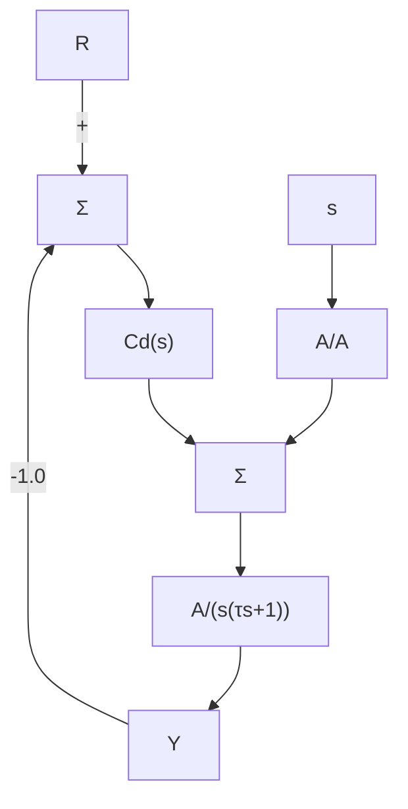

# 例 4.4 直流电动机位置控制的系统类型

考虑如图 4.6 所示单位反馈直流电动机的简化系统模型，其中，干扰转矩为 $W(s)$ 。在例 2.11 中已经考虑过这一问题。

(1) 控制器为

$$D _ {\mathrm{c}} (s) = k _ {\mathrm{p}} \tag {4.49}$$

试确定系统类型及干扰输入作用下的稳态误差。

(2) 控制器传递函数为

$$D _ {\mathrm{c}} (s) = k _ {\mathrm{P}} + \frac {k _ {\mathrm{l}}}{s} \tag {4.50}$$

试确定系统类型及干扰输入作用下的系统稳态误差。

flowchart

图 4.6 单位反馈直流电动机

解答。

(1) 从 W 到 E (其中 R=0) 的闭环传递函数为

$$
\begin{array}{l} T _ {\mathrm{w}} (s) = - \frac {B}{s (\tau s + 1) + A k _ {\mathrm{p}}} \\ = s ^ {0} T _ {\mathrm{o}, \mathrm{w}} \\ n = 0 \\ K _ {\mathrm{o,w}} = - \frac {A k _ {\mathrm{p}}}{B} \\ \end{array}
$$

由式(4.48)可知系统为0型系统，系统对单位阶跃转矩输入的稳态误差为 $e_{ss}=-B/Ak_{P}$ 。由前一节可知，当系统类型由参考输入定义时，该系统为1型系统。由此我们可以看出，同一系统由不同输入决定的系统类型是不同的。

(2) 对于这一控制器，其干扰误差的传递函数为

$$T _ {\mathrm{w}} (s) = - \frac {B s}{s ^ {2} (\tau s + 1) + (k _ {\mathrm{P}} s + k _ {\mathrm{I}}) A} \tag {4.51}n = 1 \tag {4.52}K _ {\mathrm{n}, \mathrm{w}} = - \frac {A k _ {1}}{B} \tag {4.53}$$

因此系统是1型，对单位斜坡干扰输入的稳态误差为

$$e _ {\mathrm{ss}} = - \frac {B}{A k _ {1}} \tag {4.54}$$
