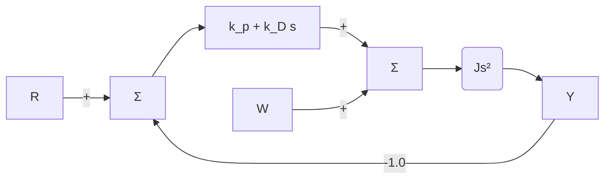
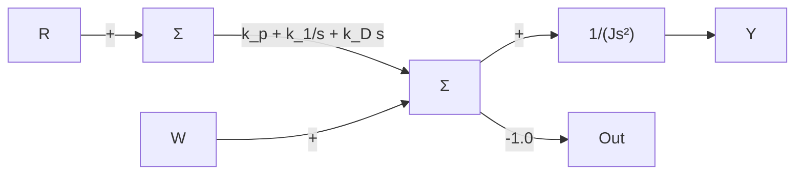

# 例 4.7 卫星姿态控制

考虑如图 4.12a 所示的卫星姿态控制系统模型，其中：J 是转动惯量；W 是干扰转矩；K 是传感器和参考增益； $D_{c}(s)$ 是补偿器。

输入滤波器和单位反馈传感器具有相同增益系数，PD 控制作用下的系统和 PID 控制作用下系统分别由图 4.12b 和图 4.12c 给出，假设在控制作用下系统是稳定的，试确定系统类型和干扰输入作用下系统的误差响应。

（1）图 4.12b 比例微分控制，控制器传递函数 $D_{\mathrm{c}}(s)=k_{\mathrm{P}}+k_{\mathrm{D}}s$ 。

(2) 图 4.12c 比例积分微分控制，控制器传递函数 $D_{\mathrm{c}}(s)=k_{\mathrm{P}}+k_{\mathrm{I}}/s+k_{\mathrm{D}}s^{\ominus}$ 。

解答。

（1）由图 4.12b 可知，被控对象在原点有两个极点，系统关于参考输入是 2 型系统。干扰对误差的传递函数为

$$T _ {\mathrm{w}} (s) = \frac {1}{J s ^ {2} + k _ {\mathrm{D}} s + k _ {\mathrm{P}}} \tag {4.86}= T _ {\mathrm{o,w}} (s) \tag {4.87}$$

其中： $n=0,\ K_{o,w}=k_{P}$ 。系统是0型系统，单位阶跃干扰输入的误差为 $1/k_{P}$ 。

(2) 对 PID 控制，前向增益在原点有三个极点，所以系统对于参考输入是 3 型系统，

而干扰输入的传递函数为

$$T _ {\mathrm{w}} (s) = \frac {s}{J s ^ {3} + k _ {\mathrm{D}} s ^ {2} + k _ {\mathrm{P}} s + k _ {\mathrm{I}}} \tag {4.88}n = 1 \tag {4.89}T _ {\mathrm{o,w}} (s) = \frac {1}{J s ^ {3} + k _ {\mathrm{D}} s ^ {2} + k _ {\mathrm{P}} s + k _ {\mathrm{I}}} \tag {4.90}$$


<details>
<summary>flowchart</summary>

```mermaid
graph LR
    R --> K
    K --> sum1["Σ"]
    sum1 --> Dc["D_c(s)"]
    Dc --> sum2["Σ"]
    sum2 --> 1Js["1/(Js)"]
    1Js --> θ̇[θ̇]
    θ̇ --> 1s["1/s"]
    1s --> θ[Y]
    θ[Y] --> K
    W --> sum2
    - --> sum1
```
</details>

a）基本系统  


<details>
<summary>flowchart</summary>


</details>

b) PD控制  


<details>
<summary>flowchart</summary>


</details>

c) PID控制  
图 4.12 卫星姿态控制模型

系统是1型系统，误差系数为 $k_{1}$ ；因此，单位斜坡干扰输入的误差为 $1/k_{1}$ 。
