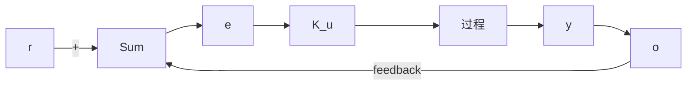

# 4.3.6 PID 控制器的齐格勒-尼科尔斯整定

当 PID 控制器被提出时，选择一些项的值（称为“整定”控制器）往往用试凑法。为了提高被控对象运行的可操作性，控制工程师不断寻找更加系统化的整定方法。卡伦德（Callender）等人（1936）提出了一种被广泛应用的 PID 控制器的设计方法，该方法适用的前提条件是被控对象的参数可以通过大量实验估计出来。齐格勒和尼科尔斯（1942 年，1943 年）推广了这种方法，他们认为大部分控制系统对单位阶跃的响应都表现为如图 4.13 所示的过程响应曲线。

line

| t | y(t) |
| --- | --- |
| t_d | 0 |
| τ | A |
| >τ | A |

图 4.13 过程响应曲线

该曲线可以由实验中的阶跃响应数据获得。诸多系统都具有 S 形的响应曲线的特点，可以用具有下面传递函数的系统的阶跃响应来近似：

$$\frac {Y (s)}{U (s)} = \frac {A \mathrm{e} ^ {- s t _ {d}}}{\tau s + 1} \tag {4.91}$$

这是一个延迟时间为 $t_{d}$ 秒的一阶系统。式(4.91)中的各个常数可以通过系统对单位阶跃的响应曲线获得。做法如下：在响应曲线的拐点处做切线，切线的斜率为 $R = A / \tau$ ，切线与横轴的交点为延迟时间 $L=t_{d}$ ，曲线终值为 A 的值 $^{\ominus}$ 。

齐格勒和尼科尔斯提出了两种用于整定该上述模型PID控制器参数的方法。第一种设计方法是通过改变控制器参数使闭环控制系统对单位阶跃响应的暂态特性衰减率接近0.25。这意味着系统阶跃响应经过一个振荡周期后幅值衰减为后来的1/4，如图4.14所示。1/4的衰减意味着 $\zeta = 0.21$ 尽管对于许多应用情况来说，这个值偏小，但是这是考虑了过程控制的快速响应和足够的稳定边界，做出的一个合理折中。他们在模拟计算机上仿真了系统的描述方程，并且调整控制器的参数使系统的动态响应在一个周期内衰减率为1/4。齐格勒和尼科尔斯所提出的控制器参数为

$$D _ {\mathrm{c}} (s) = k _ {\mathrm{P}} \left(1 + \frac {1}{T _ {1} s} + T _ {\mathrm{D}} s\right) \tag {4.92}$$

调节参数的取值如表 4.2 所示。

极限灵敏度法通过改变系统参数使系统处于临界稳定状态，并通过系统振荡响应的幅值和频率来估计参数值，它不是采用阶跃响应的方法。

具体做法如下，通过增加比例项增益使系统变为临界稳定，振荡的幅值由执行元件的饱和特性决定。将系统此时的增益定义为 $K_{u}$ （称为极限增益），振荡周期定义为 $P_{u}$ （称为极限周期）。这两个值可由图4.15和图4.16确定。 $P_{u}$ 可在振荡幅值尽可能小的情况下测量出来。整定参数的选择如表 4.3 所示。

line

| t | y(t) |
| --- | --- |
| 0 | 1 |
| 0.25 | 0.25 |

图 4.14 1/4 衰减率

表 4.2 对调节器 $D_{c}(s)=k_{p}(1+1/T_{1}s+T_{D}s)$ 的齐格勒-尼科尔斯整定，衰减率为 0.25

<table><tr><td>控制器类型</td><td>最优增益</td></tr><tr><td>P</td><td> $k_{\text{P}} = 1/(RL)$ </td></tr><tr><td>PI</td><td> $\begin{cases} k_{\text{P}} = 0.9/(RL) \\ T_{\text{I}} = L/0.3 \end{cases}$ </td></tr><tr><td>PID</td><td> $\begin{cases} k_{\text{P}} = 1.2/(RL) \\ T_{\text{I}} = 2L \\ T_{\text{D}} = 0.5L \end{cases}$ </td></tr></table>

flowchart

图 4.15 极限增益和周期的确定
