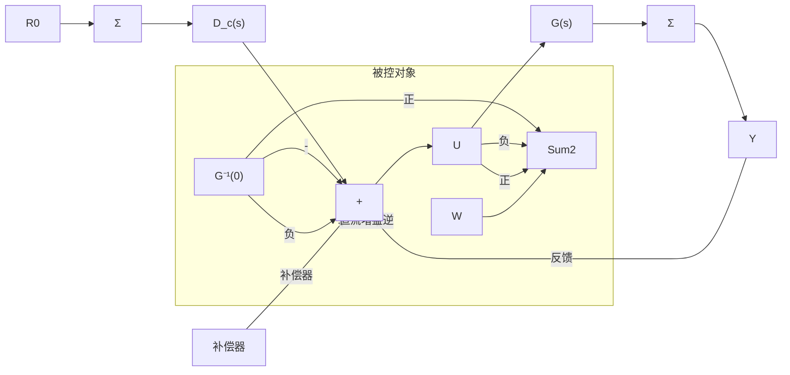

# 4.4 被控对象模型逆的前馈控制

4.3 节表明比例控制通常会对干扰或参考输入产生稳态误差。引入积分控制后能消除稳态干扰或常数参考输入带来的误差。然而积分控制往往会降低系统阻尼和稳定性。用前馈控制的方法可缓解这种矛盾，消除由参考输入引起的稳态误差。这可能是因为命令输入是已知量，能够由控制器直接确定。因此我们可计算出产生期望输出需要的控制输入。干扰并不总是可测的，但只要是能够测量，都能用于前馈控制。解决的方法是，确定被控对象传递函数模型直流增益的逆，将其合并到如图 4.21 所示的控制器中。

```mermaid
graph TD
    A["RO"] --> B["G⁻¹(0)"]
    B --> C["Σ"]
    C --> D["G(s)"]
    D --> E["Y"]
    E --> F["Σ"]
    F --> G["D_c(s)"]
    G --> C
    H["被控对象"] --> I["被控对象"]
    I --> J["Σ"]
    J --> K["补偿器"]
    K --> L["Σ"]
    L --> M["+"]
    M --> N["Σ"]
    N --> O["+"]
    O --> P["Σ"]
    P --> Q["+"]
    Q --> R["Σ"]
    R --> S["+"]
    S --> T["Σ"]
    T --> U["+"]
    U --> V["Σ"]
    V --> W["+"]
    W --> X["Σ"]
    X --> Y["+"]
    Y --> Z["Σ"]
    Z --> AA["+"]
    AA --> AB["Σ"]
    AB --> AC["+"]
    AC --> AD["Σ"]
    AD --> AE["+"]
    AE --> AF["Σ"]
    AF --> AG["+"]
    AG --> AH["Σ"]
    AH --> AI["+"]
    AI --> AJ["Σ"]
    AJ --> AK["+"]
    AK --> AL["Σ"]
    AL --> AM["+"]
    AM --> AN["Σ"]
    AN --> AO["+"]
    AO --> AP["Σ"]
    AP --> AQ["+"]
    AQ --> AR["Σ"]
    AR --> AS["+"]
    AS --> AT["Σ"]
    AT --> AU["+"]
    AU --> AV["Σ"]
    AV --> AW["+"]
    AW --> AX["Σ"]
    AX --> AY["+"]
    AY --> AZ["Σ"]
    AZ --> BA["+"]
    BA --> BB["Σ"]
    BB --> BC["+"]
    BC --> BD["Σ"]
    BD --> BE["+"]
    BE --> BF["Σ"]
    BF --> BG["+"]
    BG --> BH["Σ"]
    BH --> BI["+"]
    BI --> BJ["Σ"]
    BJ --> BK["+"]
    BK --> BL["Σ"]
    BL --> BM["+"]
    BM --> BN["Σ"]
    BN --> BO["+"]
    BO --> BP["Σ"]
    BP --> BQ["+"]
    BQ --> BR["Σ"]
    BR --> BS["+"]
    BS --> BT["Σ"]
    BT --> BU["+"]
    BU --> BV["Σ"]
    BV --> BW["+"]
    BW --> BX["Σ"]
    BX --> BY["+"]
    BY --> BZ["Σ"]
```

flowchart

a）跟踪

flowchart

b）干扰抑制   
图 4.21 前馈控制结构

206
212

这样前馈就会提供期望参考输入所需的控制效果，反馈关注的是实际被控对象与受任意干扰影响的被控对象模型之间的差值。
