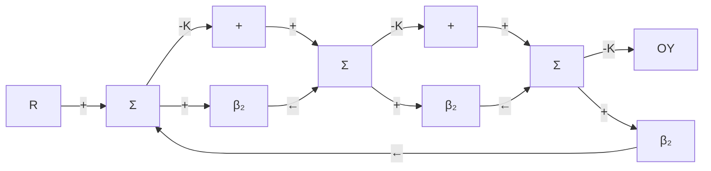

# 4.1节习题

4.1 若 S 是单位反馈系统对被控对象传递函数变化的灵敏度，T 是从参考输入到输出的传递函数，证明 $S + T = 1$ 。

4.2 定义传递函数 G 对其中一个参数 k 的灵敏度为 G 的变化率与 k 的变化率之比。

$$\mathcal {S} _ {k} ^ {G} = \frac {\mathrm{d} G / G}{\mathrm{d} k / k} = \frac {\mathrm{d} \ln G}{\mathrm{d} \ln k} = \frac {k}{G} \frac {\mathrm{d} G}{\mathrm{d} k}$$

本题的目的是检验反馈对灵敏度的影响。尤其是我们要比较图 4.24 所示的三种结构。图为三个增益为 -K 的放大器与一个增益为 -10 的放大器相连接。

● 通过计算多项式干扰输入信号的系统误差可对系统划分类型，以反映系统的干扰抑制水平。如果所有阶次小于 k 的多项式干扰信号的系统误差为零，阶次等于 k 的误差不为零，则系统称为 k 型系统。

\- 提高比例反馈增益可以降低稳态误差，但高增益会使系统不稳定。积分控制具有消除稳态误差的鲁棒性，但会降低系统稳定性。微分控制可以提高阻尼增加系统的稳定性。这三种控制结合形成了经典的三项PID控制器。

\- 标准 PID 控制器可以用以下方程描述：

$$U (s) = \Big (k _ {\mathrm{P}} + \frac {k _ {\mathrm{I}}}{s} + k _ {\mathrm{D}} s \Big) E (s) \text {或}U (s) = k _ {\mathrm{P}} \left(1 + \frac {1}{T _ {1} s} + T _ {\mathrm{D}} s\right) E (s) = D _ {\mathrm{c}} (s) E (s)$$

后一种形式被广泛用于过程控制工业中，在许多控制系统中也用来描述基本控制器。

\- 表 4.2 和表 4.3 给出了整定 PID 控制器的有用指导原则。

● 能够用 Matlab 命令 c2d 来计算离散化等效。

4.8 引入积分控制的主要目的是什么？

4.9 加入微分控制的主要目的是什么？

4.10 为什么设计者通常将微分项放在反馈回路中而不放在误差通道中？

4.11 PID 控制器整定准则的优点是什么？

4.12 给出使用数字控制器而不使用模拟控制器的两个理由。

4.13 给出使用数字控制器的两个弊端。

4.14 若用高为 $e(kT_{s})$ 和底为 $T_{s}$ 的矩形面积公式近似代替附录 W4.5 中式(8)的积分，请给出离散算子 z 和拉普拉斯变换算子 s 的关系式。

(a) 对于图 4.24 所示的每种拓扑结构，若 K=10, Y=-10R，计算 $\beta_{i}$ 。

(b) 对于每种拓扑结构，当 $G=\frac{Y}{R}$ 时计算 $S_{k}^{G}$ （ $\beta_{i}$ 值分别取 (a) 问中计算得到的值）。哪一种情况时灵敏度最小？

(c) 计算图 4.24b、c 所示系统对 $\beta_{2}$ 和 $\beta_{3}$ 的灵敏度。根据计算的结论评价如何提高传感器和执行器的精度。

4.3 对比图 4.25 所示的两种结构，用下面关系式来衡量整个系统的增益对放大器增益变化的灵敏度。

$$\mathcal {S} = \frac {\mathrm{d} \ln F}{\mathrm{d} \ln K} = \frac {K}{F} \frac {\mathrm{d} F}{\mathrm{d} K}$$

选择 $H_{1}$ 和 $H_{2}$ 使标称系统输出满足 $F_{1}=F_{2}$ ，并假设 $KH_{1}>0$ 。

flowchart

a)

flowchart

b)

