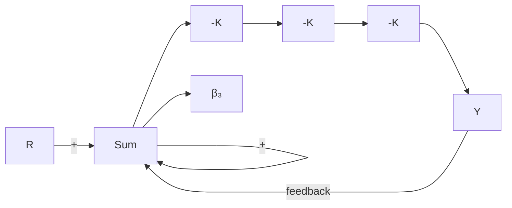
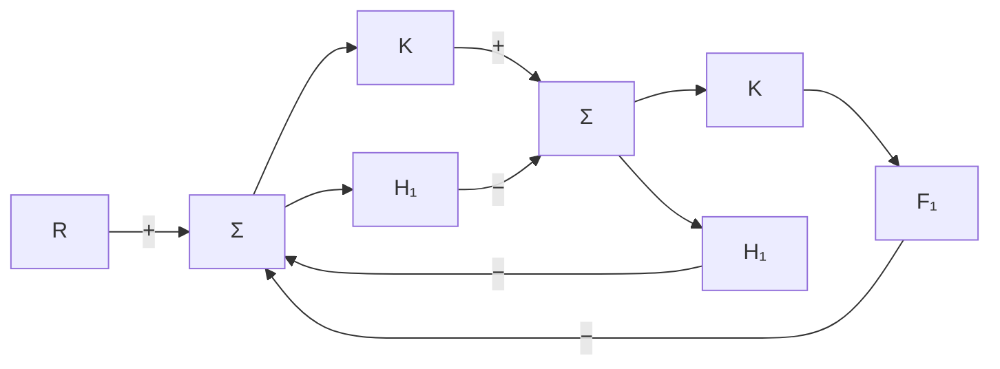
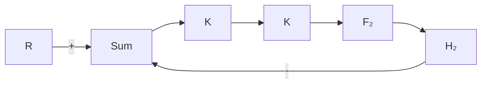
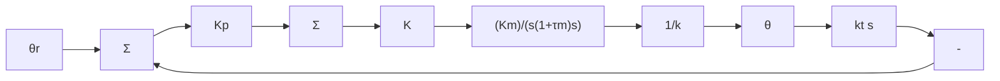
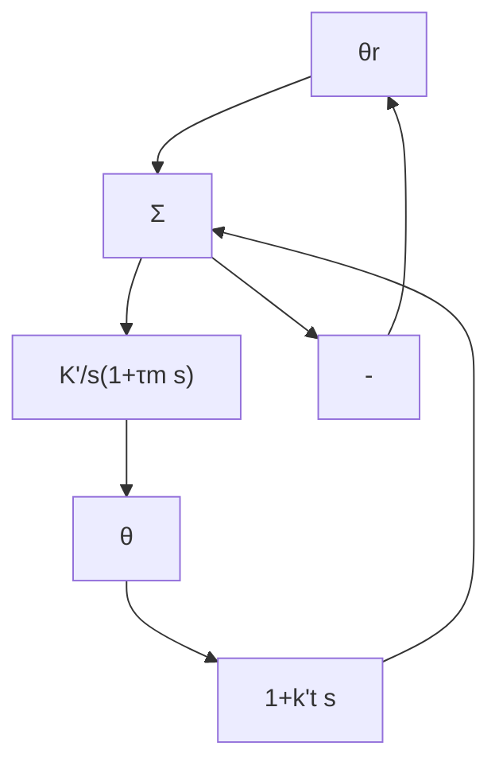
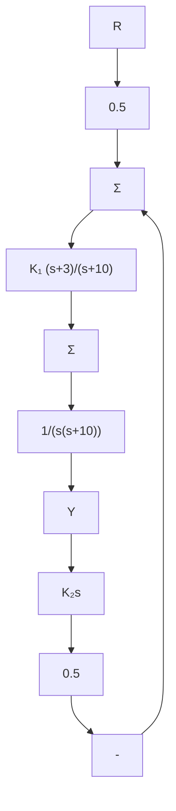

flowchart

c)

图 4.24 习题 4.2 中三种放大器拓扑  

flowchart

a)   

flowchart

b)   
图4.25 习题4.3框图

4.4 单位反馈控制系统的开环传递函数为

$$G (s) = \frac {A}{s (s + a)}$$

(a) 计算闭环传递函数对参数 A 变化的灵敏度。  
(b) 计算闭环传递函数对参数 a 变化的灵敏度。  
(c) 若反馈单位增益变为 $\beta \neq 1$ ，计算闭环系统传递函数对 $\beta$ 的灵敏度。

4.5 计算图 4.5 所示的反馈系统的系统误差方程。

4.2节习题  
4.6 考虑如图 4.26a 所示的具有速度(转速计)反馈的直流电动机控制系统。

(a) 找出使图 4.26b 和图 4.26a 所示系统有相同传递函数的 $K'$ 和 $k'$ 的值。  
(b) 确定跟踪输入为 $\theta_{r}$ 时的系统类型，并计算用参数 $K'$ 和 $k'$ 表示的系统误差常数 $K_{v}$ 。  
(c) 转速计反馈引入正数 $k_{t}$ 会使 $K_{v}$ 增大还是减小？

flowchart

a)

flowchart

b)   
图 4.26 习题 4.6 控制系统

4.7 图 4.27 所示的控制系统框图。

(a) 若 r 是阶跃函数并且系统闭环稳定，那么稳态跟踪误差是什么？  
(b) 求系统类型。  
(c) 若 $K_{2}=2$ ，并且调整 $K_{1}$ 使系统在阶跃输入信号作用下系统超调量为 17%，求系统在斜率为 5.0 的斜坡输入作用下的稳态误差。

flowchart

图 4.27 习题 4.7 闭环系统

4.8 一个标准反馈控制系统框图如图 4.5 所示，其中，
