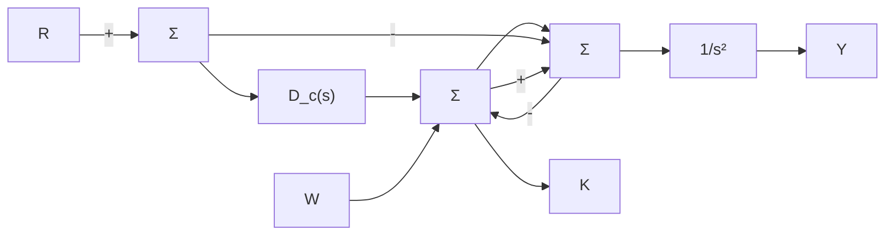

$$G (s) = \frac {1}{s}; D _ {c} (s) = \frac {2 (s + 1)}{s};H (s) = \frac {1 0 0}{(s + 1 0 0)}$$

(a) 令 W=0，计算从 R 到 Y 的传递函数。  
(b) 令 R=0，计算从 W 到 Y 的传递函数。  
(c) 若 R 为单位阶跃输入信号并且 $W \equiv 0$ ，求跟踪误差。  
(d) 若 R 为单位斜坡输入信号并且 $W \equiv 0$ ，求跟踪误差。

(e) 试求系统类型和相应的误差系数。

4.9 一类反馈通道为非单位传递函数负反馈系统，如图 4.5 所示。

(a) 试求斜坡参考输入信号作用时系统的稳态跟踪误差。

(b) 若 $G(s)$ 在 s 平面内原点处只有一个极点，试求使系统为 1 型系统的 $H(s)$ 。

(c) 假设

$$G (s) = \frac {1}{s (s + 1) ^ {2}}; D _ {\mathrm{cl}} (s) = 0. 7 3;H (s) = \frac {2 . 7 5 s + 1}{0 . 3 6 s + 1}$$

表示反馈通道中的超前补偿环节。求速度误差系数 $K_{v}$ 。

4.10 考虑如图 4.28 所示的系统，其中，


<details>
<summary>flowchart</summary>

```mermaid
graph LR
    R -->|+| Sum
    Sum --> D_e(s)
    D_e(s) -->|1/(s(s+1))| Output
    Y -->|-| Sum
    Sum -->|D_e(s)| D_e(s)
    D_e(s) = K( s + α )^2 / ( s^2 + ω_o^2 )
```
</details>

图 4.28 习题 4.10 控制系统

(a) 证明：若系统稳定，则系统可跟踪正弦参考输入信号 $r = \sin(\omega_{0}t)$ 并得到零稳态误差（提示：观察从 R 到 E 的传递函数并考虑在 $\omega_{0}$ 处的增益）。

(b) 若 $\omega_{0}=1,\quad\alpha=0.25$ ，利用劳斯判据确定使闭环系统稳定的 K 的取值范围。

4.11 考虑如图 4.29 所示的无阻尼摆角控制系统。


<details>
<summary>flowchart</summary>


</details>

图 4.29 习题 4.11 控制系统

(a) 求 $D_{c}(s)$ 必须满足什么条件时，系统在斜坡参考输入信号作用下具有常值稳态误差。

(b) 对于能稳定系统且满足(a)问条件的传递函数 $D_{c}(s)$ ，试求一类系统可抑制的干扰信号 $\omega(t)$ ，能使得稳态误差为0。

4.12 一个单位反馈系统的总传递函数为

$$\frac {Y (s)}{R (s)} = \mathcal {T} (s) = \frac {\omega_ {\mathrm{n}} ^ {2}}{s ^ {2} + 2 \zeta \omega_ {\mathrm{n}} s + \omega_ {\mathrm{n}} ^ {2}}$$

试求出多项式参考输入定义的系统类型与误差常数(用 $\zeta$ 与 $\omega_{n}$ 来表示)。

4.13 考虑二阶系统

$$G (s) = \frac {1}{s ^ {2} + 2 \zeta s + 1}$$

在单位反馈结构中加入一个形如 $D_{\mathrm{c}}(s)=\frac{K(s+a)}{(s+b)}$ 的传递函数并把它与 $G(s)$ 串联。

(a) 忽略当前稳定性，当 K, a 和 b 满足什么条件时系统是 1 型的？

(b) 求当 K, a 和 b 满足什么条件时，系统稳定并且是 1 型系统？

(c) 对于任意的正数 K，求 a 和 b 满足什么条件时，系统稳定并为 1 型系统？

4.14 考虑如图 4.30a 所示的系统。

(a) 求系统类型并计算斜坡输入信号 $r(t)=r_{0}t1(t)$ 作用下的稳态跟踪误差。

(b) 对于如图 4.30b 所示的带有前馈通道的改进系统，计算 $H_{f}$ 值使系统在参考输入信号作用下为 2 型系统并求误差系数 $K_{a}$ 。

(c) 判断 2 型系统对 $H_{f}$ 变化是否具有鲁棒性？即当 $H_{f}$ 有微小变化时系统是否仍是 2 型系统。


<details>
<summary>flowchart</summary>
