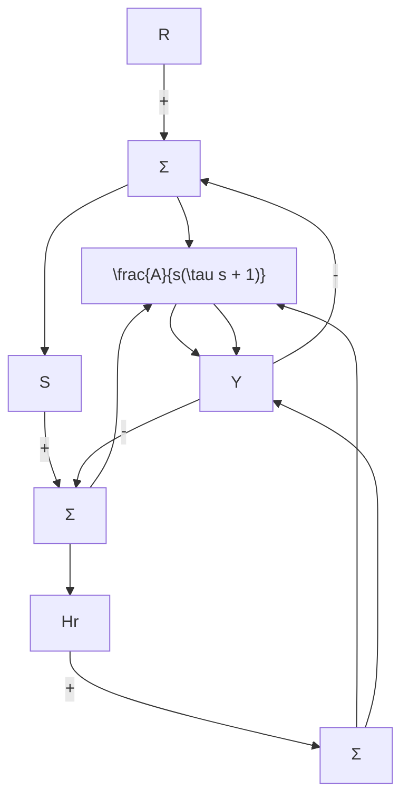
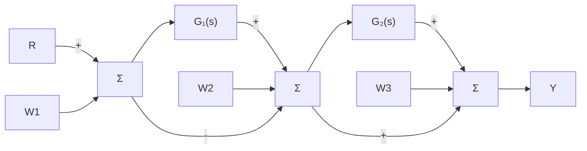
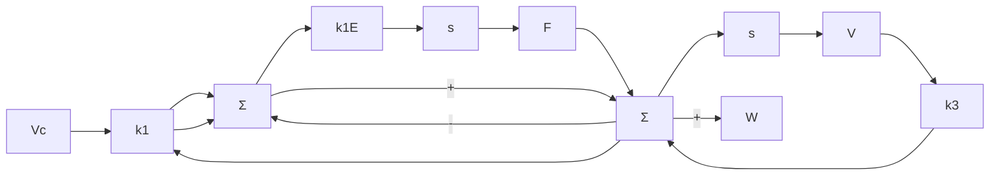

</details>

图 4.30 习题 4.14 控制系统

4.15 在一个卫星姿态控制的单位反馈结构系统中，被控对象的传递函数为 $G=1/s^{2}$ 。控制器的传递函数为 $D_{\mathrm{c}}(s)=\frac{10(s+2)}{s+5}$ 。

(a) 试求出该系统由参考输入跟踪信号所定义的系统类型以及相应的误差常数。

(b) 若有干扰转矩信号作用于该系统，使过程输入为 $u + w$ ，试求该系统由干扰抑制所定义的系统类型及相应的误差常数。

4.16 一个补偿电动机位置控制系统如图 4.31 所示。令传感器的传递函数为 $H(s)=1$ 。

(a) 系统可否以零稳态误差跟踪一个阶跃参考输入 r？若可以，给出这一速度常数。

(b) 系统可否以零稳态误差抑制一个阶跃

干扰 w？若可以，试求这一速度常数。

(c) 试计算闭环传递函数对被控对象在 -2 处的极点变化时的灵敏度。

(d) 在有些情况下，传感器是有动态的，对 $H(s)=\frac{20}{s+20}$ ，重复(a)～(c)问部分，并比较相应的速度常数。


<details>
<summary>flowchart</summary>

```mermaid
graph TD
    R -->|+| Sum1["Σ"]
    Sum1 -->|+| Subcomponent["补偿器 160 (s+4)/(s+30)"]
    Subcomponent -->|+| Sum2["Σ"]
    Sum2 -->|+| Subcomponent
    Subcomponent -->|1/(s(s+2))| Y
    Y -->|反馈| H["传感器 H(s)"]
    H -->|-| Sum1
    W -->|+| Sum2
```
</details>

图 4.31 习题 4.16 控制系统

4.17 如图 4.32 所示单位反馈控制系统，具有干扰输入 $w_{1}$ ， $w_{2}$ 和 $w_{3}$ ，且系统是渐近稳定的。其中，


<details>
<summary>flowchart</summary>


</details>

图 4.32 带干扰输入的单输入单输出单位反馈系统

$$G _ {1} (s) = \frac {K _ {1} \prod_ {i = 1} ^ {m _ {1}} (s + z _ {1 i})}{s ^ {l _ {1}} \prod_ {i = 1} ^ {m _ {1}} (s + p _ {1 i})},G _ {2} (s) = \frac {K _ {2} \prod_ {i = 1} ^ {m _ {1}} (s + z _ {2 i})}{s ^ {l _ {2}} \prod_ {i = 1} ^ {m _ {1}} (s + p _ {2 i})}$$

证明系统由 $w_{1}$ ， $w_{2}$ 和 $w_{3}$ 所定义的系统类型分别为 0 型的、 $l_{1}$ 型的和 $(l_{1}+l_{2})$ 型的。

4.18 具有积分控制的汽车速度控制系统的一种表达如图 4.33 所示。


<details>
<summary>flowchart</summary>


</details>

图 4.33 带有积分控制的系统

(a) 对于零参考输入 $v_{c}=0$ ，找出速度输出 v 到干扰 w 的传递函数。

(b) 若 w 为单位斜坡函数，求 v 的稳态响应。
