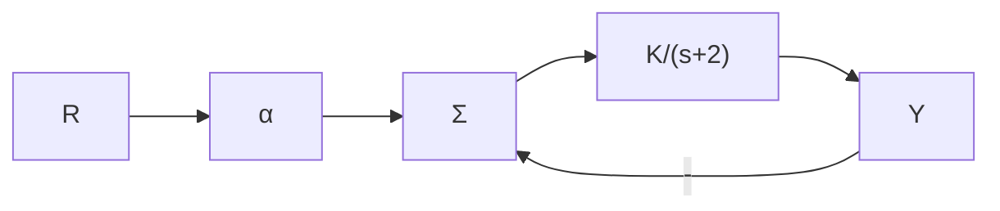
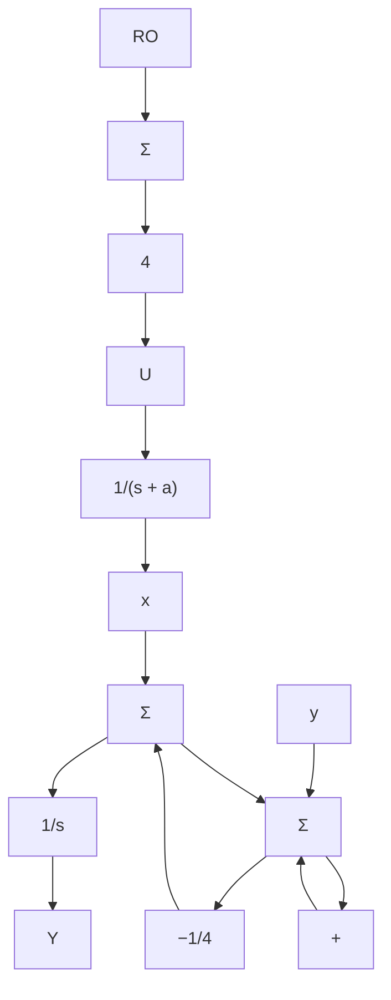
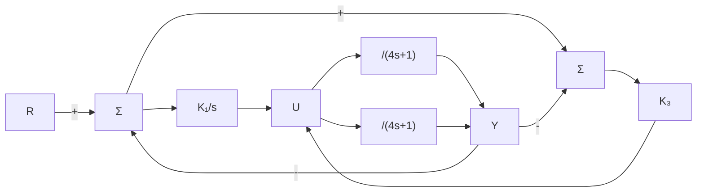

(c) 试确定系统由参考输入所决定的系统类型，并求出对应的误差常数。

(d) 试确定系统由干扰输入 w 所决定的系统类型及相应的误差系数。

4.19 如图 4.34 所示反馈系统，试求 $\alpha$ 值使系统在 K=5 时为 1 型系统。给出相应的速度常数。证明在该 $\alpha$ 值时，系统不具有鲁棒性，并计算在单位阶跃信号作用下，K=4 和 K=6 时系统的稳态误差 e=r-y。


<details>
<summary>flowchart</summary>


</details>

图 4.34 习题 4.19 控制系统

4.20 假设给定系统如图 4.35a 所示，其中被控对象参数 a 是变量。

(a) 求出 $G(s)$ 使图 4.35b 和图 4.35a 所示的系统从 r 到 y 具有相同的的传递函数。

(b) 假设 a=1 是被控对象参数的标称值。
试求此时系统类型和误差常数。

(c) 假设 $a=1+\delta a$ ，其中 $\delta a$ 是被控对象的某一摄动。试求摄动系统的类型和误差常数。


<details>
<summary>flowchart</summary>


</details>

a)


<details>
<summary>flowchart</summary>

```mermaid
graph LR
    R -->|+| Sum
    Sum -->|E(t)| Gs["G(s)"]
    Gs --> Y
    Y -->|-| Sum
```
</details>

b)   
图 4.35 习题 4.20 控制系统

4.21 如图 4.36 所示的两个反馈系统。

(a) 试确定 $K_{1}$ 、 $K_{2}$ 、 $K_{3}$ 的值，使得

(i) 在阶跃输入信号作用下，两个系统都具有零稳态误差(即都是1型系统)。

(ii) 当 $K_{0}=1$ 时，它们的静态速度误差常数 $K_{v}=1$ 。

(b) 假设 $K_{0}$ 有一个小的摄动： $K_{0} \rightarrow K_{0} + \delta K_{0}$ 。这对每种情况下的系统有什么影响？哪一种系统类型是鲁棒的？你认为哪个系统更好？


<details>
<summary>flowchart</summary>


</details>

图4.36 习题4.21的两个反馈控制系统

4.22 给定如图 4.37 所示的控制系统，其中反馈增益 $\beta$ 是一个变量。试设计一个控制器，使输出 $y(t)$ 精确跟踪参考输入信号 $r(t)$ 。


<details>
<summary>flowchart</summary>

```mermaid
graph LR
    R -->|+| Sum
    Sum -->|a| Dci(s)
    Dci -->|10/(s+1)(s+10)| Sum
    Sum -->|-| β
    β -->|feedback| Sum
    Sum --> Y
```
</details>

图 4.37 习题 4.22 控制系统

(a) 令 $\beta = 1$ ，控制器 $D_{ci}(s)$ 可选如下形式：
