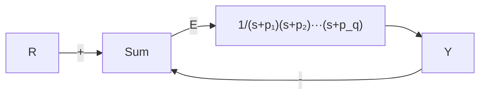

$$D _ {\mathrm{cl}} (s) = k _ {\mathrm{P}}, \quad D _ {\mathrm{c2}} (s) = \frac {k _ {\mathrm{P}} s + k _ {\mathrm{I}}}{s},D _ {\mathrm{c3}} (s) = \frac {k _ {\mathrm{P}} s ^ {2} + k _ {1} s + k _ {2}}{s ^ {2}}$$

选择控制器(包括对参数的选择)使系统在单位参考斜坡输入信号作用下为1型系统且稳态误差小于0.1。

(b) 假设模型反馈环增益 $\beta$ 衰减为 0.9，试根据在 (a) 中 $D_{ci}(s)$ 所选择的控制器，求斜坡输入信号作用下的稳态误差。

(c) 若 $\beta=0.9$ ，(b) 问中的系统类型是什么？相应的误差常数值是多少？

4.23 考虑如图 4.38 所示的系统。

(a) 试求从参考输入到跟踪误差的传递函数。

(b) 若该系统在输入信号 $r(t)=t^{n}1(t)$ (其中 n<q) 的作用下稳态误差为零。试说明 $p_{1}, p_{2}, \cdots, p_{q}$ 须满足什么条件？

flowchart

图 4.38 习题 4.23 控制系统

4.24 考虑图 4.39 所示的系统。

(a) 试求从 $R(s)$ 到 $E(s)$ 的传递函数，并分别求出系统在单位阶跃参考输入信号

和单位斜坡参考输入信号作用下的稳态误差 $\left(\overline{e}_{\mathrm{ss}}\right)$ 。

(b) 确定系统闭环极点的位置。

(c) 求使闭环系统的阻尼系数为 $\zeta=0.707$ 且 $\omega_{n}=1$ 时系统参数 $(k, k_{\mathrm{P}}, k_{\mathrm{I}})$ 的值。求系统在单位阶跃参考输入信号作用下的百分比超调量。

(d) 试求系统在单位斜坡参考输入信号 $r(t)$ 作用下的跟踪误差信号 $e(t)$ 。

(e) 试选择 PI 控制器参数 $(k_{\mathrm{P}}, k_{\mathrm{I}})$ 来确保得到(d)问中较小的暂态跟踪误差 $|e(t)|$ 。

(f) 若系统在单位斜坡参考输入信号作用下，积分控制器增益 $k_{1}$ 足够大，试分析跟踪误差 $e(t)$ 的暂态特性。此时，单位斜坡响应是否有超调？

flowchart

图 4.39 习题 4.24 控制系统框图

4.25 一个直流电动机的线性常微分方程模型，忽略其电枢电感（即 $L_{\mathrm{a}} = 0$ ），且含干扰转矩 $\omega$ ，如下式所示：

$$\frac {J R _ {\mathrm{a}}}{K _ {\mathrm{t}}} \ddot {\theta} _ {\mathrm{m}} + K _ {\mathrm{e}} \dot {\theta} _ {\mathrm{m}} = v _ {\mathrm{a}} + \frac {R _ {\mathrm{a}}}{K _ {\mathrm{t}}} w$$

其中， $\theta_{m}$ 以弧度来度量。方程两边同时除以 $\ddot{\theta}_{m}$ 的系数得

$$\ddot {\theta} _ {\mathrm{m}} + a _ {1} \dot {\theta} _ {\mathrm{m}} = b _ {0} v _ {\mathrm{a}} + c _ {0} w$$

其中：

$$a _ {1} = \frac {K _ {\mathrm{t}} K _ {\mathrm{e}}}{J R _ {\mathrm{a}}}, b _ {0} = \frac {K _ {\mathrm{t}}}{J R _ {\mathrm{a}}}, c _ {0} = \frac {1}{J}$$

用旋转电位器可以测量 $\theta$ 与参考角度 $\theta_{r}$ 之间的位置误差，即 $e=\theta_{ref}-\theta_{m}$ 。用转速计可以测量电动机的转速 $\dot{\theta}_{m}$ 。将位置误差 e 和电动机转速 $\dot{\theta}_{m}$ 作为反馈写成如下形式：
