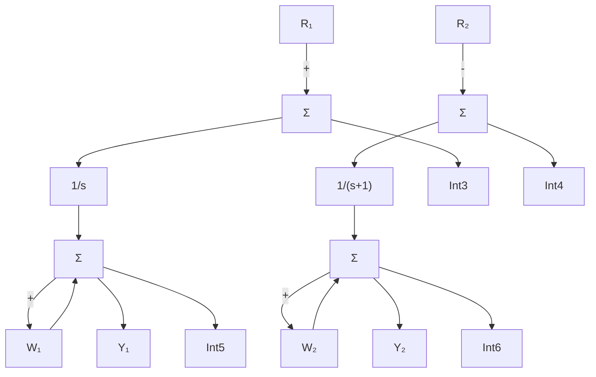
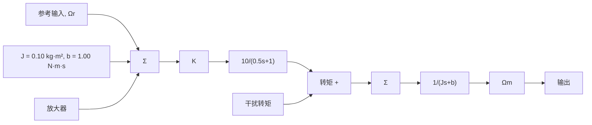
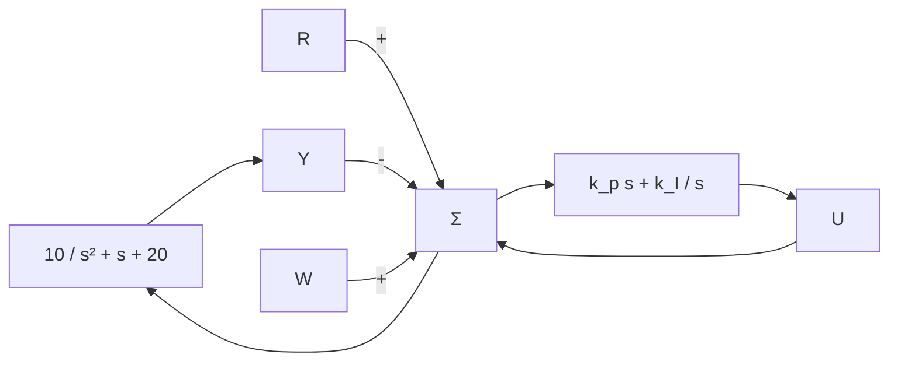

# 4.3节习题

4.29 磁带驱动的速度控制系统的传递函数如图 4.42 所示。速度传感器足够快，其动态可以忽略不计，框图给出了等效的单位反馈系统。

(a) 假设参考输入为零，试求 $1 ~N \cdot m$ 的阶跃干扰转矩的稳态误差。若要使稳态误差 $e_{ss} \leqslant 0.01 ~rad/s$ ，试求放大器增益 K。

flowchart

图 4.41 多变量系统

flowchart

图 4.42 磁带驱动速度控制系统

(b) 取(a)中计算出的增益 K，画出复平面上的闭环系统的根，并准确描绘出阶跃参考输入信号作用下的输出时间响应。

(c) 在复平面上，画出满足以下条件的闭环极点区域：阈值在1%条件下，调节时间 $t_{s}\leqslant0.1s$ ，超调量 $M_{p}\leqslant5\%$ 。

(d) 试求满足指标的 PD 控制器的 $k_{P}$ 和 $k_{D}$ 值。

(e) 运用(d)中的新控制方法，引入扰动后，系统稳态误差怎样变化？如何才能消除由干扰转矩引起的稳态误差？

4.30 考虑如图 4.43 所示带有 PI 控制的系统。

(a) 试求从 R 到 Y 的传递函数。

(b) 试求从 W 到 Y 的传递函数。

(c) 试求由参考跟踪决定的系统类型，并计算误差系数。

(d) 试分析由干扰抑制决定的系统类型，并计算误差系数。

flowchart

图 4.43 习题 4.30 控制系统

4.31 考虑二阶被控对象，其传递函数为

$$G (s) = \frac {1}{(s + 1) (5 s + 1)}$$

且具有单位反馈结构。

(a) 试确定带有 $\mathrm{P}[D_{\mathrm{c}} = k_{\mathrm{P}}]$ ， $\mathrm{PD}[D_{\mathrm{c}}(s) = k_{\mathrm{P}} + k_{\mathrm{D}}s]$ ， $\mathrm{PID}[D_{\mathrm{c}}(s) = k_{\mathrm{P}} + \frac{k_{\mathrm{I}}}{s} + k_{\mathrm{D}}s]$ 控制器的系统，在跟踪多项式参考输入信号作用下的系统类型并计算误差系数，令 $k_{\mathrm{P}} = 19$ ， $k_{\mathrm{I}} = 0.5$ ， $k_{\mathrm{D}} = \frac{4}{19}$ 。

(b) 根据(a) 问中的条件，当系统抑制多项式干扰输入时，分别用三种调节器进行控制。试求此时的系统类型与误差系数。

(c) 该系统能更好地跟踪参考信号还是抑制干扰信号？简要进行解释。

(d) 用 Matlab 画出系统跟踪和干扰抑制单位阶跃与单位斜坡信号时的响应曲线，证明 (a) 和 (b) 问的结果。

4.32 直流电动机速度控制系统如图 4.44 所示，通过如下微分方程描述

$$\dot {y} + 6 0 y = 6 0 0 v _ {\mathrm{a}} - 1 5 0 0 w$$
