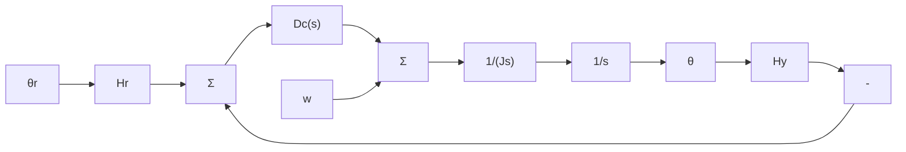

其中：y 是电动机速度； $v_{a}$ 是电枢电压；w 是负载转矩。假设电枢电压可以用 PI 控制律来计算

$$v _ {a} = - \left(k _ {\mathrm{P}} e + k _ {1} \int_ {0} ^ {t} e \mathrm{d} t\right)$$


<details>
<summary>flowchart</summary>

```mermaid
graph TD
    R -->|+| Sum1["Σ"]
    Sum1 -->|e| Dc["Dc(s)"]
    Dc -->|va| 600["600"]
    600 -->|+| Sum2["Σ"]
    Sum2 -->|1/(s+60)| Y
    Y -->|-| Sum1
    W --> 1500["1500"]
    1500 -->|-| Sum2
```
</details>

图 4.44 习题 4.32 和 4.33 中直流电动机速度控制框图

其中： $e = r - y$

(a) 以 $k_{P}$ 和 $k_{1}$ 为系数，计算从 W 到 Y 的传递函数。

(b) 计算 $k_{P}$ 和 $k_{1}$ 的值，使闭环系统特征方程的根为 $-60 \pm 60j$ 。

4.33 对于图 4.44 所示的系统，计算如下稳态误差：

(a) 对于单位阶跃参考输入；

(b) 对于单位斜坡参考输入；

(c) 对于单位阶跃干扰输入；

(d) 对于单位斜坡干扰输入；

(e) 用 Matlab 验证(a)到(d)问的答案。注意在阶跃参考输入后加上积分器后得到的系统斜坡响应。

4.34 考虑如图 4.45 所示的卫星姿态控制问题，其中标称化参数为

飞行惯量 J 为 10， $N \cdot m \cdot s^{2}/rad$ ; $\theta_{r}$ 为参考卫星姿态，rad; $\theta$ 为实际卫星姿态，rad; 传感器刻度因子 $H_{y}$ 为 1，V/rad; 参考传感器刻度因子 $H_{r}$ 为 1，V/rad；w 为干扰转矩，N·m。

(a) 当 $D_{c}(s)=k_{P}$ ，即为比例控制 P 时，计算使系统稳定时 $k_{P}$ 的范围。

(b) 当 $D_{\mathrm{c}}(s)=(k_{\mathrm{P}}+k_{\mathrm{D}}s)$ ，即为 PD 控制器时，计算由参考输入决定的系统类型和误差系数。

(c) 当 $D_{\mathrm{c}}(s)=(k_{\mathrm{P}}+k_{\mathrm{D}}s)$ ，即为 PD 控制器时，计算由干扰输入决定的系统类型和误差系数。

(d) 当 $D_{\mathrm{c}}(s)=\left(k_{\mathrm{P}}+\frac{k_{\mathrm{I}}}{s}\right)$ ，即为 PI 控制器时，计算由参考输入决定的系统类型和误差系数。

(e) 当 $D_{\mathrm{c}}(s)=\left(k_{\mathrm{P}}+\frac{k_{\mathrm{I}}}{s}\right)$ ，即为 PI 控制器时，计算由干扰输入决定的系统类型和误差系数。

(f) 当 $D_{\mathrm{c}}(s)=\left(k_{\mathrm{P}}+\frac{k_{1}}{s}+k_{\mathrm{D}}s\right)$ ，即为 PID 控制器时，计算由参考输入决定的系统类型和误差系数。

(g) 当 $D_{c}(s)=\left(k_{\mathrm{P}}+\frac{k_{1}}{s}+k_{\mathrm{D}}s\right)$ ，即为 PID 控制器时，计算由干扰输入决定的系统类型和误差系数。


<details>
<summary>flowchart</summary>


</details>

图 4.45 卫星姿态控制

4.35 轮船自动驾驶仪在汹涌的海中十分有用，它可保持轮船沿准确路线航行。如图 4.46 所示的为大型油轮的控制系统，该系统包含了从弧度方向舵偏转角到航向变化的被控对象传递函数。


<details>
<summary>flowchart</summary>
