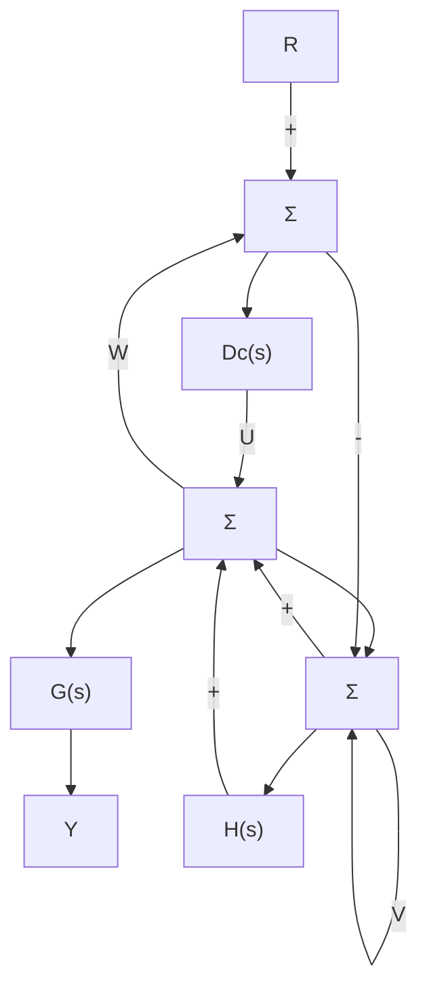

# 5.1 基本反馈控制系统的根轨迹

首先，以图 5.1 所示的基本反馈系统为例，该系统的闭环传递函数为

$$\frac {Y (s)}{R (s)} = \mathcal {T} (s) = \frac {D _ {\mathrm{c}} (s) G (s)}{1 + D _ {\mathrm{c}} (s) G (s) H (s)} \tag {5.1}$$

flowchart

图 5.1 基本的闭环框图

特征方程如下，其根是该传递函数的极点：

$$1 + D _ {\mathrm{c}} (s) G (s) H (s) = 0 \tag {5.2}$$

为了便于研究参数变化时根的情况，需要将方程变形，首先把方程转化为多项式形式并将所关注的参数记作 $K$ 。我们假设将部分多项式定义为 $a(s)$ 和 $b(s)$ ，那么特征多项式可以表示为 $a(s) + Kb(s)$ 的形式。传递函数定义为 $L(s) = \frac{b(s)}{a(s)}$ ，因此特征方程可以写成

$$1 + K L (s) = 0$$

其中：

$$L (s) = \frac {b (s)}{a (s)} \tag {5.3}$$

通常情况下，参数选为控制器的增益，此时 $L(s)$ 与 $D_{\mathrm{c}}(s)G(s)H(s)$ 呈简单比例关系。埃文斯指出我们应当绘出式(5.3)中 $K$ 从零变到无穷时的所有可能的根轨迹，然后，利用绘制出的根轨迹帮助我们选择最佳的 $K$ 值。此外，通过研究增加的零、极点对图形的影响，我们能分析在闭环系统中增加补偿环节 $D_{\mathrm{c}}(s)$ 对动态性能的影响。因此，这种方法不仅能用来选择特定参数值，还可以用来设计动态补偿器。式(5.3)以参数 $K$ 为变量的所有根的轨迹称为根轨迹，绘制这种图形的一系列规则称为根轨迹的埃文斯法。我们首先以式(5.3)为例，以 $K$ 为变参数来讨论绘制根轨迹的机理。

为研究方便，我们设置符号，假定传递函数 $L(s)$ 是有理函数，其分子 $b(s)$ 是首一（monic）多项式，阶次为 $m$ ，分母 $a(s)$ 也是首一多项式，阶次为 $n$ ，满足 $\mathbb{R} n \geqslant m$ 。因此， $m$ 为零点个数， $n$ 为极点个数，可将这些多项式分解为

$$
\begin{array}{l} b (s) = s ^ {m} + b _ {1} s ^ {m - 1} + \dots + b _ {m} \\ = (s - z _ {1}) (s - z _ {2}) \dots (s - z _ {m}) \\ = \prod_ {i = 1} ^ {m} \left(s - z _ {i}\right) \tag {5.4} \\ \end{array}
a (s) = s ^ {n} + a _ {1} s ^ {n - 1} + \dots + a _ {n}= \prod_ {i = 1} ^ {n} (s - p _ {i})
$$

$b(s)=0$ 的根是 $L(s)$ 的零点，用 $z_{i}$ 表示； $a(s)=0$ 的根是 $L(s)$ 的极点，用 $p_{i}$ 表示，特征方程本身的根用 $r_{i}$ 表示，可以由因式形式表示 (n>m) 为

$$a (s) + K b (s) = \left(s - r _ {1}\right) \left(s - r _ {2}\right) \dots \left(s - r _ {n}\right) \tag {5.5}$$

现在，我们可以用几个等效而实用的方程描述式(5.3)所示的根轨迹问题，下面每个方程具有相同的根：

$$1 + K L (s) = 0 \tag {5.6}1 + K \frac {b (s)}{a (s)} = 0 \tag {5.7}a (s) + K b (s) = 0 \tag {5.8}L (s) = - \frac {1}{K} \tag {5.9}$$

式(5.6)～式(5.9)有时称为根轨迹形式或特征方程的埃文斯形式。根轨迹是式(5.6)～式(5.9)中 K 为正实值 $^{\ominus}$ 时 s 值的集合。因为式(5.6)～式(5.9)的解是闭环系统特征方程的根，也就是系统的闭环极点，根轨迹法可以被看作是随着参数 K 变化，推导闭环系统动态特性的一种方法。
