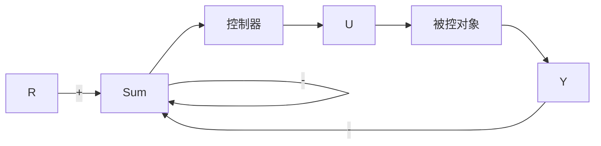

# 5.4 动态补偿设计

系统控制设计的考虑起始于过程本身的设计。对于过程设计以及执行器、传感器选择过程中潜在控制问题的初步考虑极其重要，如何强调都不为过。在早期研究中，通常过程本身是可以改变的，例如，通过在柔性对象中增加阻尼或刚性使其容易控制。只要将这些因素考虑在内，就可以开始控制器的设计了。如果被控过程的动态特性使得单纯调整比例增益不能满足设计要求，那么就需要进行动态修正和补偿。尽管可用的补偿方案非常多，其中三类被认为是比较简单有效的。这就是超前补偿、滞后补偿、超前滞后补偿 $^{①}$ 。超前补偿与PD控制的效果类似，主要作用是加快响应速度，缩短上升时间，减小动态超调。滞后补偿类似于PI控制的作用，通常用来提高系统的稳态精度。超前滞后补偿用于获得具有轻阻尼比柔性模态的系统的稳定性，正如我们在卫星姿态控制中看到的执行器和传感器单体分布的情况一样。本节将说明如何为这三种结构的控制器确定参数。超前、滞后及超前滞后补偿早期都是用模拟电子电路实现的，因此常常称为网络。然而，如今，大部分控制系统设计都采用计算机技术，因此补偿也通过软件实现。这样，我们就需要计算模拟传递函数的等价离散形式，这一部分请参考第8章和富兰克林(Franklin)等的著作(1998)。

对于具有如下传递函数的补偿

$$D _ {\mathrm{c}} (s) = K \frac {s + z}{s + p} \tag {5.70}$$

若 z<p，则它称为超前补偿；若 z>p，则称滞后补偿。补偿环节一般与被控对象串联，如图 5.21 所示。也可以放到反馈回路中，这时它对整个系统极点的作用是不变的，只是会导致（输入作用下）不同的暂态响应。

图 5.21 所示系统的特征方程为

$$1 + D _ {\mathrm{c}} (s) G (s) = 01 + K L (s) = 0$$

其中：K 和 $L(s)$ 是可选的，以便能将系统方程写成根轨迹方程的形式。

flowchart

图 5.21 带有补偿的反馈系统
