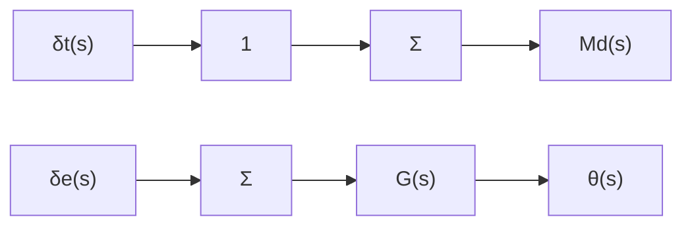
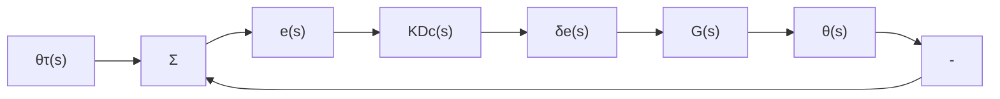

# 例5.12 小型飞机控制

图 5.32 所示的 Piper Dakota 飞机中，升降舵输入和俯仰姿态之间的传递函数为

$$G (s) = \frac {\theta (s)}{\delta_ {c} (s)} = \frac {1 6 0 (s + 2 . 5) (s + 0 . 7)}{(s ^ {2} + 5 s + 4 0) (s ^ {2} + 0 . 0 3 s + 0 . 0 6)} \tag {5.78}$$

其中： $\theta$ 为俯仰姿态，以度为单位（参见图 10.30）； $\delta_{e}$ 为升降舵角，以度为单位。

natural_image

Black-and-white photo of a small airplane in flight against a dark sky (no visible text or symbols)

a)

text_image

纵倾调整δt
升降舵δe

b)   
图 5.32 Piper Dakota 的自动驾驶仪升降舵和纵倾调整片示例  
(图片来源：Denise Freeman)

更多关于飞行纵向移动的详细描述参见10.3节。

（1）设计自动驾驶仪，使得升降舵阶跃输入时，上升时间不超过1s，超调小于10%。  
（2）当一个固定的常值扰动力作用于飞机时，驾驶仪必须在保持平稳飞行的控制力之上再提供一部分固定的补偿力，这种状态叫做失衡。扰动量到姿态之间的传递函数与升降舵到姿态之间的传递函数相同，为

$$\frac {\theta (s)}{M _ {\mathrm{d}} (s)} = \frac {1 6 0 (s + 2 . 5) (s + 0 . 7)}{(s ^ {2} + 5 s + 4 0) (s ^ {2} + 0 . 0 3 s + 0 . 0 6)} \tag {5.79}$$

其中： $M_{d}$ 为施加到飞机上的扰动力。

飞机上有一个独立的微调舵， $\delta_{t}$ ，可以进行转动，用来改变作用在飞机上的力矩，正如图5.32中尾部特写，其影响如图5.33a的框图所示。不论是手动控制还是自动控制，都可以用不增加升降舵稳态控制力的方式实现平飞（也就是 $\delta_{e}=0$ ）。手动飞行中，这意味着不需要飞行员提供补偿力矩来保持飞机的固定飞行高度，而在自动驾驶控制中，这意味着减少电能的用量，从而减轻驱动升降舵的伺服电动机的磨损。设计自动驾驶仪来控制微调舵 $\delta_{t}$ ，使 $\delta_{e}$ 的稳态值在任意常量扰动力 $M_{d}$ 下都为零，并且满足(1)部分提出的性能指标。

flowchart

a）开环

flowchart

b）调整片的反馈方案  
图 5.33 自动驾驶仪设计框图

解答。(1)为了满足上升时间 $t_{r}\leqslant1s$ ，对一个理想的二阶系统，式(3.60)指出 $\omega_{n}$ 要大于1.8rad/s。同样，对于二阶系统，图3.23表明为了使超调不超过10%， $\zeta$ 要大于0.6。在设计过程中，我们以反馈补偿的根轨迹为例，在特征根满足设计要求时，研究对应的时域响应。然而，这里所研究的是个四阶系统，这些设计要求可能不够充分，或者过于苛刻。

在开始设计之前，研究一下比例反馈系统的特性是很有帮助的，也就是说在图5.33b中 $D_{c}(s)=1$ 。用Matlab绘制参数K的根轨迹和K=0.3的时域响应，命令如下。
