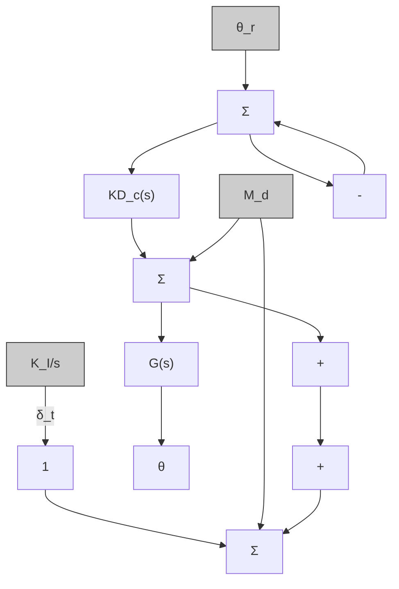
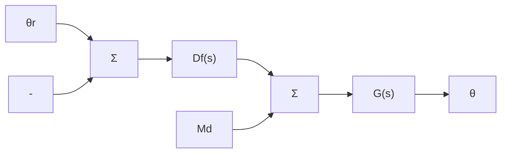

flowchart

a)

flowchart

b)   
图 5.36 调整舵命令框图

为了设计方便，可以绘制关于 $K_{\mathrm{I}}$ 的系统根轨迹，但特征方程不满足式(5.6)～式(5.9)中的形式。因此方程两边同时除以 $1 + KD_{\mathrm{c}}G$ ，得

$$1 + \frac {(K _ {\mathrm{I}} / s) K D _ {\mathrm{c}} G}{1 + K D _ {\mathrm{c}} G} = 0$$

为了将系统写成根轨迹方程的形式，定义

$$L (s) = \frac {1}{s} \frac {K D _ {\mathrm{c}} G}{1 + K D _ {\mathrm{c}} G} \tag {5.80}$$

这样 $K_{\mathrm{I}}$ 为根轨迹参数。在Matlab中，可以用sysT计算 $\frac{KD_{\mathrm{c}}G}{1 + KD_{\mathrm{c}}G}$ ，用sysIn = tf(1,[10])构造积分器，系统相对于 $K_{\mathrm{I}}$ 的闭环增益为sysL = sysIn \* sys，关于 $K_{\mathrm{I}}$ 的根轨迹可用命令r[tool(svsl)]画出。

由图5.37所示的根轨迹可以看出，快速根的阻尼比随着 $K_{\mathrm{I}}$ 的增加而减小，正好与增加积分项的效果相同。这说明了有必要使 $K_{\mathrm{I}}$ 的值尽量小。在经过一些试凑后，我们选择 $K_{\mathrm{I}} = 0.15$ 。这个值对特征根的影响很小，（注意，其实此时特征根的位置处于之前不用积分器时所得特征根位置的上方）对阶跃响应初期的形态影响很小，如图5.38a所示，因此性能指标仍然满足要求。 $K_{\mathrm{I}} = 0.15$ 确实可以使姿态无静差地接近于要求值，正如我们所预期的积分控制一样。同时，它还可以使 $\delta_{\mathrm{e}}$ 趋于零[图5.38b表明过渡过程大约为 $30\mathrm{s}]$ ，这正是我们选择积分控制的初衷。积分到达正确值的时间可以用因引入积分项而新增加的慢实根 $s = -0.14$ 来推测。与此根对应的时间常数为 $\tau = 1 / 0.14\mathrm{s}\approx 7\mathrm{s}$ 。用式(3.65)可推出 $\sigma = 0.14$ 的根对应于阈值为的调节时间为 $t_\mathrm{s} = 33\mathrm{s}$ ，与图5.38b所示的曲线一致。

other

| Re(s) | Im(s) |
| --- | --- |
| -20 | 15 |
| -15 | 10 |
| -10 | 5 |
| -5 | 0 |
| 0 | -5 |
| 5 | -10 |
| 10 | -15 |
| 15 | -10 |
| 20 | 0 |

图5.37 关于 $K_{1}$ 的根轨迹：假设有一个增加的积分项和增益为 $K = 1.5$ 的超前补偿；时根 $K_{1} = 0.15$ 的位于“·”标记处

line

| 时间/s | θ(°) |
| --- | --- |
| 0 | 1.0 |
| 1 | 4.0 |
| 2 | 5.0 |
| 3 | 5.2 |
| 4 | 5.1 |
| 5 | 5.0 |
| 10 | 5.0 |
| 15 | 5.0 |
| 20 | 5.0 |
| 25 | 5.0 |
| 30 | 5.0 |

line

| 时间/s | δc (°) |
| --- | --- |
| 0 | 0.0 |
| 5 | -0.1 |
| 10 | 0.0 |
| 15 | 0.0 |
| 20 | 0.0 |
| 25 | 0.0 |
| 30 | 0.0 |

图 5.38 具有一个积分项和 $5^{\circ}$ 命令的情况下的阶跃响应
