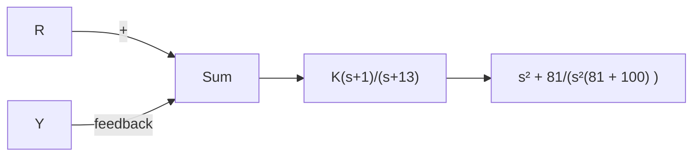
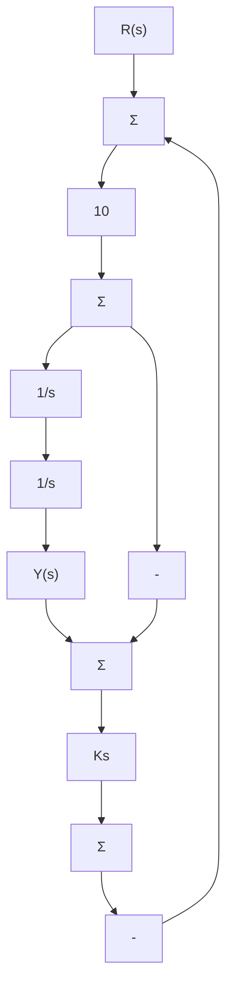

5.9 将图 5.45 所示系统的特征方程转化成以 $\alpha$ 为参数的根轨迹方程形式，给出相应的 L(s)、 $a(s)$ 和 $b(s)$ ，绘制以 $\alpha$ 为参数的根轨迹，估计闭环极点的位置，并绘制出 $\alpha=0$ 、0.5 和 2 时相应的阶跃响应。用 Matlab 检验近似阶跃响应的准确性。


<details>
<summary>flowchart</summary>

```mermaid
graph LR
    R -->|+| Sum
    Sum -->|5/(s(s+2))| A
    A --> Y
    Y -->|1 + αs| Sum
    Sum -->|-| Sum
```
</details>

图 5.45 习题 5.9 所描述的控制系统

5.10 应用 Matlab 中的函数 rltool 研究 $1+KL(s)$

在参数 a 从 0 变到 10 时的根轨迹，其中：

$$L (s) = \frac {(s + a)}{s (s + 1) (s ^ {2} + 8 s + 5 2)}$$

特别注意 $a$ 从2.5变化到3.5这段区域的情况。证明 $a$ 为这个范围内的某个值时，特征方程会有复重根。

5.11 用劳斯判据求出使图 5.46 所示系统稳定的增益 K 的范围，并用根轨迹证明计算结果。


<details>
<summary>flowchart</summary>

```mermaid
graph LR
    R -->|+| Sum1["Σ"]
    Sum1 --> K
    K --> |s² + s + 2 / (s(s + 5)(s + 6)(s² + 2s + 1))| Y
    Sum1 -->|-| Sum2["Σ"]
    Sum2 --> K
    K --> |s + 2 / (s(s - 2)(s² + 2s + 10))| Y
    subgraph a)
        direction TB
        Sum1
        Sum2
    end
    subgraph b)
        direction TB
        Sum1
        Sum2
    end
```
</details>

图 5.46 习题 5.11 所描述的反馈系统

5.12 绘制如下系统特征方程的根轨迹：

$$L (s) = \frac {(s + 2)}{s ^ {2} (s + 5)}$$

求共轭复极点具有最大阻尼比时的根轨迹增益值，此时的近似阻尼是多少？

5.13 考虑图 5.47 所示系统。

(a) 绘出以 K 为参数的闭环根轨迹。


<details>
<summary>flowchart</summary>


</details>

图 5.47 习题 5.13 所描述的反馈系统

(b) 是否存在一个 K 值使得所有根的阻尼比都大于 0.5?  
(c) 求使闭环极点阻尼比为 $\zeta=0.707$ 的 K 值。  
(d) 用 Matlab 绘出最终设计结果对参考阶跃的响应。

5.14 对于图 5.48 所示反馈系统，求使闭环主导极点的阻尼比为 $\zeta=0.5$ 的增益 K。


<details>
<summary>flowchart</summary>


</details>

图 5.48 习题 5.14 所描述的反馈系统

5.3节习题

5.15 直升机巡航时，其简化的纵向移动模型传递函数为

$$G (s) = \frac {9 . 8 (s ^ {2} - 0 . 5 s + 6 . 3)}{(s + 0 . 6 6) (s ^ {2} - 0 . 2 4 s + 0 . 1 5)}$$

特征方程为 $1 + D_{\mathrm{c}}(s)G(s) = 0$ ，首先令

$D_{\mathrm{c}}(S) = k_{\mathrm{p}}$

(a) 计算复零极点的出射角和入射角。

(b) 绘制参数 $K=9.8k_{p}$ 时系统根轨迹，坐标要求： $-4\leqslant x\leqslant4;\quad-3\leqslant y\leqslant3$ 。

(c) 用 Matlab 验证结果，可用命令 axis([-4, -3, 3]) 得到正确坐标范围。
