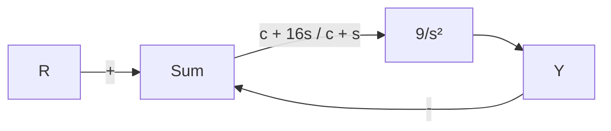
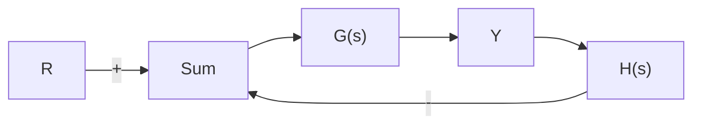

(d) 提出一种可行的(至少零点数与极点数相同)备选补偿环节 $D_{c}(s)$ ，确保系统稳定。

5.16 （a）对于图 5.49 所示系统，绘制 $\lambda=2$ 时，参数 $K_{1}$ 从 0 到 $+\infty$ 变化的特征方程的根轨迹，并写出相应的 $L(s)$ 、 $a(s)$ 和 $b(s)$ 。

(b) 令 $\lambda=5$ ，重复上述过程，看看该值下有没有什么不同？

(c) 令 $K_{1}=2$ ，选择 $K=\lambda$ 为从 0 到 $+\infty$ 变化的参数，重复(a)问过程。


<details>
<summary>flowchart</summary>

```mermaid
graph TD
    R -->|+| Sum1["Σ"]
    Sum1 --> 5["5"]
    5 --> 2["2/(s+10)"]
    2 --> Sum2["Σ"]
    Sum2 --> 0.1["0.1"]
    Sum2 --> 0.2["0.2"]
    0.1 -->|+| Sum3["Σ"]
    0.2 -->|+| Sum4["Σ"]
    Sum3 -->|+| Sum4
    Sum4 --> Y
    Sum1 -->|-| Sum3
    Sum2 -->|K₁/(s+λ)| Sum3
    Sum3 -->|+| Sum4
```
</details>

图 5.49 习题 5.16 所描述的控制系统

5.17 对于图 5.50 所示系统，确定特征方程并绘制参数 c 为正值的根轨迹。写出 $L(s)$ ， $a(s)$ 和 $b(s)$ ，并在根轨迹上沿着参数 c 增加的方向标上箭头。


<details>
<summary>flowchart</summary>


</details>

图 5.50 习题 5.17 所描述的控制系统

5.18 假设已给出系统的传递函数为

$$L (s) = \frac {(s + z)}{(s + p) ^ {2}}$$

其中：z 和 p 都是实数，且 z > p。证明 $1 + KL(s) = 0$ 关于 K 的根轨迹是中心在 z 处的圆，半径为

$$r = (z - p)$$

提示：假设 $s + z = r e^{j\phi}$ ，在这一假设条件下，证明对于实数 $\phi$ ， $L(s)$ 是负实数。

5.19 系统的回路传递函数在 s=-1 处有两个极点，s=-2 处有一个零点。第三个实轴上的极点 p 位于零点左侧某个位置。当第三个极点位置不同时，会有不同形状的根轨迹。极端情况出现在极点位于无穷远处或极点在 s=-2 处。给出相应的 p 值并绘制三种不同 p 值时的根轨迹。

5.20 对于图 5.51 所示反馈结构，通过渐近线、渐近线的中心点、出射角和入射角、劳斯表绘制如下反馈控制系统特征方程关于参数 K 的根轨迹，并用 Matlab 验证结果。


<details>
<summary>flowchart</summary>


</details>

图 5.51 习题 5.20 所描述的反馈系统

(a) $G(s)=\frac{K}{s(s+1+3j)(s+1-3j)}$ ,

$$H (s) = \frac {s + 2}{s + 8};$$

(b) $G(s) = \frac{K}{s^2}, H(s) = \frac{s + 1}{s + 3};$

(c) $G(s)=\frac{K(s+5)}{(s+1)}$ , $H(s)=\frac{s+7}{s+3}$ ;

(d) $G(s)=\frac{K(s+3+4j)(s+3-4j)}{s(s+1+2j)(s+1-2j)}$ ,

$$H (s) = 1 + 3 s _ {\circ}$$

5.21 考虑图 5.52 所示系统。

(a) 应用劳斯稳定判据，求使系统稳定的 K 值范围。

(b) 用 Matlab 绘制关于参数 K 的根轨迹，并求出根轨迹与虚轴交点处对应的 K 值。


<details>
<summary>flowchart</summary>

```mermaid
graph LR
    R -->|+| Sum
    Sum --> K
    K --> |s+3)/(s(s²+4s+5)| | Sum
    Sum --> |1/(s+1)| Feedback
    Feedback --> Y
    - --> Sum
```
</details>
