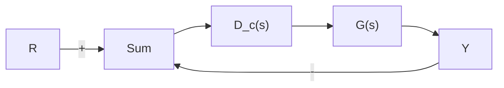

图 5.52 习题 5.21 所描述的反馈系统

5.4节习题

5.22 令

$G(s)=\frac{1}{(s+2)(s+3)}$ 和 $D_{c}(s)=K\frac{s+a}{s+b}$

应用根轨迹法求补偿环节 $D_{c}(s)$ 的参数 a, b 和 K 值，使图 5.53 的系统闭环极点为 $s = -1 \pm j$ 。

flowchart

图 5.53 习题 5.22、5.28 和 5.33 所描述的单位反馈系统

5.23 假设图 5.53 中，有

$$G (s) = \frac {1}{s (s ^ {2} + 2 s + 5)}, D _ {\mathrm{c}} (s) = \frac {K}{s + 2}$$

不使用 Matlab，绘制闭环系统特征方程关于参数 K 的根轨迹，要特别注意产生重根的点。求此点处的 K 值，说明重根的位置是什么？有多少重根？

5.24 假设图 5.53 所示的为单位反馈系统的开环被控对象为 $G(s)=1/s^{2}$ 。设计超前补偿环节， $D_{c}(s)=K\frac{s+z}{s+p}$ 与被控对象串联使用，使得闭环系统的主导极点在 $s=-2\pm2j$ 处。

5.25 假设图 5.53 所示的单位反馈系统的开环被控对象为

$$G (s) = \frac {1}{s (s + 3) (s + 6)}$$

设计滞后补偿环节使得系统满足下列要求：

● 阶跃响应的调节时间小于 5s。

\- 阶跃响应的超调量小于 $17\%$ 。

● 单位斜坡输入下的稳态误差不超过 10%。

5.26 一种数控机床的位置伺服机构的标准化传递函数由下式给出：

$$G (s) = \frac {1}{s (s + 1)}$$

若系统闭环极点位于 $s = -1 \pm j \sqrt{3}$ ，则图 5.53 所示单位反馈结构满足性能指标。

(a) 证明仅靠选择比例控制器 $D_{\mathrm{c}}(s)=k_{\mathrm{p}}$ 无法满足系统性能指标。

(b) 设计满足系统性能指标要求的超前补偿器 $D_{c}(s)=K\frac{s+z}{s+p}$ 。

5.27 位置伺服控制系统的被控对象传递函数为

$$G (s) = \frac {1 0}{s (s + 1) (s + 1 0)}$$

请在单位反馈结构下设计串联补偿传递函数 $D_{c}(s)$ ，以满足如下闭环性能指标：

\- 参考阶跃输入响应的超调量不超过 $16\%$ 。

● 参考阶跃输入响应的上升时间不超过 0.4s。

● 单位斜坡输入的稳态误差的不超过 0.05。

(a) 设计超前补偿使系统满足动态响应性能指标，不考虑误差要求。

(b) 速度常数 $K_{v}$ 是多少？它能满足误差指标要求吗？

(c) 设计滞后补偿，与之前设计的超前补偿相串联，使系统满足稳态误差指标。

(d) 用 Matlab 绘制最终设计结果的根轨迹。

(e) 用 Matlab 绘制最终结果的阶跃响应。

5.28 假设图 5.53 所示的闭环系统的前馈传递函数为

$$G (s) = \frac {1}{s (s + 2)}$$

设计滞后补偿，使得闭环系统的主导极点位于 $s = -1 \pm j$ 处，且系统在单位斜坡输入下的稳态误差小于 0.2。

5.29 图 5.54 描述的是一种基本的磁悬浮系统。考虑相对于参考位置的微小移动时，影像探测器的电压 e 由球位移 x(m) 决定，e = 100x。作用在球上向上的力(N)由电流 i(A)

决定，近似为 $f=0.5i+20x$ 。球的质量为20g，地球引力为9.8N/kg。功率放大器为电压/电流转换装置，输出(安培) $i=u+V_{0}$ 。

text_image

V₀
u
i
电磁阀
e
影像探测器
球
x
灯

图 5.54 基本磁悬浮系统

(a) 写出所建立的系统运动方程。

(b) 计算使球位于平衡位置 x=0 的偏置电压值 $V_{0}$ 。

(c) u 到 e 的传递函数是什么?

(d) 假设控制输入 u = -Ke，绘制闭环系统以 K 为参数的根轨迹。

(e) 假设采用形如 $\frac{U}{E}=D_{c}(s)=K\frac{s+z}{s+p}$ 的超前补偿，计算 K、z 和 p 的值，使性能指标优于 (d) 问中结果。

5.30 在单位正反馈系统中，具有非最小相位的被控对象的传递函数如下

$$G (s) = \frac {4 - 2 s}{s ^ {2} + s + 9}$$

控制器的传递函数为 $D_{\mathrm{c}}(s)$ 。

(a) 应用 Matlab 求 $D_{c}(s)=K$ 的值(负值)，使得闭环负反馈系统的阻尼比为 $\zeta=0.707$ 。
