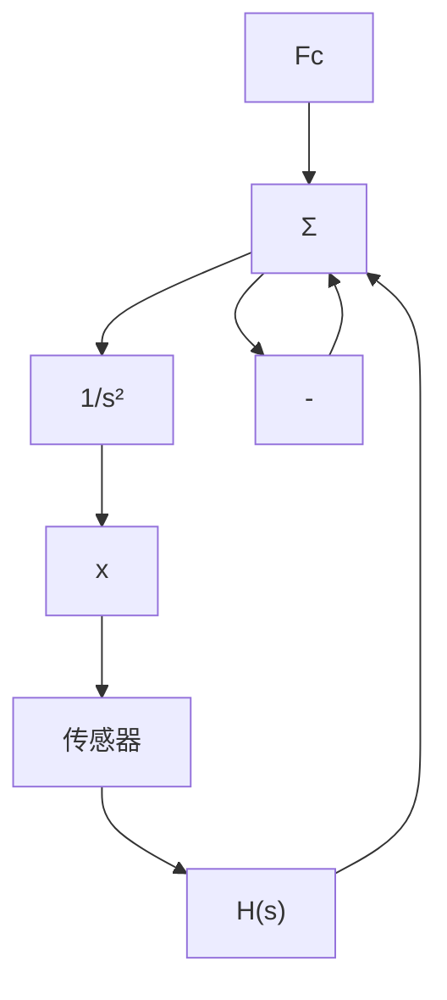
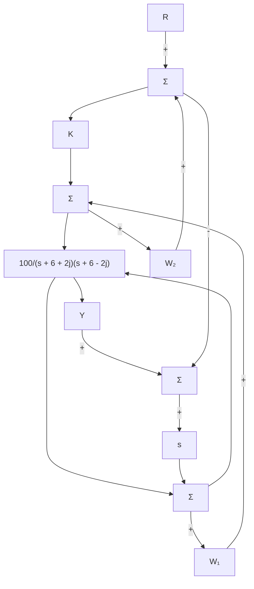
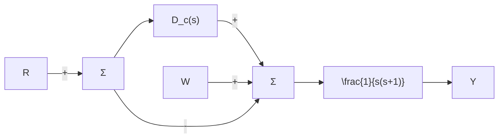

(b) 应用 Matlab 绘制系统参考阶跃响应。

5.31 考虑图 5.55 所示的火箭定位系统。

flowchart

图 5.55 火箭定位系统的框图

(a) 证明若测量的传感器传递函数为单位传递函数，则超前补偿器

$$H (s) = K \frac {s + 2}{s + 4}$$

可以镇定系统。

(b) 假设传感器传递函数是时间常数为 0.1s、单位直流增益的单极点模型。应用根轨迹法求出使阻尼比最大的增益 K 值。

5.32 对于图 5.56 所示系统：

flowchart

图 5.56 习题 5.32 所描述的控制系统

(a) 绘制以 K 为参数的闭环系统的根轨迹。  
(b) 求出使系统稳定的最大 K 值。假设本题其他问中 K=2。  
(c) 对于 r 的阶跃变化，稳态误差 $(e=r-y)$ 是多少？  
(d) 在 $w_{1}$ 为常值扰动时，y 的稳态误差是多少？  
(e) 在 $w_{2}$ 为常值扰动时，y 的稳态误差是多少？  
(f) 如果希望提高阻尼比，应对系统作何调整？

5.33 图 5.53 所示的单位反馈系统，被控对象的传递函数为

$$G (s) = \frac {b s + k}{s ^ {2} [ m M s ^ {2} + (M + m) b s + (M + m) k ]}$$

在单体传感器和执行器情况下，这是质量体 M 的输入力 $u(t)$ 到输出位置 $y(t)$ 之间的传递函数。本题中，应用根轨迹法设计控制器 $D_{c}(s)$ ，使得闭环系统阶跃响应上升时间小于 0.1 秒、超调量不超过 10%。可用 Matlab 完成下列问题：

(a) $G(s)$ 中设 $m \approx 0$ ，令 M = 1, k = 1, b = 0.1, $D_{c}(s) = K$ ，是否可以通过选择合适的 K 值满足系统性能指标，说明原因。  
(b) 假设 $D_{c}(s)=K(s+z)$ ，重复(a)问，证明通过选择合适的 K 和 z 能满足系统性能指标。  
(c) 用下列传递函数中给出的实际控制器，重复(b)问：

$$D _ {\mathrm{c}} (s) = K \frac {p (s + z)}{s + p}$$

选择 p 使(b)中 K 和 z 值仍然有效。

(d) 假设小质量 m 不可忽略，为 m=M/10。检查(c)中设计的控制器是否仍然满足系统的性能指标，若不满足，则调整控制器参数使性能指标得到满足。

5.34 图 5.57 描述的为 1 型系统。应用根轨迹法设计补偿环节 $D_{c}(s)$ 满足如下要求：① w 为常值单位扰动时，y 的稳态值小于 $\frac{4}{5}$ ，

②阻尼比 $\zeta=0.7$ 。

flowchart

图 5.57 习题 5.34 所描述的控制系统

(a) 证明仅仅使用比例控制不能达到目的。  
(b) 证明比例微分控制能满足要求。  
(c) 求 $D_{c}(s)=k_{\mathrm{P}}+k_{\mathrm{D}}s$ 中增益 $k_{P}$ 、 $k_{D}$ 的值，满足设计指标要求，具有至少 10% 的裕度。

△ 5.35 采样频率为 10Hz，采用梯形规则找出与习题 5.7 中 $D_{\mathrm{c}}(s)$ 等价的离散控制器 $D_{\mathrm{c}}(z)$ 。用 Simulink 评价时间响应，判断采用控制器的离散形式系统的阻尼比是否满足要求（注释：解决这一问题的相关知识在网站 www.fpe7e.com 的附录 W4.5 中或第 8 章介绍）。
