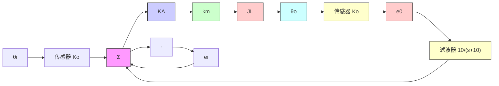

# 5.5节习题

5.36 考虑图 5.58 所示的位置伺服系统，其中： $e_{i}=K_{o}\theta_{i}$ ， $e_{o}=K_{pot}\theta_{0}$ ， $K_{o}=10V/rad$ ；T 为电动机转矩， $T=K_{t}i_{a}$ ； $k_{m}$ 为转矩常数， $k_{m}=K_{t}=0.1N\cdot m/A$ ； $K_{e}$ 为反电动势常数， $K_{e}=0.1V\cdot s$ ； $R_{a}$ 为电枢电阻， $R_{a}=10\Omega$ ；齿轮比 =1:1； $J_{L}+J_{m}=总惯量=10^{-3}kg\cdot m^{2}$ ； $v_{a}=K_{A}(e_{i}-e_{f})$ 。

(a) 放大器增益 $K_{A}$ 在什么范围内能使系统稳定？利用根轨迹图用图形方法找到 $K_{A}$ 的取值上限。  
(b) 确定 $\zeta=0.7$ 处的增益 $K_{A}$ ， $K_{A}$ 为该值时系统的三个闭环极点在何位置？

5.37 要设计一个控制速度的磁带驱动伺服系统。电流 $I(s)$ 到磁带速度 $\Omega(s)$ (mm/(ms·A)) 的传递函数：

$$\frac {\Omega (s)}{I (s)} = \frac {1 5 (s ^ {2} + 0 . 9 s + 0 . 8)}{(s + 1) (s ^ {2} + 1 . 1 s + 1)}$$

设计 1 型反馈系统使阶跃响应满足：

$$t _ {\mathrm{r}} < 4 \mathrm{ms}, \quad t _ {\mathrm{s}} \leqslant 1 5 \mathrm{ms}, \quad M _ {\mathrm{p}} \leqslant 0. 0 5$$

flowchart

图 5.58 位置伺服系统

(a) 应用积分补偿器 $K_{1}/s$ 获得 1 型系统行为，绘制以 $K_{1}$ 为参数的根轨迹。在同一绘图上标出满足性能指标时可行的极点配置区域。  
(b) 假定比例积分补偿的形式为 $k_{\mathrm{P}}(s+\alpha)/s$ ，选择最佳的 $k_{P}$ 和 $\alpha$ ，绘制所设计的根轨迹，求出 $k_{P}$ 和 $\alpha$ 值及速度常数值 $K_{v}$ ，在图上用点（·）表示闭环极点位置，标出可以接受的根的边界范围。

5.38 图 5.59 表示一个质量为 $m_{c}$ 的小车上有一个倒立摆，摆的质量为 $m_{p}$ 长度为 l，不计摩擦，标准化后的方程为

$$\ddot {\theta} - \theta = - v \tag {5.88}\ddot {y} + \beta \theta = v$$

text_image

θ
手推车
或电动车
y

图 5.59 习题 5.38 所描述的车摆图

其中 $\beta=\frac{3m_{p}}{4(m_{c}+m_{p})}$ 为质量比例系数，且 $0<\beta<0.75$ 。时间由 $\tau=\omega_{0}t$ 测得，其中 $\omega_{0}^{2}=\frac{3g(m_{c}+m_{p})}{l(4m_{c}+m_{p})}$ 。小车的位移以摆的长度 $y=\frac{3x}{4l}$ 为单位，输入力矩以系统重量 $v=\frac{u}{g(m_{c}+m_{p})}$ 为单位标准化后得到。这些方程可以用于计算传递函数：

$$\frac {\Theta}{V} = - \frac {1}{s ^ {2} - 1} \tag {5.89}\frac {Y}{V} = \frac {s ^ {2} - 1 + \beta}{s ^ {2} (s ^ {2} - 1)} \tag {5.90}$$

本题中，首先设计摆为被控对象的第一层
