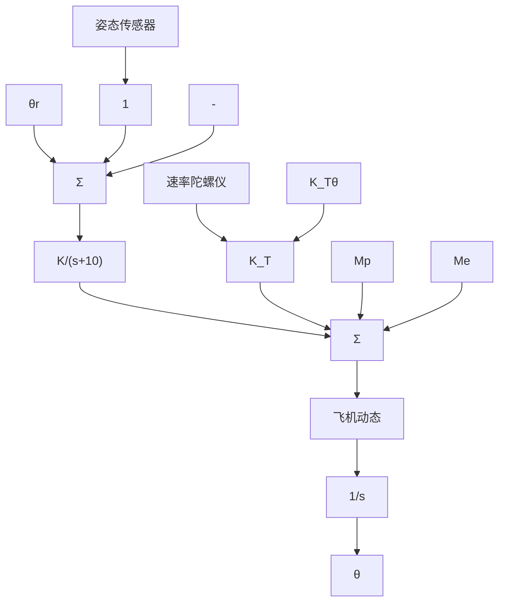
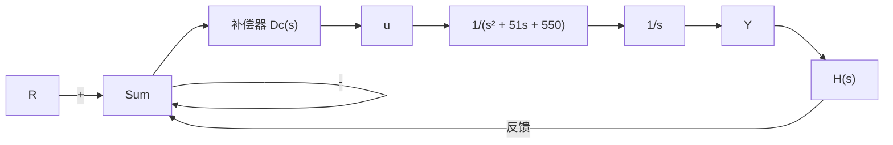

COAST GUARD
902
902
0' 10' 20' 30' 40' 50'

图 5.60 习题 5.39 的美国海岸警卫艇 Tampa(902)

flowchart

图 5.61 Golden Nugget 航空公司的自动驾驶仪

(b) 对于速度输出(测速计)反馈，令

$$H (s) = 1 + K _ {\mathrm{T}} s \text {和} D _ {\mathrm{c}} (s) = K$$

选择 $K_{T}$ 和 K 使主导根的位置与(a)问中相同。计算 $K_{v}$ 。若可以，请给出采用输出微分反馈时， $K_{v}$ 值减小的物理解释。

(c) 对于滞后网络，令

$$H (s) = 1 \text {和} D _ {\mathrm{c}} (s) = K \frac {s + 1}{s + p}$$

应用比例控制，在 $\zeta=0.4$ 时，能否有 $K_{v}=12$ ？选择 K 和 p，使主导根与比例控制的情况相同，不过对应的 $K_{v}=100$ 而不是 $K_{v}=12$ 。

flowchart

图 5.62 习题 5.41 的控制系统
