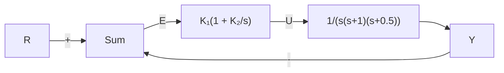
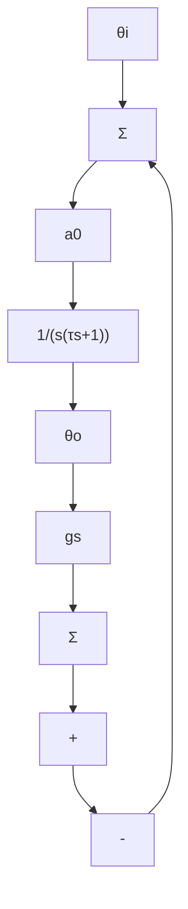

# 5.6节习题

5.42 绘制以下系统的 $0^{\circ}$ 根轨迹或负 K 根轨迹：

(a) 习题 5.3 给出的例子。  
(b) 习题 5.4 给出的例子。  
(c) 习题 5.5 给出的例子。  
(d) 习题 5.6 给出的例子。  
(e) 习题 5.7 给出的例子。  
(f) 习题 5.8 给出的例子。

5.43 假设给定被控对象传递函数为

$$L (s) = \frac {1}{s ^ {2} + (1 + \alpha) s + (1 + \alpha)}$$

其中 $\alpha$ 为变化的系统参数，应用正根轨迹法和负根轨迹法确定 $\alpha$ 怎样的变化才不会使系统失去稳定性？

△ 5.44 考虑图 5.63 所示系统。

(a) 应用劳斯判据确定 $K_{1}$ ， $K_{2}$ 平面上系统稳定的区域。  
(b) 应用 rltool 函数验证(a)的结果。


<details>
<summary>flowchart</summary>


</details>

图 5.63 习题 5.44 所描述的反馈系统

△ 5.45 图 5.64 所示的为位置伺服装置的框图。

(a) 当无转速反馈 $(K_{\mathrm{T}}=0)$ 时，绘制以K为参数的根轨迹。  
(b) 在(a)问所绘制的根轨迹上，求 K=16 时闭环系统的根的位置。对于这些根，

估计系统暂态响应指标 $t_{r}$ 、 $M_{p}$ 和 $t_{s}$ 的值，将你的估计与用 Matlab 中阶跃响应命令得到的结果对比。

(c) K=16 时，绘制以 $K_{T}$ 为参数的根轨迹。  
(d) K=16，求 $K_{T}$ 使 $M_{P}=0.05(\zeta=0.707)$ ，并估计 $t_{r}$ 和 $t_{s}$ 的值。将估计值和用 Matlab 获得的 $t_{r}$ 和 $t_{s}$ 的实际值比较。  
(e) 对(d)问中的 K 和 $K_{T}$ 值，求系统的速度误差常数 $K_{v}$ 。


<details>
<summary>flowchart</summary>

```mermaid
graph LR
    R -->|+| Sum1["Σ"]
    Sum1 --> K
    K -->|+| Sum2["Σ"]
    Sum2 --> |1/(s+2)| A
    A --> |1/s| Y
    Y -->|-| Sum1
    Sum2 -->|-| Sum2
    Sum2 --> K_T
```
</details>

图 5.64 习题 5.45 所描述的控制系统

△ 5.46 考虑图 5.65 所示的机械系统，其中 g 和 $a_{0}$ 为增益。包含 gs 的反馈环节相当于速率反馈。对给定的 $a_{0}$ 值，调节 g 相当于使 s 平面中的零点位置发生变化。


<details>
<summary>flowchart</summary>


</details>

图 5.65 习题 5.46 描述的控制系统

(a) 若 g=0 且 $\tau=1$ ，找出使极点为复数的 $a_{0}$ 。  
(b) 令 $a_{0}$ 为上述所求值，绘制以 g 为参数的根轨迹。

△5.47 用 Padé(1, 1) 近似和一阶滞后近似绘制图 5.66 所示系统关于参数 K 的根轨迹。对于这两种近似，系统不稳定时 K 的范围是多少？（注释：回答此问题的材料包含在 www.fpe7e.com 上的附录 W5.6.3）


<details>
<summary>flowchart</summary>

```mermaid
graph LR
    R -->|+| Sum
    Sum --> K
    K --> e^(-s)
    e^(-s) --> |1/(s+0.01)| Output
    Output --> Y
    Y -->|-| Sum
```
</details>

图 5.66 习题 5.47 描述的控制系统

△ 5.48 若不消去极点，证明被控对象 $G(s)=1/s^{3}$ 不可能是无条件稳定系统。  
△ 5.49 对于方程 $1 + KG(s)$ ，其中

$$G (s) = \frac {1}{s (s + p) [ (s + 1) ^ {2} + 4 ]}$$

用 Matlab 分析以 K 为参数，p 从 1 到 10 变化的根轨迹，注意，一定要包含 p=2 的情况。
