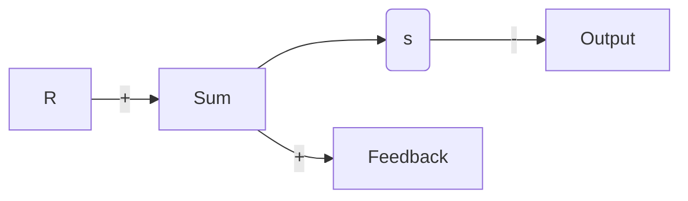

就系统的频率响应而言，对于系统性能的一个自然的指标就是带宽，它被定义为，在系统的输出以一种令人满意的方式跟踪一个正弦输入的前提下，输入信号所能达到的最大频率。按照惯例，对于图6.4所示的带有正弦输入 $r$ 的系统，带宽就是输入 $r$ 的某一频率，在该频率处，输出 $y$ 减小到输入的 $0.707^{\ominus}$ 。图6.5对于闭环传递函数

flowchart

图 6.4 简化系统的示意图

$$\frac {Y (s)}{R (s)} \stackrel {\mathrm{def}} {=} T (s) = \frac {K G (s)}{1 + K G (s)}$$

的频率响应形象地描绘了这个想法。此图是绝大多数闭环系统的典型情况：（1）在较低的激励频率处，输出跟随输入 $(|T|\approx1)$ ；（2）在较高的激励频率处，输出停止跟随输入$(|T|<1)$ 。频率响应的幅值的最大值称为谐振峰值 $M_{r}$ 。

line

| ω (rad/s) | 幅值比 T(s) | 幅值(dB) |
| --- | --- | --- |
| 谐振峰值 M_r | 1.0 | 0 |
| 带宽 ω_BW | 0.7 | -3 |
| 高度幅值 | 0.1 | -20 |

图 6.5 带宽和谐振峰值的定义

带宽是响应速度的一个度量，因此类似于时域度量，例如，上升时间和峰值时间，或作为 $s$ 平面上的度量的主导特征根的自然频率。事实上，如果图6.4中的 $KG(s)$ 满足其闭环响应是由图6.3给出的，我们可以看出，带宽将等于闭环特征根的自然频率（即对于一个闭环阻尼比 $\zeta = 0.7$ ， $\omega_{\mathrm{BW}} = \omega_{\mathrm{n}}$ 。对于其他阻尼比，带宽也近似等于闭环特征根的自然频率，误差一般小于2倍。

这里所述的带宽定义，对于具有低通滤波行为的系统是有意义的，这对于任何的物理控制系统都是一种可能情况。在其他应用中，带宽可能有不同的定义。另外，如果系统的理想模型不具有高频衰减（即如果其具有相同的零点和极点数目），其带宽是无穷大的，然而这不会出现在自然界中，因为没有系统能在无穷大频率处进行良好的响应。

在许多的情况中，设计者主要考虑的是由扰动引起的误差，而不是由跟踪输入的能力引起的误差。对于误差分析，我们对4.1节中定义的灵敏度函数之一的 $S(s)$ ，更感兴趣，而不是对 $T(s)$ 更感兴趣。对于大多数在低频处具有高增益的开环系统，在一个扰动输入下， $S(s)$ 在低频处将具有很低的值，并且当输入或者扰动的频率接近带宽时，该值增加。对于 $T(s)$ 或者 $S(s)$ 的分析，典型方法就是，绘制它们的响应对于输入频率的图像。用于控制系统设计的频率响应，要么可以利用计算机来计算，要么可以对于简单的系统利用下面6.1.1小节中所描述的有效方法进行快速绘制。下面描述的这种方法对于加快设计过程与在计算机输出上进行合理性检验也是有用的。
