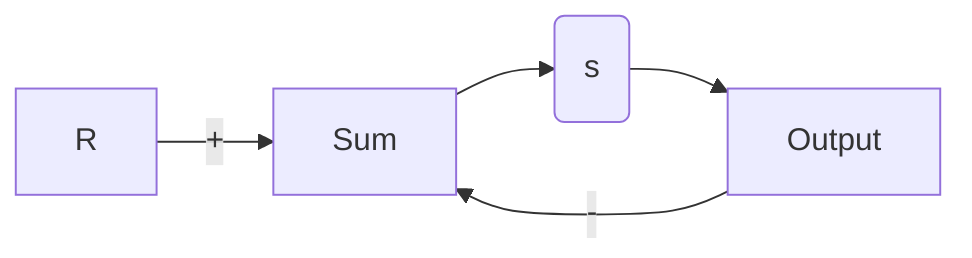

# 6.3.2 辐角原理在控制设计中的应用

将辐角原理应用到控制设计中，我们令 s 平面中的闭合曲线 $C_{1}$ 包围整个右半平面，这样一个位于 s 平面中该区域的极点就会导致系统不稳定（见图 6.17）。仅当 $H(s)$ 在右半平面有一个极点或零点时， $H(s)$ 的计算结果才会包围原点。

如前所述，所有闭合曲线的行为都是有用的，这是由于开环 $KG(s)$ 的闭合曲线赋值可以用于判断闭环系统的稳定性。特别地，对于图 6.18 所示的系统，其闭环传递函数为

$$\frac {Y (s)}{R (s)} = \mathcal {T} (s) = \frac {K G (s)}{1 + K G (s)}$$

因此，闭环特征根就是方程

$$1 + K G (s) = 0$$

text_image

Im(s)
无穷远处的
闭合曲线
C₁
Re(s)
C₁

图 6.17 一个包围整个右半平面的闭合曲线 $C_{1}$ 的 s 平面图

flowchart

图 6.18 $Y(s)/R(s)=KG(s)/[1+KG(s)]$ 的框图

的解且我们对函数 $1 + KG(s)$ 应用辐角原理。若使 $s$ 平面上包围整个右半平面的闭合赋值曲线包含 $1 + KG(s)$ 的一个零点或极点，那么计算出的 $1 + KG(s)$ 的闭合曲线就会包围原点。注意， $1 + KG(s)$ 就是将 $KG(s)$ 简单地向右移动一个单位，如图6.19所示。所以，如果 $1 + KG(s)$ 的图包围原点，则 $KG(s)$ 的图包围实轴上的-1点。因此，我们可以画出开环 $KG(s)$ 的闭合曲线，检查其包围-1点的周数，从而得出关于闭环传递函数 $1 + KG(s)$ 包围原点周数。用这种方法描绘 $KG(s)$ 的值，通常称为奈奎斯特图或极坐标图，这是因为我们画的是 $KG(s)$ 的幅值相对于它的角度的图。

text_image

[KG(s)]_s=C_1
Im
-1 0 Re

text_image

[1+KG(s)]_s=C_1
Im
Re

图 6.19 $KG(s)$ 和 $1+KG(s)$ 的奈奎斯特图

为了判断曲线对于原点的包围是由零点还是极点引起的，我们将 $1 + KG(s)$ 写成关于 $KG(s)$ 的零极点形式，即

$$1 + K G (s) = 1 + K \frac {b (s)}{a (s)} = \frac {a (s) + K b (s)}{a (s)} \tag {6.27}$$

式(6.27)表明， $1+KG(s)$ 的极点也是 $G(s)$ 的极点。有理由假设 $G(s)$ 的极点（或 $a(s)$ 的因子）是已知的，并以此求得它在右半平面的极点分布。现在假设 $G(s)$ 在右半平面没有极点，那么 $KG(s)$ 包围-1点一周就说明 $1+KG(s)$ 在右半平面有一个零点，因此也存在一个不稳定的闭环系统的特征根。

注意到顺时针方向的闭合曲线 $C_1$ 包围了 $1 + KG(s)$ 的一个零点——也就是如果一个闭环系统的特征根——从而导致 $KG(s)$ 顺时针包围-1点，这样我们就可以推广上述想法。同样的，如果 $C_1$ 包围了 $1 + KG(s)$ 的一个极点——也就是如果系统有一个不稳定的开环极点——那么 $KG(s)$ 就会逆时针包围-1点一周。此外，如果 $1 + KG(s)$ 有两个极点或零点在右半平面，那么 $KG(s)$ 就会包围-1点两次，等等。顺时针包围的周数 $N$ ，等于其位于右半平面的零点（闭环系统特征根）的个数 $Z$ ，减去位于右半平面的开环极点个数 $P$ ，即

$$N = Z - P$$

这就是奈奎斯特稳定判据的核心思想。
