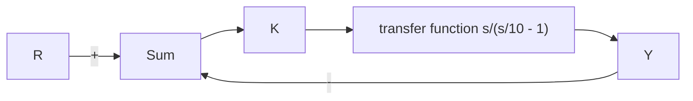

# 例6.10 开环不稳定系统的奈奎斯特图

第三个例子是定义在图 6.28 中的。利用奈奎斯特判据判断它的稳定性。

解答。这个系统当 K>1 时的根轨迹画在图 6.29 中。因为开环系统在右半平面有一个极点，所以它是不稳定的。开环伯德图如图 6.30 所示。注意 $\left|KG(j\omega)\right|$ 的表现行为与极

flowchart

图 6.28 例 6.10 的控制系统

点处于左半平面时的相同。然而， $\angle G(\mathrm{j}\omega)$ 增加 $90^{\circ}$ 而不是像通常那样在极点处减小。任何带有右半平面极点的系统都是不稳定的；因此通过实验的方法来确定它的频率响应是很困难的，这是因为对于正弦输入，系统从来不会达到一个稳态正弦响应。然而根据6.1节的规则来计算传递函数的幅值和相位是可行的。因为式(6.28)中的 $P$ 为 $+1$ ，所以右半平

面的极点影响了奈奎斯特包围判据。

text_image

Im(s)
4
2
-2
-2
-4
-8 -6 -4 2 4 6 8 10 Re(s)

图 6.29 $G(s)=(s+1)/s[(s/10-1)]$ 的根轨迹

line

| ω/(rad/s) | 幅值, G | 幅值, dB |
| --- | --- | --- |
| 0.1 | 10 | 20 |
| 1 | 1 | 0 |
| 10 | 0.1 | -20 |
| 100 | 0.01 | -20 |

a)

line

| ω (rad/s) | 相位, ∠G |
| --- | --- |
| 0.1 | 90° |
| 1 | 140° |
| 10 | 220° |
| 100 | 270° |

b)   
图6.30 $G(s) = (s + 1) / s[(s / 10 - 1)]$ 的伯德图

像前几个例子那样，我们将图6.30所示的频率响应信息转化到图6.31a所示的奈奎斯特图中。和之前一样，图6.31b中 $C_1$ 绕过 $s = 0$ 的极点，这在图6.31a中的无穷远处产生了一个大圆弧。这个圆弧穿越负实轴，这是由于右半平面极点导致了 $180^{\circ}$ 的相位改变，如图6.31b所示。

text_image

C
ω>0
ω=±√10
B -1/Ks -1 Re[G(s)]
-1/K1 ω=+∞
ω<0
A
由ω≈0产生的
位于+∞处的圆弧
Im[G(s)]

a） $\mathrm{G}(\mathrm{s}) = (\mathrm{s} + 1) / [\mathrm{s}(\mathrm{s}/10 - 1)]$ 的奈奎斯特图 $^{-}$

text_image

Im(s)
C₁
C
~180°
B
A
Re(s)

b）闭合曲线 $C_{1}$   
图6.31 例6.10

实轴穿越出现在 $|G(s)| = 1$ 处，这是因为在伯德图中，当 $\angle G(s) = 180^{\circ}$ 时， $|G(s)| = 1$ ，这发生于 $\omega \approx 3\mathrm{rad / s}$ 处。
