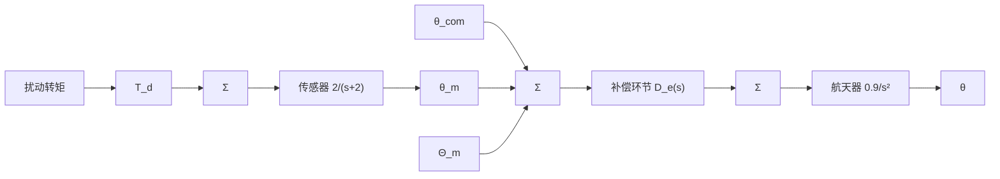

# 例 6.20 PID 补偿用于航天器的姿态控制

在 6.5 节，曾对简化的航天器姿态控制系统进行过设计。本例中需考虑真实情况下的系统，考虑到系统中存在干扰转矩和传感器滞后作用，系统的框图如图 6.67 所示。

  
图6.66 $T_{\mathrm{I}} / T_{\mathrm{D}} = 20$ 的PID补偿的频率响应

flowchart

图 6.67 例 6.20 中航天器 PID 控制设计的系统框图

（1）请设计 PID 控制器，消除干扰转矩的稳态误差，要求系统的相位裕度为 $65^{\circ}$ ，同时系统的带宽要尽可能高。

(2) 画出系统的阶跃响应曲线和阶跃扰动响应曲线。

(3) 画出闭环频率响应, $\frac{\Theta}{\Theta_{com}}$ , 和灵敏度函数 S。

(4) 确定系统的 $\omega_{BW}$ 和 $\omega_{DRB}$ 。

(5) 由于来自太阳能压力的扰动转矩和轨道速率 ( $\omega=0.001rad/s$ 或者周期约为 100min) 是相等的正弦信号。讨论该控制器对于减弱太阳能压力影响的作用。

解答。首先，考虑稳态误差。航天器要有稳定的姿态，总的输入转矩 $T_{\mathrm{d}} + T_{\mathrm{c}}$ 必须为零。因此，如果 $T_{\mathrm{d}} \neq 0$ ，则 $T_{\mathrm{c}} = -T_{\mathrm{d}}$ 。唯一可实现的消除误差（即 $e = 0$ ）的方法是 $D(s)$ 中包含有积分项。因此含有积分控制的补偿环节才可以满足稳态误差的要求。这在数学上可通过终值定理来验证（见习题6.47）。

航天器和传感器的传递函数为

$$G (s) = \frac {0 . 9}{s ^ {2}}, H (s) = \left(\frac {2}{s + 2}\right) \tag {6.49}$$

其频率响应曲线如图 6.68 所示，由图中曲线斜率为 -2（-40dB/10 倍频）和 -3（-60dB/10 倍频）可知，如果没有微分环节，无论 K 取任何值，系统都是不稳定的。显然，这是因为伯德图的幅相关系，即斜率为 -2 和 -3 时，相位分别为 $-180^{\circ}$ 和 $-270^{\circ}$ ，相位裕度分别为 $0^{\circ}$ 和 $-90^{\circ}$ 。因此，如 6.5 节介绍过的，需要加入微分控制，使幅频曲线在穿越频率处的斜率为 -1，进而使系统稳定。现在的任务是确定式 (6.48) 中的三个参数 K、 $T_{D}$ 和 $T_{I}$ ，以满足系统性能指标。

  
图 6.68 例 6.20 中的 PID 补偿

最简单的方法就是首先考虑相位裕度，在较高的频率点上，使系统的相位裕度为 $65^{\circ}$ 。这主要通过调整 $T_{\mathrm{D}}$ 来实现，在 $T_{\mathrm{I}}$ 远大于 $T_{\mathrm{D}}$ 的情况下， $T_{\mathrm{I}}$ 对相位的影响是很小的。在相位调整好后，就可以根据穿越频率很容易地确定增益 $K$ 。
