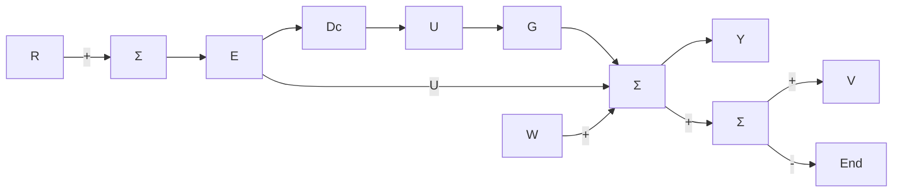

# △6.7.7 用灵敏度函数描述性能指标

已经知道，幅值裕度和相位裕度不但包含了关于系统的相对稳定性的有用信息，而且还可作为超前补偿和滞后补偿的设计策略。然而，在实际的系统设计中，仅有GM和PM两个性能指标指导设计是不够的。如果可以先给出一些外部信号的频率描述，诸如参考输入信号和干扰信号，同时考虑到4.1节所定义的灵敏度函数，则可以在频域上给出更为完整的设计指标。例如，到目前为止，我们还只是通过系统对简单的阶跃和斜坡输入信号的暂态响应来描述系统的动态性能。对于实际中输入复杂信号，更为精确的描述是将它们看成具有一定功率谱密度的随机过程。为了简化分析，而又不失准确性，可认为这些信号是由某特定频率的正弦信号合成的。例如，通常在频域上这样描述参考输入信号：它是一组具有不同频率的正弦信号的和，而各种频率的正弦信号的幅值，是由图6.73所描述的幅值方程 $|R|$ 所决定的。也就是说，由正弦信号分量组成的信号，一直到某个频率 $\omega_{1}$ ，各分量都有相同的幅值。而在大于 $\omega_{1}$ 的频率范围内，因为幅值极小所以可忽略。于是可以这样来描述系统响应的性能指标：对于任意频率 $\omega_{0}$ ，满足 $0\leqslant\omega_{0}\leqslant\omega_{1}$ ，幅值为 $|R(j\omega_{0})|$ 的正弦信号，系统误差的幅值应小于 $e_{b}$ （比如0.01）。为了表示设计中使用的性能要求，重新考虑一下图6.74所描述的单位反馈系统。对于这样的系统，其误差是由下式决定的：

$$E (\mathrm{j} \omega) = \frac {1}{1 + D _ {\mathrm{c}} G} R \stackrel {\mathrm{def}} {=} S (\mathrm{j} \omega) R \tag {6.50}$$

  
图 6.73 典型参考输入信号的频谱

其中：就是前面提到的灵敏度函数。

$$\mathcal {S} \stackrel {\mathrm{def}} {=} \frac {1}{1 + D _ {\mathrm{c}} G} \tag {6.51}$$

作为系统误差的乘数因子，灵敏度函数也正是 DG 在奈奎斯特图上的曲线与临界点 -1 的距离倒数。因此，S 的取值越大，表示奈奎斯特图越接近不稳定点。根据式(6.50)，频域内的误差指标可表示为$|E|=|S||R|\leqslant e_{b}$ 。为了使问题规范化，不必每次都定义频率R和误差限度 $e_{b}$ ，通过定义频率 $\omega$ 的实数方程 $W_{1}(\omega)=|R|/e_{b}$ ，那么式(6.50)就可以写成

flowchart

图6.74 闭环系统的框图

$$\mid \mathcal {S} \mid W _ {1} \leqslant 1 \tag {6.52}$$
