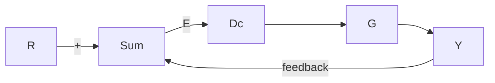

# 小结

\- 伯德图是传递函数中以对数刻度的幅值、以线性刻度的相位分别对于以对数刻度的频率而绘制的曲线。传递函数的幅值和相位分别为

$$
\begin{array}{l} M = | G (\mathrm{j} \omega) | = | G (s) | _ {s = \mathrm{j} \omega} \\ = \sqrt {\left\{\operatorname{Re} [ G (\mathrm{j} w) ] \right\} ^ {2} + \left\{\operatorname{Im} [ G (\mathrm{j} w) ] \right\} ^ {2}} \\ \phi = \arctan \left[ \frac {\operatorname{Im} [ G (\mathrm{j} w) ]}{\operatorname{Re} [ G (\mathrm{j} w) ]} \right] = \angle G (\mathrm{j} \omega) \\ \end{array}
$$

\- 将传递函数写成伯德形式为

$$K G (\omega) = K _ {0} (\mathrm{j} \omega) ^ {n} \frac {(\mathrm{j} \omega \tau_ {1} + 1) (\mathrm{j} \omega \tau_ {2} + 1) \cdots}{(\mathrm{j} \omega \tau_ {\mathrm{a}} + 1) (\mathrm{j} \omega \tau_ {\mathrm{b}} + 1) \cdots}$$

根据 6.11 节所介绍的规则，可以很简单地手工绘制伯德图。

\- 虽然伯德图可以通过计算机法（如 Matlab 的 bode 函数）来绘制，但是手工绘制的技巧仍然非常重要。

\- 对于二阶系统，伯德图中幅值的峰值与比的阻尼比有如下关系：

$$\left| G (\mathrm{j} \omega) \right| = \frac {1}{2 \zeta}, \quad \omega = \omega_ {\mathrm{n}}$$

\- 奈奎斯特稳定判据是根据系统的开环传递函数频率响应特性来确定闭环系统稳定性的方法，奈奎斯特图的绘制规则见6.3节。系统在右半平面的闭环极点的个数 $Z$ ，可由下式求得：

$$Z = N + P$$

其中：N 为奈奎斯特图顺时针 -1 点的包围圈数；P 为右半平面上开环极点的个数。

对于一个稳定的闭环系统，z 必须为 0，因此 N = -P。

\- 奈奎斯特图可以通过计算机进行绘制(如 Matlab 中的 nyquist 函数)。

\- 通过观察开环传递函数的伯德图或奈奎斯特图可以直接得到幅值裕度(GM)和相位裕度(PM)。也可以通过Matlab中的margin函数求得。

\- 对于标准的二阶系统，由式(6.32)可知，相位裕度和系统的闭环阻尼比有如下关系：

$$\zeta \approx \frac {\mathrm{PM}}{1 0 0}$$

● 带宽是系统响应速度的一个量度。在控制系统中，带宽的定义为：在闭环系统的对数幅频特性曲线上，幅值为 0.707（-3dB）所对应的频率值。它可由系统的穿越频率近似表示 $\omega_{c}$ 。穿越频率就是开环增益曲线穿过幅值为 1 的曲线时

对应的频率。

\- 矢量裕度是表征系统稳定裕度的单参数性能指标。它由奈奎斯特图上距临界点 $-1 / K$ 最近的点决定。

\- 对于稳定的最小相位系统，伯德图的幅相关系描述了系统的增益和相位的唯一对应关系。这一关系可近似表示为

$$\angle G (\mathrm{j} \omega) \approx n \times 9 0 ^ {\circ}$$

其中：n 是 $\left|G(j\omega)\right|$ 的斜率。它表示每 10 倍频上幅值变化了多少个 10 倍量。这种关系表明，在大多数情况下，增益曲线以 -1 的斜率穿越幅值为 1 的曲线就可以保证闭环系统的稳定性。

\- 在不知道闭环控制系统解析模型的情况下，开环系统的频率响应实验数据可直接用于闭环控制系统的分析和设计。

\- 对于图6.84所描述的系统，它的开环传递函数的伯德图可由频率响应 $GD_{\mathrm{c}}$ 得到，而闭环频率响应特性可由 $\mathcal{T}(s) = GD_{\mathrm{c}} / (1 + GD)$ 得到。

flowchart

图 6.84 典型系统

\- 本章讨论了几种补偿环节的频率特性，并给出了利用这些特性进行设计的例子。在6.7节中已经给出超前补偿和滞后补偿的步骤。通过本节的例子可以看到，基于频率响应的设计方法，我们能够更方便地确定设计参数，得到设计结果。在6.7.5小节的最后对各种补偿环节进行归纳总结。

\- 超前补偿，传递函数由式(6.38)给出：

$$D _ {\mathrm{c}} (s) = \frac {T _ {\mathrm{D}} s + 1}{\alpha T _ {\mathrm{D}} s + 1}, \quad \alpha < 1 \tag {6.72}$$

超前补偿环节可以看做是高通滤波器，其控制规律和 PD 控制相似。只要想稳定提高系统阻尼比，就可采用超前补偿。若系统的低频增益是一定的，超前补偿环节就可以提高系统的响应速度。

\- 滞后补偿，传递函数由式(6.47)给出：

$$D _ {\mathrm{c}} (s) = \alpha \frac {T _ {\mathrm{I}} s + 1}{\alpha T _ {\mathrm{I}} s + 1}, \quad \alpha > 1 \tag {6.73}$$

滞后补偿环节可看做是低通滤波器，其控制规律和 PI 控制相似。它可提高低频段的增益，在带宽一定的情况下可改善系统的稳态响应。如果系统的低频增益是一定的，那么它就会减小系统的响应速度。

\- PID 补偿可以看做是超前和滞后补偿的组合。

\- 减小跟踪误差，干扰抑制的性能指标，由伯德
