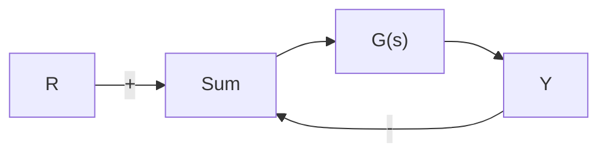

# 6.4节习题

6.24 一些实际控制系统的奈奎斯特图类似于图6.88所示的奈奎斯特图。其中， $\alpha = 0.4$ ， $\beta = 1.3$ ， $\phi = 40^{\circ}$ 。那么，图6.88所示系统的增益和相位裕度各是多少？当增益由0增大到一个很大的值时，系统的稳定性有何变化？也请绘制此系统对应的伯德图。


<details>
<summary>text_image</summary>

Im[G(s)]
β
α
-1
ωL
φ
ωH
ω*
1 Re[G(s)]
</details>

图 6.88 习题 6.24 的奈奎斯特图

6.25 系统为

$$G (s) = \frac {1 0 0 [ (s / 1 0) + 1 ]}{s [ (s / 1) - 1 ] [ (s / 1 0 0) + 1 ]}$$

的伯德图如图 6.89 所示。

(a) 为何在低频段的相位由 $-270^{\circ}$ 开始?

(b) 绘制 $G(s)$ 的奈奎斯特图。

(c) 图 6.89 所示的闭环系统是否稳定？

  
图6.89 习题6.25的伯德图

(d) 如果将增益减小到原来的 1/100，那么系统是否稳定？绘制系统的根轨迹概略图，并定性地验证你的答案。

6.26 如图 6.90 所示系统，其中 $G(s)$ 为

$$G (s) = \frac {2 5 (s + 1)}{s (s + 2) (s ^ {2} + 2 s + 1 6)}$$

使用 Matlab 中的 margin 命令，基于系统伯德图计算 $G(s)$ 的 PM 和 GM，然后判断哪个裕度为此系统的控制设计提供更有用的信息。


<details>
<summary>flowchart</summary>


</details>

图 6.90 习题 6.26 的控制系统

6.27 考虑图 6.91 给出的系统。


<details>
<summary>flowchart</summary>

```mermaid
graph TD
    R -->|+| Sum
    Sum --> K
    K --> |1/(s-1)| Sum
    Sum -->|-| Feedback
    Feedback --> |s+2/(s+1)²+1| Sum
    Sum --> O["Y"]
```
</details>

图 6.91 习题 6.27 的控制系统

(a) 令 K=1，用 Matlab 画出系统的伯德图，然后由图确定系统稳定时 K 的取值范围。

(b) 使用 marign 命令来确定使系统稳定的

K 的值，并对所选的 K 确定 PM 的值。

(c) 用 rlocus 命令确定系统处于稳定边界时的 K 值。

(d) 画出系统的奈奎斯特图，由此判断在 K 的取值使系统不稳定时，系统不稳定的特征根的数目。

(e) 根据劳斯判据，确定此系统闭环稳定时 K 的取值范围。

6.28 设图 6.90 所示的 $G(s)$ 有如下形式：

$$G (s) = \frac {3 . 2 (s + 1)}{s (s + 2) (s ^ {2} + 0 . 2 s + 1 6)}$$

使用 Matlab 中的 margin 命令计算 $G(s)$ 的 PM 和 GM，并讨论该系统的闭环特征根的阻尼比是否合适？

6.29 对于给定的某个系统，判断齐格勒—尼科尔斯方法中的极限周期和对应的极限增益如何由下列图像确定：

(a) 奈奎斯特图；

(b) 伯德图；

(c) 根轨迹。

6.30 如果系统的开环传递函数为

$$G (s) = \frac {\omega_ {\mathrm{n}} ^ {2}}{s (s + 2 \zeta \omega_ {\mathrm{n}})}$$

若采用单位反馈，闭环传递函数由下式给出：

$$T (s) = \frac {\omega_ {\mathrm{n}} ^ {2}}{s ^ {2} + 2 \zeta \omega_ {\mathrm{n}} s + \omega_ {\mathrm{n}} ^ {2}}$$

当时，确定图 6.36 所示的 PM。

6.31 考虑某单位反馈系统，其开环传递函数为

$$G (s) = \frac {K}{s (s + 1) [ (s ^ {2} / 2 5) + 0 . 4 (s / 5) + 1 ]}$$

(a) 令 K=1，使用 Matlab 画出 $G(j\omega)$ 的伯德图。

(b) 若相位裕度 PM 为 $45^{\circ}$ ，K 如何取值，此时的 GM 为多少？

(c) 当 K 的取值可以使 $PM=45^{\circ}$ 时， $K_{v}$ 的取值为多少？

(d) 画出系统关于 K 的根轨迹，当 PM 为 $45^{\circ}$ 时，确定闭环特征根的位置。
