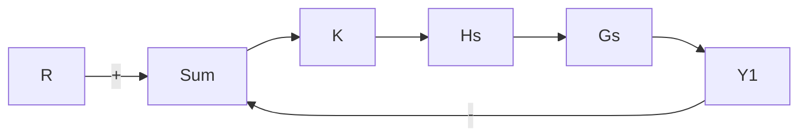
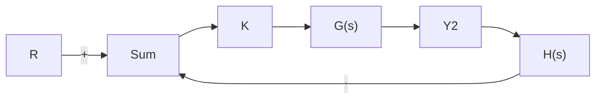
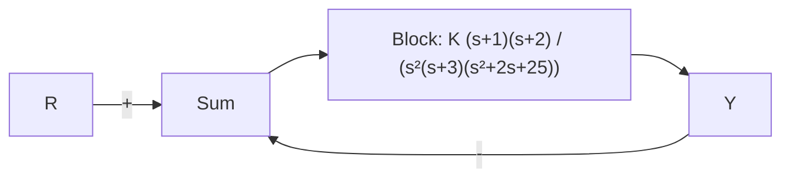
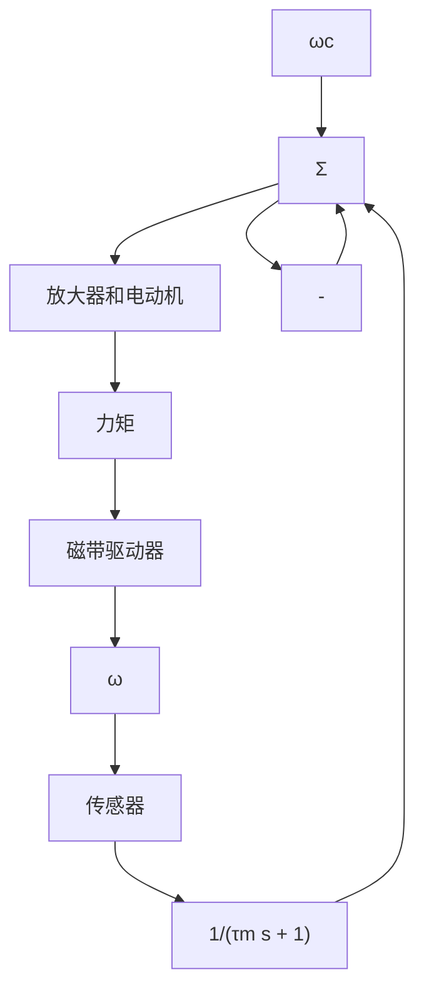

6.32 对于图 6.92a 描述的系统，其传递函数为

$$G (s) = \frac {1}{(s + 2) ^ {2} (s + 4)}, H (s) = \frac {1}{s + 1}$$

(a) 用 rlocus 和 rlocfind 命令确定使系统达到稳定边界的 K 值。

(b) 用 rlocus 和 rlocfind 命令确定 K 值，使闭环极特征根的阻尼比 $\zeta=0.707$ 。

(c) 当 K 取 (b) 问中所确定的值时，系统的 GM 是多少？分析这个问题时，不要利用任何频率响应方法。

(d) 绘制系统的伯德图，当 $PM = 65^{\circ}$ 时，确定 GM 的值。此时所期望的阻尼比 $\zeta$

是多少？

(e) 画出图 6.92b 所示系统的根轨迹图，它和 (a) 问中根轨迹有何不同？

(f) 对于图 6.92a 和图 6.92b 描述的两个系统，它们的传递函数 $Y_{2}(s)/R(s)$ 和 $Y_{1}(s)/R(s)$ 有何不同？是否期望二者对于阶跃输入 $r(t)$ 的响应会有所不同？


<details>
<summary>flowchart</summary>


</details>

a) 单位反馈


<details>
<summary>flowchart</summary>


</details>

b) $H(s)$ 反馈  
图6.92 习题6.32的框图

6.33 对于图 6.93 所示的系统，用伯德图和根轨迹图来确定系统刚好达到不稳定时的增益与频率。增益为多少可使 PM 为 $20^{\circ}$ ? 当 $PM=20^{\circ}$ 时，GM 为多少?


<details>
<summary>flowchart</summary>


</details>

图 6.93 习题 6.33 的控制系统

6.34 磁带驱动速度控制系统如图 6.94 所示。由于速度传感器的响应较慢，所以应考虑其动态特性。速度测量的时间常数 $\tau_{m}=0.5s$ ；绕带时间常数 $\tau_{r}=J/b=4s$ ，其中 b= 输出轴阻尼比 $=1N\cdot m\cdot s$ ；电动机时间常数 $\tau_{1}=1s$ 。


<details>
<summary>flowchart</summary>


</details>

图 6.94 磁带速度控制系统

(a) 确定增益 K，使系统跟踪参考输入的速度稳态误差小于 7%。

(b) 确定系统的增益裕度和相位裕度。你认为这是个良好的系统设计吗？

6.35 对于图 6.95 中的系统，绘制奈奎斯特图，

并根据奈奎斯特判据回答下列问题：


<details>
<summary>flowchart</summary>

```mermaid
graph TD
    R -->|+| Sum
    Sum --> E --> K --> F --> |3/(s(s+1)(s+3))| Y
    Y -->|Ŷ| Sum
    Sum -->|-| Sum
    Sum -->|1| 传感器
```
</details>

图 6.95 习题 6.35、6.69 和 6.70 的控制系统

(a) 确定 K 的范围(正和负)，保证系统是稳定的。

(b) 当 K 的取值使系统不稳定时，确定系统在右半平面特征根的数目。画出根轨迹概略图来验证你的答案。
