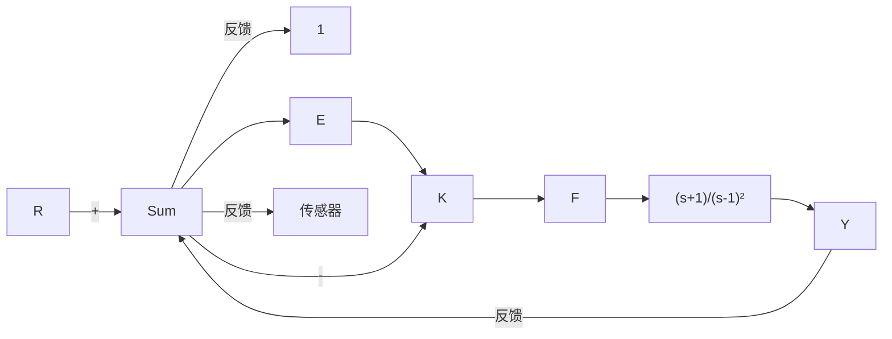
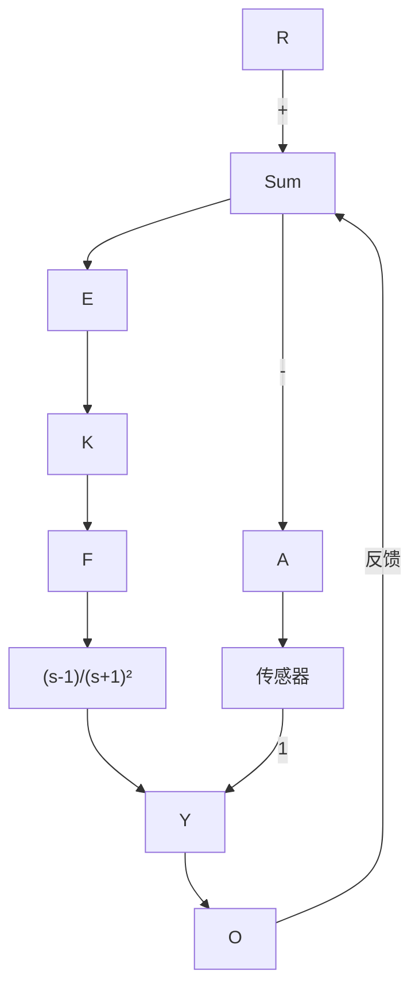

6.36 对于图 6.96 所示的系统，绘制奈奎斯特图，根据奈奎斯特判据回答下列问题：

(a) 确定 K 的范围(正和负)，保证系统是稳定的；

(b) 当 K 的取值使系统不稳定时，确定系统在右半平面特征根数目。画出根轨迹的概略图来验证你的答案。

flowchart

图 6.96 习题 6.36 的控制系统

6.37 对于图 6.97 所示的系统，绘制奈奎斯特图，根据奈奎斯特判据回答下列问题：

flowchart

图 6.97 习题 6.37 的控制系统

(a) 确定 K 的范围(正和负)，保证系统是稳定的。

(b) 当 K 的取值使系统不稳定时，确定系统在右半平面特征根数目。画出根轨迹概略图来验证你的答案。

6.38 有两个稳定的开环系统，其奈奎斯特图如图 6.98 所示。 $K_{0}$ 是指定的可操作的系统开环增益，箭头方向是频率增加方向。请对两个闭环系统（单位反馈）的下列每个指标做出大致估计：

(a) 相位裕度；

(b) 阻尼比；

(c) 系统稳定时的增益取值范围(如果存在);

(d) 系统类型(0, 1 或 2)。

text_image

Im[G(s)]
Re[G(s)]
-1/K₀
a)

text_image

- \frac{1}{K_0}
\text{Im}[G(s)]
\text{Re}[G(s)]
b)

图 6.98 习题 6.38 的奈奎斯特图

6.39 某船舶驾驶系统的动态模型可由下面的传递函数表示：

$$\frac {V (s)}{\delta_ {\mathrm{r}} (s)} = G (s) = \frac {K [ - (s / 0 . 1 4 2) + 1 ]}{s (s / 0 . 3 2 5 + 1) (s / 0 . 0 3 6 2 + 1)}$$

其中：V 是船舶的侧向速度，单位是 m/s， $\delta_{r}$ 是方向舵的旋转角度，单位是 rad。

(a) 对于 K=0.2，用 Matlab 的 bode 命令绘制的对数幅值与相位。

(b) 在所画的图中，标出穿越频率、PM 和 GM。

(c) 当 K=0.2 时，该系统是否稳定？

(d) 确定 K 值，使系统的相位裕度 $PM = 30^{\circ}$ ，此时的穿越频率为多少？

6.40 对于开环系统：

$$K G (s) = \frac {K (s + 1)}{s ^ {2} (s + 1 0) ^ {2}}$$

确定系统处于稳定边界时的 K 值，以及 $PM=30^{\circ}$ 时的 K 值。
