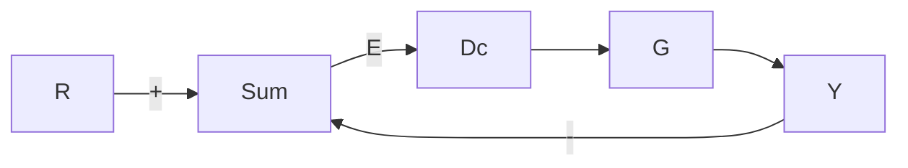

# 6.5节习题

6.41 一个在单位反馈配置下的控制对象的频率响应如图 6.99 所示。假设对象是开环稳定的且是最小相位的。

(a) 图中所画的速度误差常数 $K_{v}$ 是多少?

(b) $\omega=100$ 处的复极点的阻尼比是多少?

(c) 跟踪一个 $\omega=3rad/s$ 的正弦输入时，系统的误差大约是多少？

(d) 图中所画的 PM 是多少(误差为 $\pm10^{\circ}$ 以内)?

  
图 6.99 习题 6.41 的幅值频率响应

6.42 对于系统

$$G (s) = \frac {1 0 0 (s / a + 1)}{s (s + 1) (s / b + 1)}$$

其中，b=10a，通过绘制待选的 a 值的幅值曲线，确定 a 的近似值从而使系统产生最好的 PM。

6.6节习题

6.43 开环系统的传递函数为

$$K G (s) = \frac {K (s + 1)}{s ^ {2} (s + 2 0) ^ {2}}$$

确定 K 值，使系统的相位裕度满足 $PM \geqslant 30^{\circ}$ ，并且有尽可能大的闭环带宽。可利用 Matlab 求系统带宽。

6.7节习题

6.44 某超前补偿器为

$$D _ {\mathrm{c}} (s) = \frac {T _ {\mathrm{D}} s + 1}{\alpha T _ {\mathrm{D}} s + 1}$$

其中： $\alpha < 1$ 。

(a) 证明超前补偿器的相位满足下列等式：

$$\phi = \arctan (T _ {\mathrm{D}} \omega) - \arctan (\alpha T _ {\mathrm{D}} \omega)$$

(b) 证明最大超前角频率满足下列等式：

$$\omega_ {\max} = \frac {1}{T _ {D} \sqrt {\alpha}}$$

并证明最大超前相位满足下列等式：

$$\sin \phi_ {\max} = \frac {1 - \alpha}{1 + \alpha}$$

(c) 请证明最大超前角频率应处于两个转角频率的中心处(坐标采用对数刻度)，即满足下列等式：

$$\lg \omega_ {\max} = \frac {1}{2} \left(\lg \frac {1}{T _ {\mathrm{D}}} + \lg \frac {1}{\alpha T _ {\mathrm{D}}}\right)$$

(d) $D_{c}(s)$ 也可以写成：

$$D _ {\mathrm{c}} (s) = \frac {s + z}{s + p}$$

请证明 $D_{c}(s)$ 的相位满足下列等式：

$$\phi = \arctan \left(\frac {\omega}{| z |}\right) - \arctan \left(\frac {w}{| p |}\right)$$

以及

$$\omega_ {\max} = \sqrt {| z | | p |}$$

也就是最大超前角频率等于零点和极点绝对值的平方根。

6.45 对于某三阶伺服系统：

$$G (s) = \frac {5 0 0 0 0}{s (s + 1 0) (s + 5 0)}$$

利用伯德简图，设计超前补偿器，使得 $PM\geqslant50^{\circ}$ ， $\omega_{BW}\geqslant20rad/s$ ，然后用Matlab检验设计，并改善设计。

6.46 对于图 6.100 所示的系统，假设：

$$G (s) = \frac {5}{s (s + 1) (s / 5 + 1)}$$

通过伯德图设计具有单位增益的超前补偿环节 $D_{s}(s)$ ，满足 $PM = 40^{\circ}$ 。然后利用 Matlab 检验并改善你的设计。该系统的近似带宽是多少？

flowchart

图 6.100 习题 6.46 的控制系统

6.47 对于图 6.67 所示的系统，从 $\theta$ 到 $T_{d}$ 推导传递函数。然后应用终值定理（假设 $T_{d}$ 为常数），判断下列两种情况下 $\theta(\infty)$ 是否非零：

(a) $D_{c}(s)$ 不含有积分项， $\lim_{s\to0}D_{c}(s)=$ 常数：

(b) $D_{c}(s)$ 含有积分项：

$$D _ {c} (s) = \frac {D _ {c} ^ {\prime} (s)}{s}$$

其中， $\lim_{s\to0}D_{c}^{\prime}(s)=$ 常数

6.48 倒立摆的传递函数由式(2.31)给出，可近似为：

$$G (s) = \frac {1}{s ^ {2} - 0 . 2 5}$$

(a) 根据伯德图来设计超前补偿环节，满足 $PM=30^{\circ}$ ，利用 Matlab 验证并改善你的设计。
