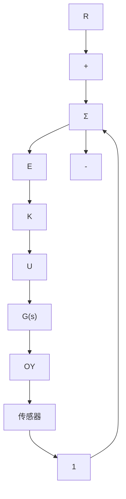

# △6.9节习题

6.67 某反馈控制系统如图 6.103 所示，要求闭环系统的阶跃响应超调量小于 30%。


<details>
<summary>flowchart</summary>

```mermaid
graph LR
    R -->|+| Sum
    Sum -->|K/(s(s+2))| Output
    Output --> Y
    Y -->|-| Sum
```
</details>

图 6.103 习题 6.67 的控制系统

(a) 要满足要求，相位裕度 PM 和闭环谐振峰值 $M_{r}$ 应满足怎样的条件(参考图 6.37)。

(b) 根据系统的伯德图，确定满足相位裕度 PM 要求的最大 K 值。

(c) 将图 6.82 做一份拷贝，然后在上面绘制系统的幅相曲线 [K 就是 (b) 问中确定的值]，由此确定谐振峰值 $M_{r}$ ，然后和 (a) 问中的近似结果作比较。

(d) 利用尼科尔斯图，确定谐振频率 $\omega_{r}$ 和闭环带宽。

6.68 图 6.104 所示为两个系统的尼科尔斯图，一个系统未加补偿环节，另一个加入了补偿环节。


<details>
<summary>contour</summary>

| ∠Dc(s)G(s) | Dc(s)G(s) | ω | v |
| --- | --- | --- | --- |
| -180° | 0.1 | 40 | 5.0 |
| -160° | 0.2 | 70 | 2.0 |
| -140° | 0.3 | 30 | 1.50 |
| -120° | 0.4 | 40 | 1.30 |
| -100° | 0.5 | 20 | 1.20 |
| -80° | 0.6 | 25 | 1.10 |
| -60° | 0.7 | 95° | 1.05 |
| -40° | 0.8 | 95° | 1.00 |
| -20° | 0.9 | 95° | 0.95 |
| 0 | 1.0 | 95° | 0.90 |
| 20 | 1.1 | 95° | 0.80 |
| 40 | 1.2 | 95° | 0.70 |
| 60 | 1.3 | 95° | 0.60 |
| 80 | 1.4 | 95° | 0.50 |
| 100 | 1.5 | 95° | 0.40 |
| 120 | 1.6 | 95° | 0.30 |
| 140 | 1.7 | 95° | 0.20 |
| 160 | 1.8 | 95° | 0.15 |
| 180 | 1.9 | 95° | 0.10 |
The chart displays a contour plot with the x-axis labeled '∠Dc(s)G(s)' and the y-axis labeled 'Dc(s)G(s)'. The contour lines represent the '闭环幅值' (closed amplitude) for each of the curves, with labels indicating the parameter 'ω'. The legend is in English, so the contours are not explicitly labeled in the code but correspond to different ω values.
</details>

图 6.104 习题 6.68 的尼科尔斯图

(a) 确定两个系统各自的谐振峰值。

(b) 确定两个系统各自的 PM 和 GM。

(c) 请确定两个系统各自的带宽。

(d) 加入补偿环节的系统采用的是什么补偿环节？

6.69 考虑图 6.95 所示的系统。

(a) 绘制 $[Y(\mathrm{j}\omega) / E(\mathrm{j}\omega)]^{-1}$ 的逆奈奎斯特图（见附录W6.9.2）

(b) 如何在逆奈奎斯特图上直接确定新系统中性稳定时的 K 值。

(c) 对于 K=4, 2, 1，请确定相位裕度和幅值裕度。

(d) 绘制系统的根轨迹图，注意两幅图上的对应点。对于(c)问，确定GM和PM，响应的阻尼比 $\zeta$ 为何值？

6.70 某不稳定系统，其传递函数为

$$\frac {Y (s)}{F (s)} = \frac {s + 1}{(s - 1) ^ {2}}$$

为它加上简单的控制回路，组成闭环系统，使其框图如图 6.95 所示。

(a) 绘制系统 $Y(s)/F(s)$ 的奈奎斯特图。

(b) 确定 K 值，使 PM 为 $45^{\circ}$ ，相应的 GM 为多少？

(c) 当 K<0 时，关于系统的稳定性，从系统的逆奈奎斯特图上你能得到什么结论。

(d) 绘制系统的根轨迹图，注意两幅图上

的对应点。PM 为 $45^{\circ}$ 时，相应的阻尼比 $\zeta$ 为何值？

6.71 考虑图 6.105a 所示的系统。

  
a)


<details>
<summary>flowchart</summary>


</details>

b)   
图 6.105 习题 6.71 的控制系统

(a) 绘制系统的伯德图。

(b) 根据伯德图，绘制系统的逆奈奎斯特图(见附录 W6.9.2)。

(c) 加入控制回路 $G(s)$ ，使系统闭合，如图 6.105b 所示。根据奈奎斯特图，由伯德图确定 K=0.7, 1.0, 1.4, 2 等不同情况下的 GM 和 PM。要满足 $PM=30^{\circ}$ ，K 取何值？

(d) 绘制系统的根轨迹图，在图上标出 K=0.7, 1.0, 1.4, 2 时的对应点。确定 (c) 问中每一组 PM 和 GM 所对应的阻尼比。PM 和阻尼比 $\zeta$ 之间是否符合图 6.36 所示的近似关系？
