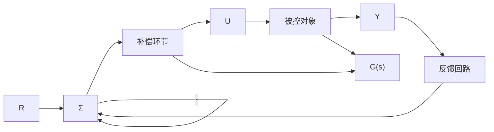

# 状态空间设计简介

除了根轨迹和频率响应两种变换方法以外，设计反馈控制系统还有另外一种主要的方法：即状态空间法。我们将介绍描述微分方程的状态变量法。在状态空间设计中，控制工程师直接通过系统的状态变量描述设计动态补偿器。与变换方法类似，状态空间法的目的是找到满足设计指标的补偿环节 $D_{\mathrm{c}}(s)$ ，如图7.1所示。因为状态空间法在描述被控对象

以及计算补偿环节方面与其他变换方法不同，所以乍看起来状态空间法好像是在解决一类完全不同的问题。我们在本章末尾选择了一些例子进行分析，意在使读者明确：状态空间法设计得到的具有传递函数 $D_{\mathrm{c}}(s)$ 的补偿器，与利用另外两种方法得到的补偿器 $D_{\mathrm{c}}(s)$ 是等价的。

flowchart

图 7.1 控制系统设计定义

因为状态空间法非常适合利用计算机技术进行设计，所以，越来越多的控制工程师正在研究和使用这种设计方法。

433
