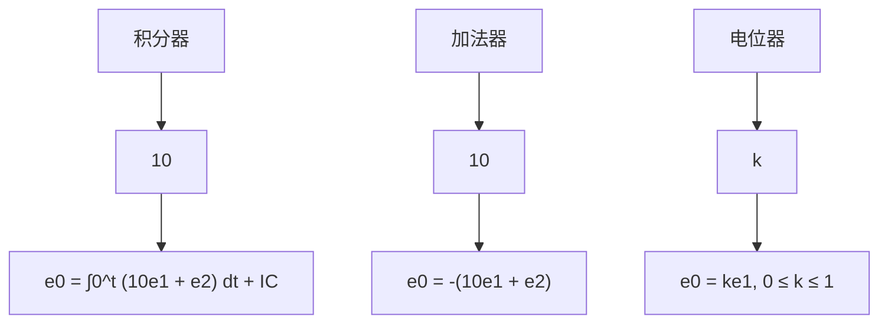

# 7.3 框图与状态空间

也许，借助模拟计算机框图的表现形式是理解状态变量方程的最有效方法。使用积分器作为该图示结构的中心元件，这尤其适合利用状态变量描述的一阶动态系统。尽管模拟计算机几乎已被淘汰，但是在状态变量的设计和模拟补偿电路的设计中，模拟计算机的应用依然具有价值 $^{①}$ 。

模拟计算机是由电子元器件组成的设备，用来对微分方程组（ODE）进行仿真。模拟计算机的最基本动态元件是积分器，由一个带有电容反馈和电阻前馈的运算放大器构成，如图2.29所示。因为积分器是一个元器件，其输入是输出的导数，如图7.3所示。如果在一个模拟计算机仿真中，将积分器的输出作为状态，那么我们将自动获得状态变量形式的方程。相反地，如果系统通过多个状态变量描述，那么根据给定的状态变量方程，对每个状态变量及其输入使用一个积分器，可以构建出反映状态方程的一个模拟计算机仿真系统。

  
图7.3 积分器

flowchart

图 7.4 计算机模拟器件

一个典型的模拟计算机组成部件用于

实现如图 7.4 所示的函数。注意到运算放大器的符号变化，由此给出的是负增益。
