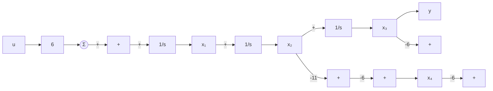
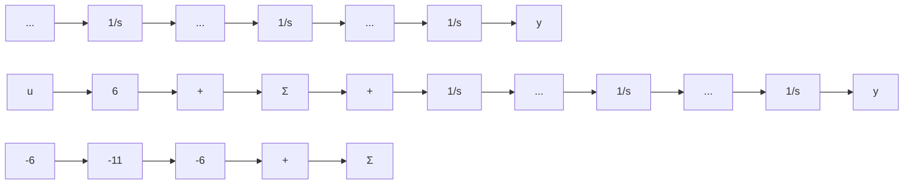

# 例7.7 模拟计算机实现

求出如图 7.5 所示的三阶系统的状态变量描述和传递函数，其微分方程为

$$\ddot {y} + 6 \dot {y} + 1 1 \dot {y} + 6 y = 6 u$$

flowchart

图7.5 三阶系统框图

解答。从该常微分方程中解出最高阶导数项，得到

$$\ddot {y} = - 6 \dot {y} - 1 1 \dot {y} - 6 y + 6 u \tag {7.8}$$

现在，我们假设已经得到这个最高阶导数并且注意到其低阶项可以通过积分得到，如图7.6a所示。最终，应用式(7.8)得到如图7.6b所示的实现形式。为了获得状态描述，简单定义状态变量 $x_{1}=\ddot{y}$ ， $x_{2}=\dot{y}$ 和 $x_{3}=y$ 作为积分器的输出，得到

$$\dot {x} _ {1} = - 6 x _ {1} - 1 1 x _ {2} - 6 x _ {3} + 6 u\dot {x} _ {2} = x _ {1}\dot {x} _ {3} = x _ {2}$$

flowchart

b) 最终框图  
图 7.6 仅利用积分器作为动态元件来求解 $\ddot{y} + 6\dot{y} + 11\dot{y} + 6y = 6u$ 的系统框图

给出状态变量描述

$$
\mathbf {A} = \left[ \begin{array}{c c c} - 6 & - 1 1 & - 6 \\ 1 & 0 & 0 \\ 0 & 1 & 0 \end{array} \right], \quad \mathbf {B} = \left[ \begin{array}{c} 6 \\ 0 \\ 0 \end{array} \right], \quad \mathbf {C} = \left[ \begin{array}{c c c} 0 & 0 & 1 \end{array} \right], \quad D = 0
$$

Matlab 语句如下。

$$[ \text { num,den } ] = \text { ss2tf(A,B,C,D) }$$

将得到传递函数为

$$\frac {Y (s)}{U (s)} = \frac {6}{s ^ {3} + 6 s ^ {2} + 1 1 s + 6}$$

如果希望传递函数以因式分解形式出现，可以用 Matlab 中 ss 或 tf 命令变换获得。或者使用如下 Matlab 语句：

$$[ z, p, k ] = s s 2 z p (A, B, C, D)$$

和

$$[ z, p, k ] = t f 2 z p (n u m, d e n)$$

将得到

$$z = [ ], p = [ - 3 \quad - 2 \quad - 1 ] ^ {\mathrm{T}} \text {和} k = 6 。$$

这意味着传递函数也可以写成因式形式：

$$\frac {Y (s)}{U (s)} = G (s) = \frac {6}{(s + 1) (s + 2) (s + 3)}$$
