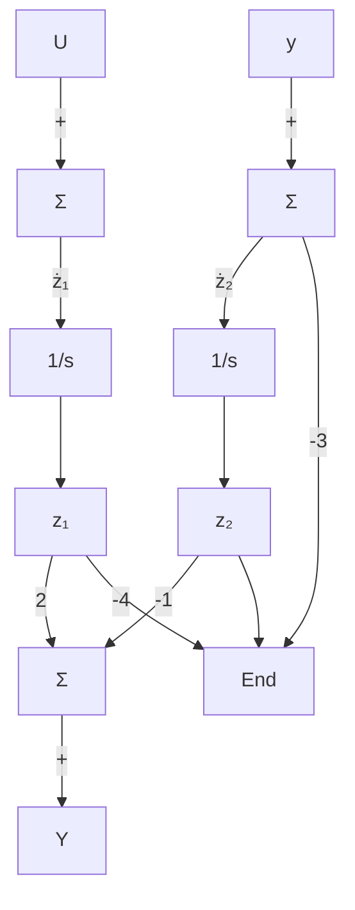

用模态标准形表示一个系统有可能会变得复杂，主要是由于以下两方面原因：（1）当系统的极点是复数形式时，矩阵元素将是复数的形式；（2）当部分分式展开式有重极点时，该系统矩阵不能对角化。为了解决第一个问题，将部分分式展开式的重极点表示为共轭复数对，使得所有元素都是实数。相应矩阵 $A_{m}$ 的主对角线具有 $2\times2$ 阶块矩阵，这表示复数极点集内变量之间的局部耦合。为了解决第二个问题，也可以把相应的状态变量耦合起来，使得极点出现在对角线上，用非对角线项表示这种耦合关系。例7.1的卫星系统就是对后一情况的举例，该系统的传递函数是 $G(s)=1/s^{2}$ ，该传递函数系统矩阵的模态标准形表示为

flowchart

图 7.8 式(7.12)的模态标准形框图

$$
\boldsymbol {A} _ {\mathrm{m}} = \left[ \begin{array}{l l} 0 & 1 \\ 0 & 0 \end{array} \right], \quad \boldsymbol {B} _ {\mathrm{m}} = \left[ \begin{array}{l} 0 \\ 1 \end{array} \right], \quad \boldsymbol {C} _ {\mathrm{m}} = \left[ \begin{array}{l l} 1 & 0 \end{array} \right], \quad D _ {\mathrm{m}} = 0 \tag {7.15}
$$
