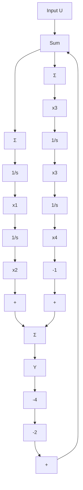

# 例 7.8 模态标准形的状态方程

具有一个共振状态的“四分之一卡车模型”[见式(2.12)]，其传递函数为

$$G (s) = \frac {2 s + 4}{s ^ {2} (s ^ {2} + 2 s + 4)} = \frac {1}{s ^ {2}} - \frac {1}{s ^ {2} + 2 s + 4} \tag {7.16}$$

求解描述该系统的模态形状态矩阵。

解答。传递函数已经以实的部分分式形式给出。为了得到状态描述矩阵，我们只需要画出相应的带有积分器的框图，指定状态变量并且写出相应的矩阵即可。此过程不唯一，因此，对所描述的问题存在几个可行解，但是他们只在极小的地方存在不同。图7.9给出了一种合理选取变量后的框图。

flowchart

图 7.9 一个四阶系统的模态标准形，其中阴影部分是能控标准形

注意到表示复极点的二阶项已用能控标准形实现。这部分也可以有许多其他的实现方法作为替代。通过观测，该特殊形式可以写成如下的系统矩阵：

$$
\boldsymbol {A} = \left[ \begin{array}{c c c c} 0 & 0 & 0 & 0 \\ 1 & 0 & 0 & 0 \\ 0 & 0 & - 2 & - 4 \\ 0 & 0 & 1 & 0 \end{array} \right], \quad \boldsymbol {B} = \left[ \begin{array}{l} 1 \\ 0 \\ 1 \\ 0 \end{array} \right]

\boldsymbol {C} = \left[ \begin{array}{l l l l} 0 & 1 & 0 & - 1 \end{array} \right], \quad D = 0 \tag {7.17}
$$

到目前为止，我们可以通过传递函数得到能控形或者模态型表示的系统状态描述。既然这些矩阵描述的是相同的动态系统，我们也许会问，两种形式的矩阵（及他们对应的状态变量）之间有什么样的关系呢？更一般地，假设我们有一组描述某种物理系统的状态方程，这些方程以非特殊形式给出，由于采用能控标准形将有助于解决给定的某些问题（如例7.5给出类似的一个问题），那么有没有可能不用先获得传递函数就可以得到期望的标准形呢？为了回答这些问题，先来看看有关状态变换的概念。

考虑状态方程描述的系统为

$$\dot {x} = A x + B u \tag {7.18a}y = \mathbf {C x} + D u \tag {7.18b}$$

如前面分析结果，上式不是该动态系统的唯一描述。考虑用 $x$ 的一个线性变换，将状态由 $x$ 变换为一个新的状态 $z$ 。对于非奇异变换矩阵 $\pmb{T}$ ，令

$$\boldsymbol {x} = \boldsymbol {T} \boldsymbol {z} \tag {7.19}$$

将式(7.19)代入到式(7.18a)中，得到以新状态z表示的动态方程为

$$\dot {x} = T \dot {z} = A T z + B u \tag {7.20a}\dot {z} = \boldsymbol {T} ^ {- 1} \boldsymbol {A} \boldsymbol {T} z + \boldsymbol {T} ^ {- 1} \boldsymbol {B} u \tag {7.20b}\dot {z} = \overline {{{A}}} z + \overline {{{B}}} u \tag {7.20c}$$

在式(7.20c)中

$$\overline {{{A}}} = T ^ {- 1} A T \tag {7.21a}\overline {{{\boldsymbol {B}}}} = \boldsymbol {T} ^ {- 1} \boldsymbol {B} \tag {7.21b}$$

然后，将式(7.19)代入到式(7.18b)中，得到以新状态Z表示的输出方程为

$$y = C T z + D u = \overline {{{C}}} z + \overline {{{D}}} u$$

此时，

$$\overline {{{C}}} = C T, \quad \overline {{{D}}} = D \tag {7.22}$$
