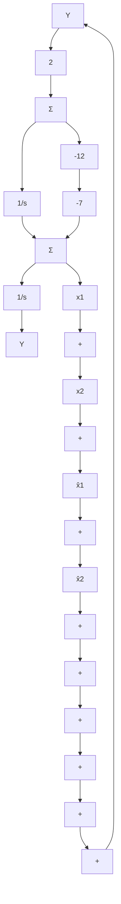

通过式(7.29)给出的变换矩阵的数值很难精确地求出，因此通常不这样求 T 矩阵。之所以详细地推导变换矩阵，是因为要表明在理论上这种状态的变换是如何实现的，并且说明了下面重要的结论：

（当且仅当）可控性矩阵 C 是非奇异时，一个给定的状态描述总是可以转化为能控标准形的。

如果需要在实数域内验证可控性，我们可以使用一种数值稳定的方法，把系统矩阵化为“阶梯”形式，而不是再试图计算出可控性矩阵。本章最后习题7.30就要求采用这种方法来判断能控性。

目前为止，我们讨论关于可控性的一个重要问题：状态变换对可控性的影响是怎样的？下面我们利用式(7.17)，式(7.21a)和式(7.21b)给出答案。系统(A，B)的可控性矩阵为

$$
\boldsymbol {C} _ {x} = \left[ \begin{array}{l l l l} \boldsymbol {B} & \boldsymbol {A B} & \dots & \boldsymbol {A} ^ {n - 1} \boldsymbol {B} \end{array} \right] \tag {7.30}
$$

经过状态变换，式(7.21a)和式(7.21b)给出了新的矩阵描述形式，则可控性矩阵变为

$$
C _ {z} = \left[ \begin{array}{l l l l} \overline {{B}} & \overline {{A}} \overline {{B}} & \dots & \overline {{A}} ^ {n - 1} \overline {{B}} \end{array} \right] \tag {7.31a}

= \left[ \begin{array}{l l l l} T ^ {- 1} B & T ^ {- 1} A T T ^ {- 1} B & \dots & T ^ {- 1} A ^ {n - 1} T T ^ {- 1} B \end{array} \right] \tag {7.31b}
= T ^ {- 1} C _ {x} \tag {7.31c}
$$

由此可见，当且仅当 $C_{x}$ 是非奇异时， $C_{z}$ 是非奇异阵，所以得到下面结论。

系统的状态经过非奇异线性变换并不能改变系统的可控性。

下面我们再研究式(7.9)的传递函数，这次采用能观测标准形的框图来表示它，如图7.10所示。此时标准形所对应的矩阵为

$$
\boldsymbol {A} _ {0} = \left[ \begin{array}{l l} - 7 & 1 \\ - 1 2 & 0 \end{array} \right], \quad \boldsymbol {B} _ {0} = \left[ \begin{array}{l} 1 \\ 2 \end{array} \right] \tag {7.32a}

\boldsymbol {C} _ {0} = \left[ \begin{array}{l l} 1 & 0 \end{array} \right], \quad D _ {0} = 0 \tag {7.32b}
$$

这种标准形的一个重要事实是，系统的输出通过系统矩阵 $A_{0}$ 的系数反馈到每个系统的状态变量。

现在让我们讨论一下如果改变-2这个零点，系统的可控性会受到什么影响？为此，用可变零点 $-z_{0}$ 代替矩阵 $B_{0}$ 中的第二个元素2，则得到可控性矩阵为

$$
\boldsymbol {C} _ {x} = \left[ \begin{array}{l l} \boldsymbol {B} _ {0} & \boldsymbol {A} _ {0} \boldsymbol {B} _ {0} \end{array} \right] \tag {7.33a}

= \left[ \begin{array}{c c} 1 & - 7 - z _ {0} \\ - z _ {0} & - 1 2 \end{array} \right] \tag {7.33b}
$$

矩阵的行列式是 $z_{0}$ 的函数为

flowchart

图 7.10 二阶系统的能观测标准形

$$\det \left(\boldsymbol {C} _ {x}\right) = - 1 2 + \left(z _ {0}\right) (- 7 - z _ {0})= - \left(z _ {0} ^ {2} + 7 z _ {0} + 1 2\right)$$
