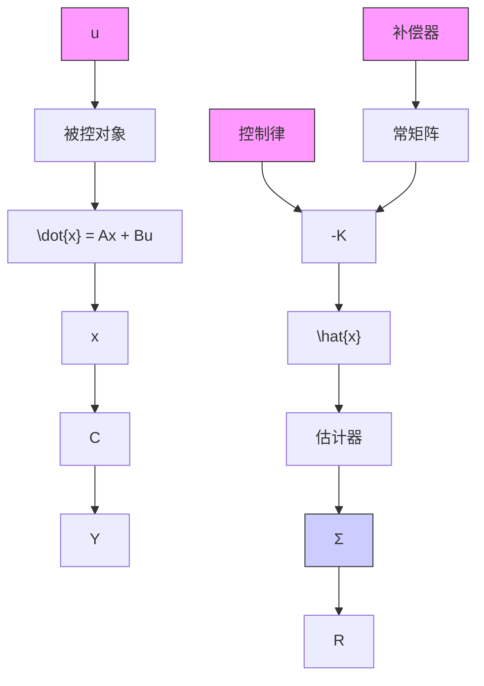

# 7.5 全状态反馈控制律设计

如本章概述中所提，状态空间设计法的一个显著特征是它由一系列独立的步骤组成。第一步是确定控制律，将在7.5.1小节中进行介绍。确定控制律是为了给闭环系统分配一组极点，使其在上升时间和暂态响应的其他性能指标方面都能满足所期望的动态响应。在7.5.2小节中，我们将介绍具有全状态反馈的参考输入。在7.6节中将介绍求取极点以获得理想设计的过程。

第二步——当全部状态不可测时很有必要——设计一个估计器(有时称为观测器)，当给出式(7.18b)的各个系统量时，观测器可以计算全状态矢量的估计值。7.7节将介绍估计器的设计。

第三步是将控制律和估计器结合起来。图 7.11 给出了控制律与估计器如何结合在一起，以及这种结合如何取代前面提到的补偿器。在这一步中，控制律的计算是基于估计器状态而不是实际状态。7.8 节将解释这种取代的合理性，同时也说明控制律与观测器结合得到的闭环极点位置与将控制器和观测器分开设计所得到的闭环极点位置是相同的。

第四步，即最后一步是在状态空间设计法中引入参考输入，这种方式使得被控对象的输出能够跟踪具有可接受的上升时

flowchart

图 7.11 状态空间示意图

间，超调量和调整时间的外部指令信号。在此步设计中，闭环系统极点都已经选定，并且设计者关心的是整个传递函数的零点。图7.11表明，指令输入 $r$ 引入的相对位置与变换设计法中相同；然而，在7.9节中，我们将介绍如何在另外一个位置引入参考输入，以得到不同的零点和(通常)更好的控制效果。
