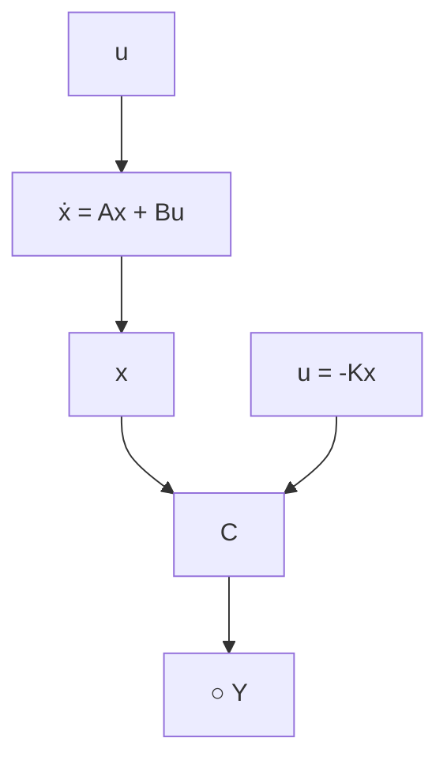

# 7.5.1 寻找控制律

前文提到，状态空间设计法的第一步是找到状态变量线性组合的反馈控制律，即

$$
u = - \mathbf {K} \mathbf {x} = - \left[ \begin{array}{l l l l} K _ {1} & K _ {2} & \dots & K _ {n} \end{array} \right] \left[ \begin{array}{c} x _ {1} \\ x _ {2} \\ \vdots \\ x _ {n} \end{array} \right] \tag {7.67}
$$

我们假设对于反馈而言，状态矢量的全部分量都可获得，这就是为什么称其为“全状态”反馈。在实际应用中，这种假设是不现实的；而且，有经验的设计者知道其他设计方法并不需要如此多的传感器。假设所有的状态变量均可获得，以此来保证第一步设计能继续。

式(7.67)表明系统在状态矢量反馈通道上具有一个常矩阵，如图7.12所示。一个 $n$ 阶系统将有 $n$ 个反馈增益，即， $K_{1}, \ldots, K_{n}$ ，并且由于系统有 $n$ 个根，因此可能存在足够多的自由度使得通过选择合适的 $K_{i}$ 值来任意配置所期望的根的位置。这种自由度与根轨迹设计法形成了鲜明的对比。在根轨迹设计法中，仅有一个参数且闭环极点被限定在根轨迹线上。

flowchart

图7.12 用于控制律设计的假定系统

将式(7.67)给出的反馈律代入式(7.18b)所描述的系统中，得到

$$\dot {x} = A x - B K x \tag {7.68}$$

该闭环系统的特征方程为

$$\det [ s \boldsymbol {I} - (\boldsymbol {A} - \boldsymbol {B K}) ] = 0 \tag {7.69}$$

当计算得到一个 n 阶多项式，其中包含增益 $K_{1}, \ldots, K_{n}$ 时，控制律设计包括挑选增益 K 使得式(7.69)的根在期望的位置上。在选择期望根的位置时有可能需要设计者进行迭代计算，因此选择期望根的位置并不科学。例 7.14～例 7.16 及 7.6 节中考虑了根位置选择中遇到的问题。现在，我们假设期望的根的位置是已知的，即

$$s = s _ {1}, s _ {2}, \dots , s _ {n}$$

那么，期望的相应(控制)特征方程是

$$\alpha_ {c} (s) = \left(s - s _ {1}\right) \left(s - s _ {2}\right) \dots \left(s - s _ {n}\right) = 0 \tag {7.70}$$

因此，K 中要求的元素就可通过匹配式(7.69)和式(7.70)的系数求得。这就迫使系统的特征方程和期望的特征方程相同，闭环极点也就可以在期望的位置上了。
