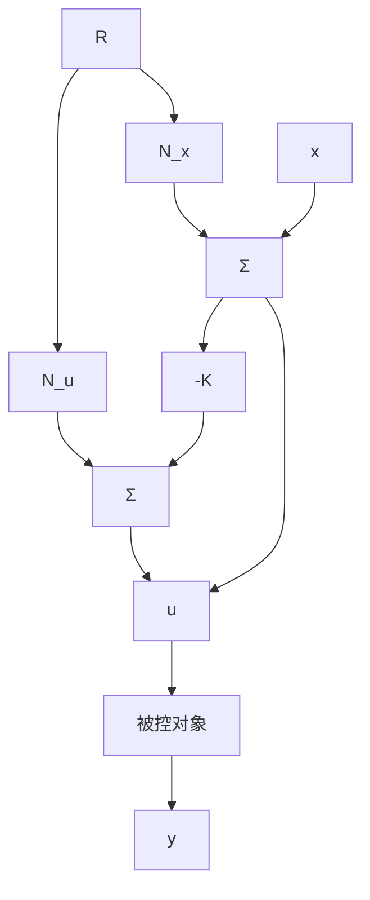
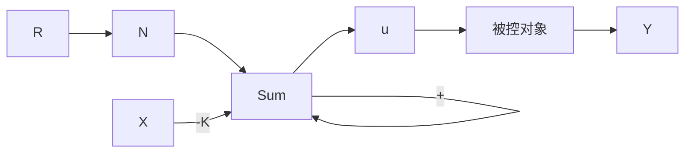

# 7.5.2 引入参考输入用于全状态反馈

到目前为止，控制律已由式(7.67)或 $u = -Kx$ 给出。为了研究利用极点配置设计的系统对输入指令信号的暂态响应，必须将参考输入引入到系统中。这可以用一种简单的方法实现，即将控制律改为 $u = -Kx + r$ 。然而，这种系统对于阶跃信号将产生一个非零的稳态误差。修正这一问题的方法是计算得到零输出误差的稳态值和控制输入的稳态值，然后令它们取这些值。如果状态和控制输入的期望终值分别为 $x_{\mathrm{ss}}$ 和 $u_{\mathrm{ss}}$ ，则新的控制公式为

$$u = u _ {\mathrm{ss}} - K (x - x _ {\mathrm{ss}}) \tag {7.94}$$

这样，当 $x=x_{ss}$ （无误差）时， $u=u_{ss}$ 。为了挑选正确的终值，必须求解方程，使得系统对于任意的常值输入都能得到零稳态误差。系统的微分方程具有如下的标准形式：

$$\dot {x} = A x + B u \tag {7.95a}y = \mathbf {C x} + D u \tag {7.95b}$$

在恒稳态中，式(7.95a)和式(7.95b)可化简为

$$\mathbf {0} = \boldsymbol {A} \boldsymbol {x} _ {\mathrm{ss}} + \boldsymbol {B} \boldsymbol {u} _ {\mathrm{ss}} \tag {7.96a}y _ {\mathrm{ss}} = \mathbf {C x} _ {\mathrm{ss}} + D u _ {\mathrm{ss}} \tag {7.96b}$$

想要求解对于任意数值的 $r_{\mathrm{ss}}$ ，都有 $y_{\mathrm{ss}} = r_{\mathrm{ss}}$ 成立的值。为此，令 $x_{\mathrm{ss}} = N_x r_{\mathrm{ss}}$ 并且 $u_{\mathrm{ss}} = N_u r_{\mathrm{ss}}$ 。通过这些替换可将式(7.96)写成一个矩阵方程；消去常因子 $r_{\mathrm{ss}}$ ，得到如下的增益方程：

$$
\left[ \begin{array}{l l} \mathbf {A} & \mathbf {B} \\ \mathbf {C} & D \end{array} \right] \left[ \begin{array}{l} N _ {x} \\ N _ {u} \end{array} \right] = \left[ \begin{array}{l} \mathbf {0} \\ 1 \end{array} \right] \tag {7.97}
$$

通过这个方程可求得 $N_{x}$ 和 $N_{u}$ 为

$$
\left[ \begin{array}{l} N _ {x} \\ N _ {u} \end{array} \right] = \left[ \begin{array}{l l} A & B \\ C & D \end{array} \right] ^ {- 1} \left[ \begin{array}{l} 0 \\ 1 \end{array} \right]
$$

有了这些值，就有了引入参考输入的前提条件，使得系统对阶跃输入能产生零稳态误差：

$$u = N _ {u} r - K (x - N _ {x} r) \tag {7.98a}= - \boldsymbol {K} \boldsymbol {x} + \left(N _ {u} + \boldsymbol {K N} _ {x}\right) r \tag {7.98b}$$

括号内的 $r$ 的系数为一个预先计算出来的常值。用符号 $\overline{N}$ 表示，即

$$u = - K x + \overline {{{N}}} r \tag {7.99}$$

系统框图如图 7.15 所示。

flowchart

a) 带有状态和控制增益

flowchart

b) 带有单个复合增益   
图 7.15 引入参考输入用于全状态反馈框图
