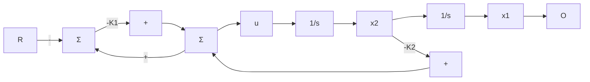
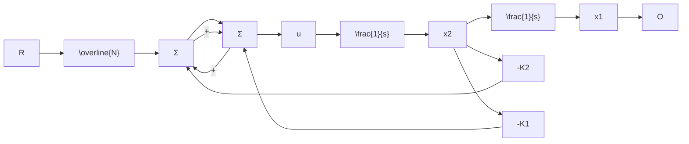

# 例 7.18 1 型系统的参考输入：直流电动机

对于例 5.1 中的直流电动机，计算引入一个对阶跃信号产生零稳态误差的参考输入所需的输入增益，用矩阵描述状态变量形式：

$$
\begin{array}{l} \boldsymbol {A} = \left[ \begin{array}{c c} 0 & 1 \\ 0 & - 1 \end{array} \right], \quad \boldsymbol {B} = \left[ \begin{array}{l} 0 \\ 1 \end{array} \right] \\ \mathbf {C} = \left[ \begin{array}{l l} 1 & 0 \end{array} \right], \quad D = 0 \\ \end{array}
$$

假设状态反馈增益为 $\left[K_{1}\quad K_{2}\right]$

解答。将本例的系统矩阵代入求解输入增益的式(7.97)，解为

$$
\begin{array}{l} \mathbf {N} _ {x} = \left[ \begin{array}{c} 1 \\ 0 \end{array} \right] \\ N _ {u} = 0 \\ \overline {{{N}}} = K _ {1} \\ \end{array}
$$

用 $N_{x}$ 和 $N_{u}$ [式(7.98b)] 表示的控制律简化为

$$u = - K _ {1} (x _ {1} - r) - K _ {2} x _ {2}$$

而用 $\overline{N}$ [式(7.99)] 所表示的控制律变为

$$u = - K _ {1} x _ {1} - K _ {2} x _ {2} + K _ {1} r$$

图 7.17 给出了每一个控制方程所对应的系统框图。式(7.99)对应的框图如图 7.17b 所示，必须将输入乘上一个增益 $K_{1}(=\overline{N})$ ，且 $K_{1}$ 应当恰好等于反馈通路中的增益。如果这两个增益匹配得不准确，将会产生稳态误差。另一方面，式(7.98b)的框图如图 7.17a 所示，在参考输入和第一个状态的差值处仅用一个增益，即使这个增益稍微存在偏差，也会得到零稳态误差。图 7.17a 所示的系统比图 7.17b 所示的系统具有更强的鲁棒性。

flowchart

a) 式 (7.98b)  

flowchart

b)式(7.99)   
图 7.17 引入参考输入的两种结构

在适当的位置加入参考输入，则闭环系统的输入为 r，输出为 y。从状态描述中可知，系统的极点为闭环系统矩阵 A-BK 的特征值。为了计算闭环系统的暂态响应，必须知道从 r 到 y 的传递函数的闭环零点所在的位置。将式(7.64)应用到闭环描述中可以求得零点，假设闭环系统从输入 u 到输出 y 没有直接的通路，即 D=0 。则零点为满足下式的 s 的值：

$$
\det \left[ \begin{array}{c c} s I - (A - B K) & - \overline {{{N}}} B \\ C & 0 \end{array} \right] = 0 \tag {7.102}
$$

利用行列式的两个基本性质化简式(7.102)。首先，将行列式的最后一列除以标量 $\overline{N}$ ，行列式值为零的点保持不变。然后，将行列式的最后一列乘上K再加到第一(方框)列上，行列式的值保持不变，这样就可以消去BK。则求解零点的矩阵方程可化简为

$$
\det \left[ \begin{array}{c c} s I - A & - B \\ C & 0 \end{array} \right] = 0 \tag {7.103}
$$

在应用反馈之前，式(7.103)与式(7.64)所求得的被控对象的零点是相同的。由此得出一个重要的结论：按式(7.98b)或式(7.99)加入全状态反馈时，系统的零点并未因反馈的加入而改变。
