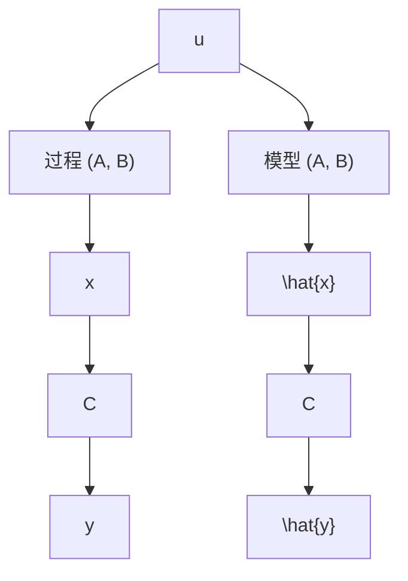
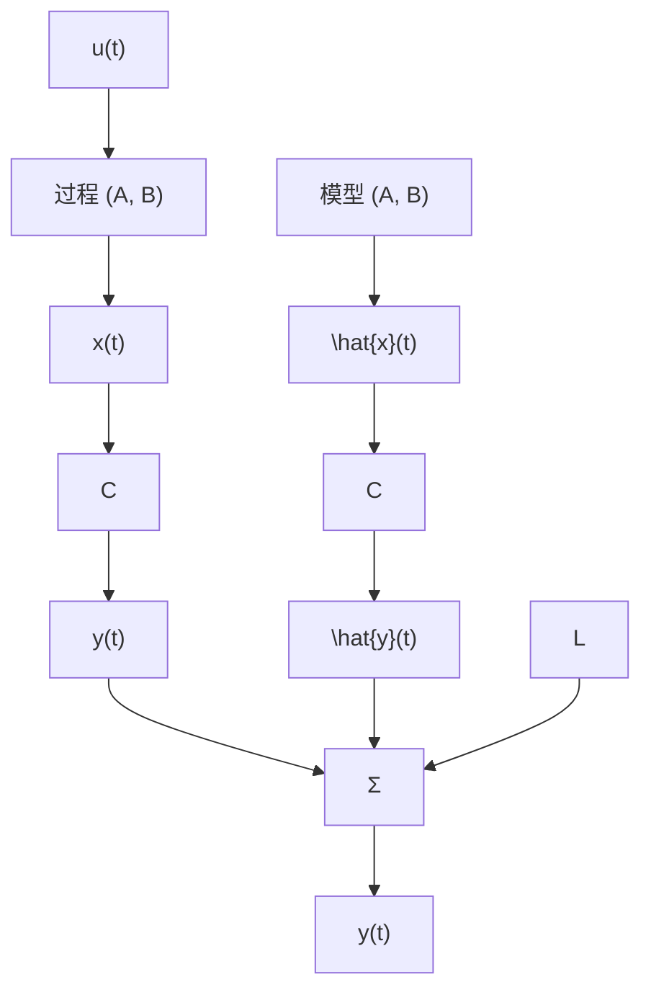

# 7.7.1 全阶估计器

估计状态的一种方法是对被控对象动态构建一个全阶估计模型，即

$$\dot {\hat {x}} = A \hat {x} + B u \tag {7.127}$$

其中： $\hat{x}$ 为实际状态 x 的估计；A，B 和 $u(t)$ 已知。

因此，如果能够找到正确的初始状态 $x(0)$ ，令 $\hat{x}(0)$ 等于 $x(0)$ ，那么这个估计器就是满足要求的。图7.27描述了这个开环估计器。然而，明显缺少构造估计器所需的 $x(0)$ 的信息。否则，被估计的状态会准确跟踪实际的状态。因此，如果对初始状态的估计不精确，那么被估计的状态就会产生持续增加的误差，或者误差趋于零的速度很慢，以至于失去作用。此外，在已知系统 $(A, B)$ 中，微小的误差也将会使估计的状态偏离真实状态。

为了研究估计器的动态，我们定义估计误差为

$$\widetilde {x} \stackrel {\text {def}} {=} x - \hat {x} \tag {7.128}$$

则误差系统的动态由下式给出：

$$\dot {\widetilde {x}} = \dot {x} - \dot {\hat {x}} = A \widetilde {x}, \widetilde {x} (0) = x (0) - \hat {x} (0) \tag {7.129}$$

我们无法改变状态的估计值向真实状态值收敛的速率。

现在我们引入黄金规则：有麻烦，用反馈。考虑将被测输出和待估输出之差反馈到输入端，并用该误差信号连续不断地修正模型。如图 7.28 所示，该方案对应的方程为

$$\dot {\hat {x}} = A \hat {x} + B u - L (y - C \hat {x}) \tag {7.130}$$

flowchart

图 7.27 开环估计器框图

flowchart

图 7.28 闭环估计器框图

这里， $L$ 为比例增益，定义为

$$
\boldsymbol {L} = \left[ \begin{array}{l l l l} l _ {1} & l _ {2} & \dots & l _ {n} \end{array} \right] ^ {\mathrm{T}} \tag {7.131}
$$

选取 L 以得到满意的误差特性。用状态[式(7.41)]减去状态估计值[式(7.130)]得到误差的动态特性，误差方程为

$$\dot {\widetilde {x}} = (A - L C) \widetilde {x} \tag {7.132}$$

误差的特征方程为

$$\det [ s \boldsymbol {I} - (\boldsymbol {A} - \boldsymbol {L B}) ] = 0 \tag {7.133}$$

如果选择 L 使得 A-LC 具有使系统稳定并且快速收敛的特征值，那么 $\tilde{x}$ 将衰减到零并保持在零——而不依赖已知的强迫函数 $u(t)$ 以及它对状态 $x(t)$ 的影响，也与初始状态 $\tilde{x}(0)$ 无关。这意味着无论 $\hat{x}(0)$ 取何值， $\hat{x}(t)$ 都将会收敛到 $x(t)$ ；此外，选择误差的动态特性为稳定的，这比利用矩阵 A 所确定的开环动态快得多。

值得注意的是，在得出式(7.132)的过程中，我们假设 A, B, C 在物理对象和计算机的实现中是相同的。若得不到被控对象(A, B, C)的精确数学模型，那么误差的动态特性将不再受式(7.132)控制。然而，通过选取 L 使得误差系统仍保持基本的稳定，并且即使对于(很小的)模型误差和扰动输入，误差也仍能保持在允许的最小值范围内。重点强调被控对象和估计器的本质差别相当大。被控对象是一个实际的物理系统，如一个化学过程或者伺服机构，而估计器通常是一个数字处理器，由式(7.130)计算估计的状态。

L 的选取可以按照控制律设计中选取 K 时完全相同的方法进行。如果规定估计器误差极点的期望位置为

$$s _ {i} = \beta_ {1}, \beta_ {2}, \dots , \beta_ {n}$$

则期望的估计器特征方程为

$$\alpha_ {\mathrm{e}} (s) \stackrel {\mathrm{def}} {=} (s - \beta_ {1}) (s - \beta_ {2}) \dots (s - \beta_ {n}) \tag {7.134}$$

然后，将式(7.133)与式(7.134)进行比较可求出L。
