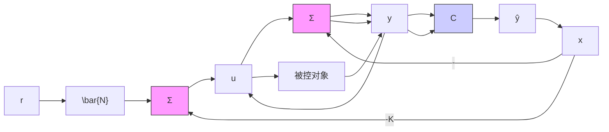

# 例 7.24 单摆系统的估计器设计

给单摆设计一个估计器。计算估计器的增益矩阵，将两个估计器的误差极点都设置在 $-10\omega_{0}$ （是例7.14中选定的控制器极点的5倍）。取 $\omega_{0}=1$ ，用Matlab对结果进行验证。评估该估计器的性能。

解答。单摆的运动方程为

$$
\dot {x} = \left[ \begin{array}{c c} 0 & 1 \\ - \omega_ {0} ^ {2} & 0 \end{array} \right] + \left[ \begin{array}{c} 0 \\ 1 \end{array} \right] u \tag {7.135a}

y = \left[ \begin{array}{l l} 1 & 0 \end{array} \right] x \tag {7.135b}
$$

要求将两个估计器的误差极点均放置在 $-10\omega_{0}$ 。相应的特征方程为

$$\alpha_ {\mathrm{e}} (s) = (s + 1 0 \omega_ {0}) ^ {2} = s ^ {2} + 2 0 \omega_ {0} s + 1 0 0 \omega_ {0} ^ {2} \tag {7.136}$$

由式 $(7.133)$ 可得

$$\det [ s I - (A - L C) ] = s ^ {2} + l _ {1} s + l _ {2} + \omega_ {0} ^ {2} \tag {7.137}$$

将式(7.136)与式(7.137)的系数进行比较，可得

$$
\pmb {L} = \left[ \begin{array}{l} l _ {1} \\ l _ {2} \end{array} \right] = \left[ \begin{array}{l} 2 0 \omega_ {0} \\ 9 9 \omega_ {0} ^ {2} \end{array} \right] \tag {7.138}
$$

取 $\omega_{0}=1$ ，用下述 Matlab 语句同样可得到上述结果：

```matlab
wo=1;
A=[0 1; -wo*wo 0];
C=[1 0];
pe=[-10*wo; -10*wo];
Lt=acker(A', C', pe);
L=Lt' 
```

得到 $L=\left[20\quad99\right]^{T}$ ，与手工计算结果一致。

给被控对象加上实际的状态反馈，并画出观测误差曲线，由此可测试该估计器的性能。注意，这并不是系统最终所建立的方式，但是它提供了一种测试估计器性能的方法。

将带有状态反馈的被控对象式(7.68)与带有输出反馈的估计器式(7.130)联立，得到整个系统的方程如下：

$$
\left[ \begin{array}{l} \dot {x} \\ \dot {\hat {x}} \end{array} \right] = \left[ \begin{array}{c c} A - B K & 0 \\ L C - B K & A - L C \end{array} \right] \left[ \begin{array}{l} x \\ \hat {x} \end{array} \right] \tag {7.139}

y = \left[ \begin{array}{l l} C & 0 \end{array} \right] \left[ \begin{array}{l} x \\ \hat {x} \end{array} \right] \tag {7.140}

\widetilde {y} = \left[ \begin{array}{l l} \mathbf {C} & - \mathbf {C} \end{array} \right] \left[ \begin{array}{l} x \\ \hat {x} \end{array} \right] \tag {7.141}
$$

图 7.29 给出了该系统的框图。


<details>
<summary>flowchart</summary>


</details>

图 7.29 与被控对象相连的估计器

图7.30给出了 $\omega_0 = 1$ 时且闭环系统的初始状态为 $x_{0} = [1.0,0.0]^{\mathrm{T}}$ 和 $\hat{x}_0 = [0,0]^{\mathrm{T}}$ 时的响应曲线，其中 K 由例 7.14 给出，L 由式 (7.138) 给出。该响应曲线可由 Matlab 的 impulse 和 initial 函数给出。从图中可以看出，即使 $\hat{x}$ 的初始值有很大的误差，经过一个初始的暂态过渡后，最终状态估计也会收敛到实际的状态矢量。并且，观测误差的衰减比状态本身的衰减几乎快了 5 倍，而这与我们的设计相吻合。
