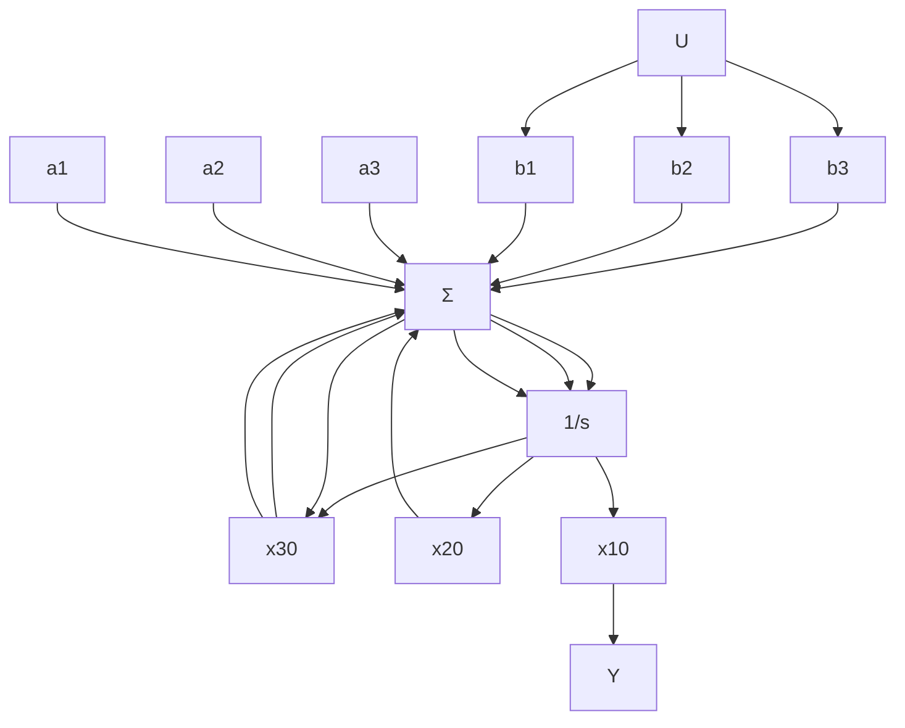

# 能观标准形

正如控制律设计的情况一样，存在一种标准形能使估计器增益设计方程变得极其简单，并且可显而易见的判断估计器解的存在性。7.4.1 小节介绍了这种标准形。方程组为能观标准形，并且具有以下结构：

$$\dot {\boldsymbol {x}} _ {\circ} = \boldsymbol {A} _ {\circ} \boldsymbol {x} _ {\circ} + \boldsymbol {B} _ {\circ} u \tag {7.142a}y = C _ {\mathrm{o}} x _ {\mathrm{o}} \tag {7.142b}$$

其中：

$$
\boldsymbol {A} _ {\circ} = \left[ \begin{array}{c c c c c c} - a _ {1} & 1 & 0 & 0 & \dots & 0 \\ - a _ {2} & 0 & 1 & 0 & \dots & \vdots \\ \vdots & \vdots & \ddots & & & 1 \\ - a _ {n} & 0 & & 0 & & 0 \end{array} \right], \quad \boldsymbol {B} _ {\circ} = \left[ \begin{array}{c} b _ {1} \\ b _ {2} \\ \vdots \\ b _ {n} \end{array} \right]

\boldsymbol {C} _ {\mathrm{o}} = \left[ \begin{array}{l l l l l} 1 & 0 & 0 & \dots & 0 \end{array} \right], D _ {\mathrm{o}} = 0
$$

图 7.31 给出了三阶系统能观标准形的框图。在能观标准形中，所有的反馈回路都是从输出或从被观测的信号引出。与能控标准形相同，能观标准形也是一种“直接”形式，矩阵中重要的元素值都是直接从相应的传递函数 $G(s)$ 的分子和分母多项式的系数中得到的。因为方程的系数出现在矩阵的左侧，所以称矩阵 A。为特征方程的左相伴矩阵。

flowchart

图 7.31 三阶系统的能观标准形框图

能观标准形的一个优势是通过观察就能得到估计器的增益。三阶系统估计器误差闭环矩阵为

$$
\mathbf {A} _ {\mathrm{o}} - \mathbf {L C} _ {\mathrm{o}} = \left[ \begin{array}{l l l} {- a _ {1} - l _ {1}} & {1} & {0} \\ {- a _ {2} - l _ {2}} & {0} & {1} \\ {- a _ {3} - l _ {3}} & {0} & {0} \end{array} \right] \tag {7.143}
$$

其特征方程为

$$s ^ {3} + (a _ {1} + l _ {1}) s ^ {2} + (a _ {2} + l _ {2}) s + (a _ {3} + l _ {3}) = 0 \tag {7.144}$$

将式(7.144)与式(7.134)中的 $\alpha_{\mathrm{e}}(s)$ 的系数进行比较即可求出估计器的增益。

下面用与设计控制律相似的步骤进行研究，当且仅当系统存在一种结构特性时，可以找到一个变换将给定的系统转换成能观标准形，这种特性称为可观测性。粗略地讲，可观测性是指仅仅通过检测测量输出就可以推导出系统所有的模态信息的能力。当某些模态或子系统在物理上与输出断开而不再出现在测量中时，就产生了不可观测性的结果。例如，如果仅仅某些状态矢量的导数被测量出来，而这些状态矢量又不影响动态特性，那么积分常数是不可得的。对于一个传递函数为 $1 / s^2$ 的被控对象，如果仅速度可测，由于此时不可能推导出位置的初始值，就会出现上述的这种情况。另一方面，对于一个振荡器，测量出速度就足以估计出位置，因为加速度受位置的影响，而加速度可观测到速度。验证可观测性的数学判据为如下所示的可观测性矩阵的各列必须线性无关：

$$
\mathcal {O} = \left[ \begin{array}{c} C \\ \boldsymbol {C A} \\ \vdots \\ \boldsymbol {C A} ^ {n - 1} \end{array} \right] \tag {7.145}
$$

我们将研究单输出的情况，O为方阵，因此能观的必要条件为O是非奇异的，或者O的行列式不为零。通常，当且仅当可观测性矩阵为非奇异矩阵时，就能找到将系统矩阵转换成能观标准形的变换矩阵。注意，这同前面推导的将系统矩阵转化成能控标准形的结论相似。

同控制律设计一样，可以找到转换成能观标准形的变换矩阵，根据式(7.144)的等效形式计算增益，然后变换回去。计算 $L$ 的另一种方法就是使用阿克曼公式的估计器形式，即

$$
\boldsymbol {L} = \alpha_ {\mathrm{e}} (\boldsymbol {A}) \boldsymbol {\mathcal {O}} ^ {- 1} \left[ \begin{array}{l} 0 \\ 0 \\ \vdots \\ 1 \end{array} \right] \tag {7.146}
$$

其中：O为式(7.145)给出的可观测性矩阵。
