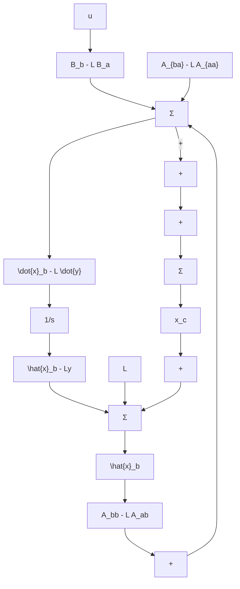

$$\dot {\hat {x}} _ {\mathrm{b}} = A _ {\mathrm{bb}} \hat {x} _ {\mathrm{b}} + \underbrace {A _ {\mathrm{ba}} y + B _ {\mathrm{b}} u} _ {\text {输入}} + L (\underbrace {\dot {y} - A _ {\mathrm{aa}} y - B _ {\mathrm{a}} u} _ {\text {测量}} - A _ {\mathrm{ab}} \hat {x} _ {\mathrm{b}}) \tag {7.152}$$

如果将估计器误差定义为

$$\widetilde {x} _ {\mathrm{b}} \stackrel {\text {def}} {=} x _ {\mathrm{b}} - \hat {x} _ {\mathrm{b}} \tag {7.153}$$

那么，将式(7.152)减去式(7.148)，可以得到误差动态方程为

$$\widetilde {\boldsymbol {x}} _ {\mathrm{b}} = \left(\boldsymbol {A} _ {\mathrm{bb}} - \boldsymbol {L A} _ {\mathrm{ab}}\right) \widetilde {\boldsymbol {x}} _ {\mathrm{b}} \tag {7.154}$$

它的特征方程由下式给出：

$$\det \left[ s I - \left(A _ {b b} - L A _ {a b}\right) \right] = 0 \tag {7.155}$$

通过选取 L 设计估计器的动态，使得式(7.155)与降阶的 $\alpha_{e}(s)$ 相匹配，则式(7.152)改写为

$$\dot {\hat {x}} _ {\mathrm{b}} = (A _ {\mathrm{bb}} - L A _ {\mathrm{ab}}) \hat {x} _ {\mathrm{b}} + (A _ {\mathrm{ba}} - L A _ {\mathrm{aa}}) y + (B _ {\mathrm{b}} - L B _ {\mathrm{a}}) u + L \dot {y} \tag {7.156}$$

事实上，从式(7.156)中得到测量值的微分存在实际的困难。众所周知，微分运算增强噪声干扰，因此如果 y 为噪声，则使用 $\dot{y}$ 是不可取的。为了克服这一困难，定义新的控制器状态为

$$\boldsymbol {x} _ {\mathrm{c}} \stackrel {\mathrm{def}} {=} \hat {\boldsymbol {x}} _ {\mathrm{b}} - \boldsymbol {L y} \tag {7.157}$$

由这一新状态，降阶估计器的实现式为

$$\dot {\boldsymbol {x}} _ {\mathrm{c}} = \left(\boldsymbol {A} _ {\mathrm{bb}} - \boldsymbol {L A} _ {\mathrm{ab}}\right) \hat {\boldsymbol {x}} _ {\mathrm{b}} + \left(\boldsymbol {A} _ {\mathrm{ba}} - \boldsymbol {L A} _ {\mathrm{aa}}\right) y + \left(\boldsymbol {B} _ {\mathrm{b}} - \boldsymbol {L B} _ {\mathrm{a}}\right) u \tag {7.158}$$

$\dot{y}$ 不再直接出现。图 7.32 给出了降阶估计器的框图。

flowchart

图 7.32 降阶估计器结构图
