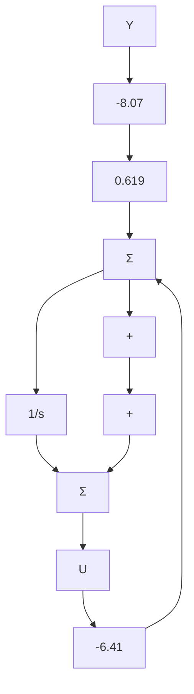

# 例 7.28 卫星姿态控制系统的降阶估计器设计

对传递函数为 $1/s^{2}$ 的卫星被控对象设计一个降阶估计器，配置估计器极点为 -5rad/s。

解答。由式(7.155)可知估计器增益为

$$L = 5$$

由式 $(7.176a, b)$ 得到标量式补偿器方程为

$$\dot {x} _ {\mathrm{c}} = - 6. 4 1 x _ {\mathrm{c}} - 3 3. 1 yu = - 1. 4 1 x _ {\mathrm{c}} - 8. 0 7 y$$

其中：由式(7.157)有

$$x _ {c} = \hat {x} _ {2} - 5 y$$

由式(7.178)求出补偿器具有如下形式的传递函数：

$$D _ {\mathrm{cr}} (s) = - \frac {8 . 0 7 (s + 0 . 6 1 9)}{s + 6 . 4 1}$$

图 7.38 给出了补偿器的结构图。

该降阶补偿器是一个超前网络。这是个有趣的发现，因为它再次表明了变换法与状态变量法可以得到完全相同类型的补偿。从图7.39所示的根轨迹曲线可以看出，闭环极点在指定的位置上。补偿系统的频率响应如图7.40所示，由该图可以看出，相位裕量大约为 $55^{\circ}$ 。与全阶估计器相同，使用其他方法分析证实了被选的根位置是正确的。

flowchart

图 7.38 相位超前的降阶控制器的简化框图

line

| Re(s) | Im(s) |
| --- | --- |
| -8 | 0 |
| -6 | 0 |
| -4 | 0 |
| -2 | 0 |
| 0 | 0 |
| 2 | 0 |
| 4 | 0 |
| 6 | 0 |
| 8 | 0 |

图 7.39 带降阶控制器和 $1/s^{2}$ 过程的根轨迹，其中圆点表示 K=8.07 时根的位置  

line

| ω (rad/s) | 已补偿 (幅值/dB) | 未补偿 (幅值/dB) | 已补偿 (相位) | 未补偿 (相位) |
| --- | --- | --- | --- | --- |
| 0 | 100 | 100 | -180 | -180 |
| 55 | 1 | 1 | -120 | -120 |
| 100 | 0.1 | 0.1 | -180 | -180 |
| 200 | 0.01 | 0.01 | -210 | -210 |

图 7.40 带降阶估计器的 $G(s)=1/s^{2}$ 被控对象的频率响应

以一个三阶系统为例，说明极点配置方法更细微的性质。
