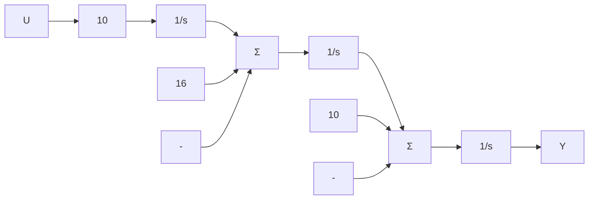

# 例 7.29 直流伺服系统的全阶补偿器设计

使用状态空间极点配置方法为直流伺服系统设计补偿器，该系统的传递函数为

$$G (s) = \frac {1 0}{s (s + 2) (s + 8)}$$

使用能观标准形的状态描述，将控制极点配置于 pc=[-1.42；-1.04±2.14j]，将全阶估计器的极点配置于 pe=[-4.25；-3.13±6.41j]。

解答。图 7.41 给出了该系统能

flowchart

图 7.41 用能观标准形表示的直流伺服系统

观标准形下的一种框图。相应的状态空间矩阵为

$$
\begin{array}{l} \mathbf {A} = \left[ \begin{array}{c c c} - 1 0 & 1 & 0 \\ - 1 6 & 0 & 1 \\ 0 & 0 & 0 \end{array} \right], \mathbf {B} = \left[ \begin{array}{c} 0 \\ 0 \\ 1 0 \end{array} \right] \\ \boldsymbol {C} = \left[ \begin{array}{l l l} 1 & 0 & 0 \end{array} \right], D = 0 \\ \end{array}
$$

期望极点为

$$\mathrm{pc} = [ - 1. 4 2; - 1. 0 4 + 2. 1 4 * \mathrm{j}; - 1. 0 4 - 2. 1 4 * \mathrm{j} ]$$

用 $K = (A, B, pc)$ 命令，求出状态反馈增益为

$$\mathbf {K} = \left[ - 4 6. 4 \quad 5. 7 6 \quad - 0. 6 5 \right]$$

估计器误差极点为

$$\mathrm{pe} = [ - 4. 2 5; - 3. 1 3 + 6. 4 1 * \mathrm{j}; - 3. 1 3 - 6. 4 1 * \mathrm{j} ]$$

用 $Lt=place(A', C', pe)$ 命令， $L=Lt'$ 求出估计器增益为

$$
\boldsymbol {L} = \left[ \begin{array}{l} 0. 5 \\ 6 1. 4 \\ 2 1 6 \end{array} \right]
$$

代入式(7.174)得到补偿器的传递函数为

$$D _ {c} (s) = - 1 9 0 \frac {(s + 0 . 4 3 2) (s + 2 . 1 0)}{(s - 1 . 8 8) (s + 2 . 9 4 \pm 8 . 3 2 j)}$$

图 7.42 绘制了由补偿器与被控对象串联所组成系统的根轨迹，其中以补偿器增益为参数。该图证实了当增益 K=190 时，尽管得到特殊的（不稳定的）补偿，但所有的根仍处于所期望的指定位置。即使这个补偿器在 s=+1.88 有不稳定的根，系统的所有闭环极点（控制器与估计器）都是稳定的。

由于在装置测试过程中，检测补偿器自身或检测处于开环状态的系统都存在困难，不稳定的补偿器通常是不被接受的。然而，在一些情况下，却可以由不稳定的补偿器得到更好的控制效果；那么在检测过程中带来的不便也是值得的 $^{①}$ 。

图 7.33 表明使用不稳定补偿器导致的直接结果是当增益从标称值开始减小时，系统也变得不稳定了。这类系统称为条件稳定系统，应该尽可能避免。正如第 9 章所述，响应大信号的执行器饱和会产生降低有效增益的情况，而且在条件稳定系统中会导致系统不稳定。同样，如果电子设备在启动过程中，控制放大器的增益从零连续增长到标称值，那么这样的系统在初始时刻就是不稳定的。考虑到这些情况，我们就要为这类条件稳定系统寻找其他设计方法。

line

| Re(s) | Im(s) |
| --- | --- |
| -8 | 6 |
| -6 | 4 |
| -4 | 2 |
| -2 | 0 |
| 0 | 0 |
| 2 | 0 |
| 4 | 2 |
| 6 | 4 |
| 8 | 6 |

图 7.42 直流伺服系统极点配置的根轨迹
